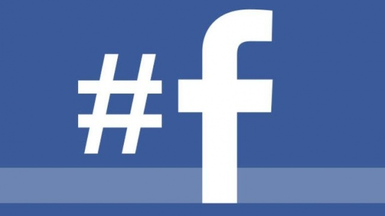

今天稍早Facebook公開宣布將要加入Hashtags標籤功能（[Facebook官方Newsroom](http://newsroom.fb.com/News/633/Public-Conversations-on-Facebook)），在網路上引起軒然大波，有人認為這是一個非常好的改善，考慮到許多公司企業的官方粉絲專頁在分享時可以加入標籤來更加明確議題，同時使用者在討論同一件事情時也能夠更加明確和其他使用者歸類為在一起。就Facebook自己的說法而言，他們提到了在許多重大時事發生的時候有相當大量的人同時在討論同樣的事情，而他們想要將這些分散的訊息串在一起而更加明確了解現在到底發生什麼事情。許多評論家或觀察家的回饋是非常樂觀正向的，甚至許多的評論是「也該是時候了！」樂見其成的使用者也不在少數。

不過，也有一派人持另外不一樣的意見。Mashable的社論作者Chris Taylor就寫了一篇名為「Facebook真的需要Hashtags嗎？」的文章（[Does Facebook Really Need Hashtags?](http://mashable.com/2013/06/12/facebook-hashtags/)）。其中提出兩個問題：Hashtags會被過度使用嗎？Hashtags對於Facebook而言真的是必須的嗎？Chris Taylor認為Hashtags對於Twitter而言是一個象徵、一個代表物，Hashtags能夠讓使用者及時得到世界上同時在討論同樣事情的所有tweets，一個能夠快速、簡明獲取資訊的管道；但是Facebook不是，Facebook是一個能夠讓使用者分享一些好東西的地方，能夠讓你和你的好友聯繫的地方，你打開Facebook看到的是你好友最新的動態，並不是時事的潮流。

[（TechCrunch）Facebook Announces Searchable Hashtags, Promises More Features For Following Public Conversations](http://techcrunch.com/2013/06/12/facebook-hashtag/)

但就筆者的看法而言，Hashtags加入Facebook的意義不只是這樣而已。Facebook最初是設計只給Harvard的學生使用，而在演進過程中，Facebook將社交功能搬上網路的成就不容小覷，這就是為什麼Facebook被人稱作為社交網站的代表；人們在Facebook上分享最近發生什麼事情－私人的事情，人們在Facebook上聊天、分享自己正在吃的食物的照片，這些都是社交功能。但是今天，有多少人是利用Facebook跟隨新聞網頁而得知一些新知，有多少人是跟隨歌手藝人而得知他們現在在幹嘛的？如同評論家所說，Twitter上的訊息同時也發表在Facebook模糊了兩者的界線。或許你無法在Facebook上看到最多數、最詳盡的所有人的資料，但是藉由分享，Facebook其實也是一個能夠得到許多非好友消息的管道。我想要說的是，人們的使用讓Facebook變得越來越不只是一個社交網站，而還同時像是一個囊括各種消息通路的情報站，增加公共對話的機會可能可以加強Facebook身為一個資訊中心的重要性，所以或許帶Hashtags進入Facebook是一個明智的選擇。

縱使許多爭議依然，像是Hashtags隱私權、美觀性和目標導向廣告，Facebook同時也表示「這只是讓人們更輕鬆的參與『公共對話』的第一步而已」
