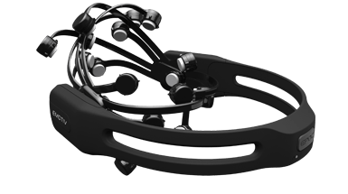
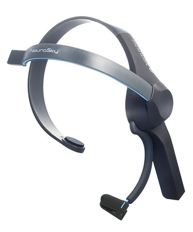
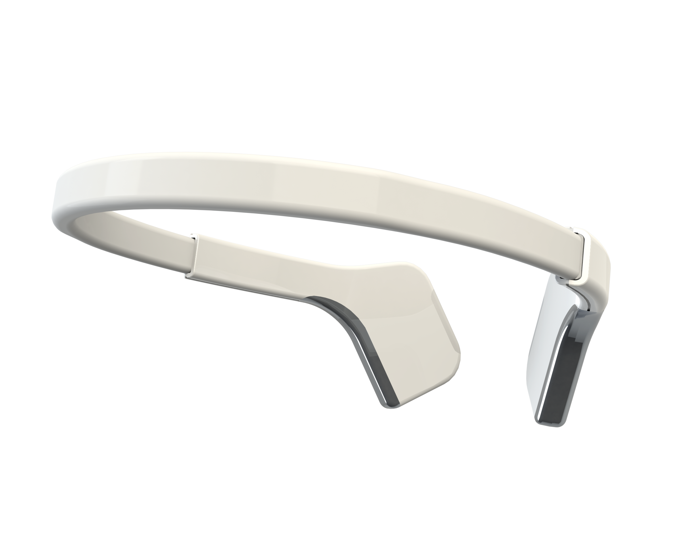
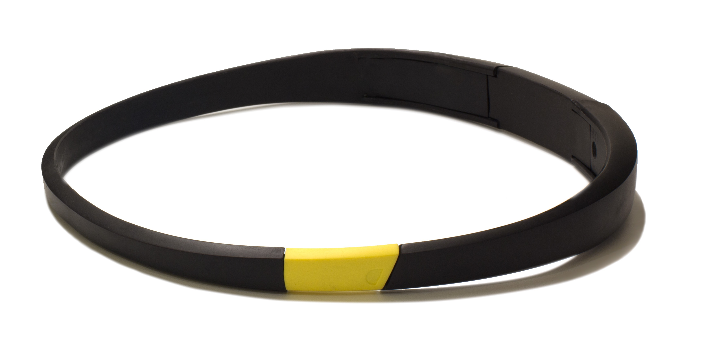
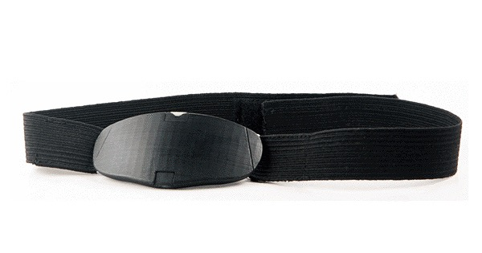
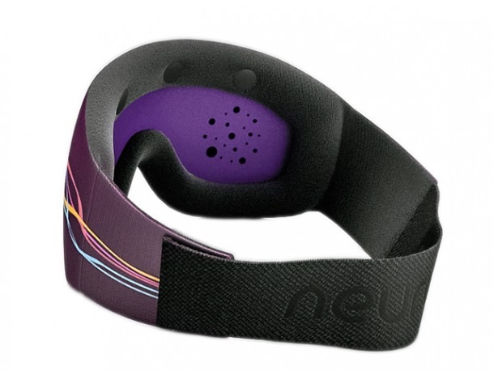

## Abstract

This review looked at the private companies that are developing brain-computer interface for commercialisztion, either consumer- or researcher-facing. The main discussion is on the inexpensive, portable, wireless, dry-electrode, off-the-shelf EEG BCI devices. Information regarding the validity, usability, and application of BCI devices are gathered to review their receptions. The review encompasses a total of 6 companies’ products, with the primary focus on Emotiv’s and NeuroSky’s BCIs.

## Introduction

A brain-computer interface (BCI) is a communication system between the brain and external devices. It bridges the gap between the signals of animal brains and the commands used by computer systems.

BCIs usually record only signals from the brain, as opposed to neuroprosthetics which works on signals from peripheral nerves and muscles. Components of a BCI system usually involves the acquisition of the signals, further processing the signals, and the translation of signals into computer commands. Both invasive and non-invasive technologies have been used for the monitoring of brain signals for BCIs, such as electroencephalograph (EEG) and intracortical brain implants. Mathematical models and algorithms were developed to aid the processing of the naturally noisy brain signals. Also, several computer systems were also built to handle the commands from the brain. (Nicolas-Alonso and Gomez-Gi, 2012)

Since its early work in the 1970s, the development of BCIs has been growing rapidly. Like many other technologies invented for medical-related purposes, the research of BCIs has primary been centered around the restoration of damaged sensory or motor abilities, or the examination of brain functions. There were also less private companies in this field. However, in recent years, the development of BCIs for non-disabled users are on the rise. New research are being done in such applications. Private companies are beginning to looking into it because of the new interests in its potential consumer applications in entertainment, education, and health care. The first commercialisation attempt is by Interactive Product Line whose Mindball is a game that utilize BCI headband. (Childers, 2013) There are many companies spawning up in light of the potential of BCI; for example, NeuroVigil makes iBrain, a EEG monitoring device that’s made for medical purposes; nielsen, a market research company, is also taking neuroscience approach to gather information.

This review looks at the efforts done by the private sector in BCIs, comparing the receptions of different companies and their applications.

## The Choice of EEG

BCI requires reception of brain signals captured directly from human brain. There are three different ways to capture these signals, i.e. (i) invasive, (ii) partially invasive, and (iii) noninvasive. Invasive capture is characterized by introduction of implants into user’s encephalic mass, directly into the gray matter, providing high quality signal reading; however it causes great inconvenience and risks to human health. In partially invasive capture, implants are placed beneath the skull without drilling the brain. Despite its lower quality signals, this signal capture form presents lower risks to health as compared with invasive approach. Lastly, noninvasive capture enables gathering information without any implant since sensors are placed on the scalp, fully external to the body. Noninvasive BCIs are more convenient and easy to use, and due to technological advancements of current solutions, provide good quality signal capture. It is also the only one to not present risk to users’ health. (Ferreira, Miranda, Miranda and Sakamoto, 2013)

One of the intensive focuses of BCIs is the use of EEG because of the its relatively less costly, non-invasive, and responsive nature. EEG reading is a completely non-invasive procedure that can be applied repeatedly to patients, normal adults, and children with virtually no risk or limitation. (Teplan, 2002) These advantages also makes it a rather suitable option for consumer use. However, while EEG doesn’t require surgery, it still involves a lot of wires and sticky electrodes which makes it inconvenient and improbable for commercialization. Companies, such as Emotiv, have made devices with fewer electrodes and eliminated the need for wires.

## General Purpose BCIs

### Emotiv

Emotiv is an Australia-based bioinformatics startup which specialized in EEG devices. Their primary products are EPOC and Insight. EPOC, their headset for scientific EEG monitoring, uses only 14 electrodes and connects to computers wirelessly. Considering the inconvenient features of traditional EEG, the small-sized headsets with so few electrodes from Emotiv is certainly impressive but also raises questions regarding its validity.

Although there are certain differences between headsets which can be resulting from communication delays and responsiveness of recording software, it is confirmed that the Emotiv EPOC headset does pick up ‘true’ or ‘real’ EEG. (Ekanayake, 2010) More specific inspection, such as for auditory ERPs, the P1, N1, P2, N2, and P3 measured at the frontal sites, results of EPOC compares well to that of the research EEG system. (Badcock, Mousikou, Mahajan, Lissa, Thie and McArthur, 2013) However, there are also research that suggest EPOC be chosen only for non-critical applications such as games, communication systems, etc. (Duvinage, Castermans, Petieau, Hoellinger, Cheron and Dutoit, 2013) A comparison between the EMOTIV headset and six gel-based disc electrodes found that it shows no overall statistically significant difference between the two modalities although there is a trend for the Emotiv headset to provide worse performance, but, in terms of set up time, Emotive headset is twice as fast. The results of the comparison suggest the choice of modality be decided on a case-by-case basis given. (Mayauda, Congedo, Laghenhovea, Orlikowski, Figèrea, Azaboub and Cheliout-Heraut, 2013) Therefore, while the Emotiv EPOC is clearly sufficient for consumer use, whether or not it’s up for serious scientific inquiry is still debatable.

On the other hand, the fixed position of electrodes of EPOC may pose inconvenience to the need of EEG related research, as researchers may use locations other that those of EPOC, or even want to use placement systems other than the popular International 10-20 System, the one used by Emotiv EPOC. That said, this may not be a major problem as the low spatial frequency is already one of the prominent features of EEG. In addition, Emotiv said that they chose the locations and the number of electrodes deliberately because the purpose of the EPOC is to do the best possible BCI job with the least difficulty in fitting for the average consumer, who does not want to mess around with straps and adjustments, and that they had done serious stats on the problem and found no crucial need to increase the number of electrodes. (gmac, 2009)

Many applications of EPOC have been implemented. Its portability liberated the users from the hassle of traditional EEG devices and opened up possibilities of connection to mobile devices. Work done in mobile devices suggests that the mobility and simplified application development may enable completely new research directions for imaging neuroscience and thus offset the expected reduced signal quality of a mobile off-the-shelf, low-density neuroheadset relative to more conventional and controlled, high-density laboratory equipment. (Stopczynski, Stahlhut, Larsen, Petersen and Hansen) A team from Dartmouth College has successfully used neural signals to control iPhones for hands-free, silent and effortless human-mobile interaction. They implemented an address book dialing app which works on similar principles to P300-speller, which is a test designed to determine what the subject is attend to, brain-computer interfaces. (Campbell, Choudhury, Hu, Lu, Mukerjee, Rabbi and Raizada)

While the immediate and obvious benefit of application of BCI in telepresence robots is giving disabled patients the ability of navigating environment remotely so that, for example, they could hang out with their families again, there is much potential for applications for the non-disabled. A team at Oklahoma State University designed a platform for "Remote Presence" which enables a person to be present at a remote location through the embodiment of a humanoid robot. It would help the user to feel total immersion in the remote environment. This system could immensely benefit a variety of sectors such as military, medicine, disaster management etc. for carrying out dangerous or physically intensive tasks. (Thobbi, Kadam and Sheng) More work are being done here, and optimizations such as giving more autonomy to the telepresent robot can further make the remote control more efficient. (Shanmugapriya and Senthilkumar, 2013)

As Emotiv claimed, EPOC can also differentiate emotions. So there are potential that it can be used for pedagogical purposes to monitor students’ frustration or boredom. (INVENTADO, LEGASPI, SUAREZ and NUMAO, 2011) The monitoring of emotion may also be helpful in games (Pröll, 2012), where emotional feedback can be used to customize the player experience. Gaming is also one of the most exciting application of BCIs like EPOC, with particular features suitable for consumer use. A survey of nearly three hundred participants that included researchers, game developers and users around the world showed all three groups agree that games is one the most promising BCI applications. (Ahn, Lee, Choi and Jun, 2014) Emotiv has provided a online store where games that can be played with its headsets are available for purchase, and its software development kit (SDK) also allows developers and third-party companies alike to release games based on the technology. Several impressive games have been released since, such as Stillalive Studios’ Son of Nor, in which players can control the character and interact with the environment in game using EPOC.

There are also applications in business, such as NeuroSpire, a "neuromarketing" solution provider which uses EPOC.

### NeuroSky

California-based NeuroSky is one of the earliest companies that got into the commercialization of BCI. They produces similar devices as Emotiv, including MindSet, MindWave, and several others with some variations, all of which base on similar EEG technology.

NeuroSky’s products use, like Emotiv, dry electrodes, but they only have single channel. A study that recognized the validity and fast setup time of MindSet also noted that there are major trade-offs in terms of the number of recording locations. (Johnstone, Blackman and Bruggemann, 2012) Although having only one electrode may cause restrictions, it is shown that the commercially available dry EEG devices produced by NeuroSky are a viable solution for use in real-world applications. These devices’ ability to integrate with open source software, such as BCI2000, and flexible script languages, such as Matlab, make them suitable candidates for further research in the detection of vigilance states. (Choi, Jones and Schwartz) On the other hand, it’s also suggested that  while these channels might be useful for some applications such as testing the cognitive load, they are not for general BCI applications. (Alkhater) There is also experiment that report the single electrode of NeuroSky’s headset is inadequate for classifying various kinds of mental activities. (Wang and Larsen)

The usability of MindSet, NeuroSky’s 2009 EEG headset, is evaluated in a study which defined a model of attention to fuse attention signals with user-generated data in a Second Life assessment exercise. The results of this evaluation suggest that the MindSet provides accurate readings regarding attention, since there is a positive correlation between measured and self-reported attention levels. The results also suggest there are some usability and technical problems with its operation. (Rebolledo-Mendez, Dunwell, Martínez-Mirón, Vargas-Cerdán, Freitas, Liarokapis and García-Gaona, 2009) Another study, which use the Mindwave Mobile EEG to test its validity in children with developmental coordination disorder (DCD), concluded that, though the single-channel, dry-electrode EEG device has limited scalp recording locations, it could accurately measure the overall level of mental attention in children with DCD clinically with no significant influence of eye blinking, and that the portable device has a potential utility in special pediatric populations, in which ease of use is the first priority. (Fong, Tsang, Cheng, Ki, Ma and Macfarlane, 2015)

The first use of NeuroSky’s technology was by the USA Olympic Archery team for training, which also gained the company much  media coverage. Other applications include tele-operation of robot (Vourvopoulos and Liarokapis), attention exercise (Rebolledo-Mendez and Freitas, 2013), games, and even software development (Fritz, Begelb, Müller, Yigit-Elliott and Züger). Neurowear, a Japan fashion-electronic company, also used NeuroSky’s technology to built the Necomimi, a cat-ear headband that respond to the wearer’s EEG signals that gained popularity among some niche markets. With its SDK, there are also many user-made applications.
One of the major focuses of NeuroSky’s products is education. Its MindWave is designed for use by children in grades 2-7 and is marketed as a device to improve school performance. (BUTLER, 2012) NeuroSky’s official online store provides several such apps. Focus Pocus, with the MindWave Mobile headset, is claimed to be a game that would improve attention, concentration, and information retention ability. However, there have not been many educational research utilizing it, and, pedagogically, it is still regarded as toy or novelty rather than serious tool.

## BCIs for Meditation

### InteraXon

InteraXon is a Toronto-based company whose primary product, MUSE headband, is a crowdfunded EEG monitoring device that’s made to aid meditation. There are 7 sensors on the MUSE which all will be placed on the user’s forehead. The capacity of MUSE is somewhat intermediate, with more electrodes than NeuroSky’s products and more simple wearing design to better fit general users than Emotiv’s EPOC or Insight. The fact that the
MUSE is much more consumer-facing than the aforementioned two companies products, and rarely promote any research potential. Therefore, there’s hardly any study using the MUSE as a tool, and its applications by third party users or companies are relatively few, though there are SDK in place. The main slogan of InterAxon is that MUSE would "boost mindfulness" of the user by meditation. MUSE’s meditation training program is self-contained, with the app also developed by InterAxon, and is marketed as a fully-fledged mindfulness training product.
While there are little studies to test its usability or validity in academic settings, non-academic reviews suggest overall mixed reception. A user reached out to the company for evidence for its claim that the training would help increase mindfulness in absence of the device but did not receive direct response. (codymclain, 2014) However, user-interface and product-design-wise, the reviews are mostly positive-hardly a surprise considering InterAxon’s CEO, Ariel Garten, used to be a fashion designer. Stills, usability concerns are still present. (Ferriss, 2014)

## BCIs for Cognitive Training

### Melon

Melon, an eponymous product of the company, is a EEG headband based on NeuroSky’s chip that claim to help users to gain better focus. Although Melon came out several years ago, there have been few reviews and none academic mentions. After being acquired by DAQRI in early 2015, the current status of Melon is unknown.

## BCIs for Sleep Tracking

### iWink

Based in California, iWink is a rather new and small startup compared with other companies. Its primary product, Aurora headset, is also a crowdfunded EEG "dream-enhancing headband". They claimed the headset would allow users to better control and experience "lucid dreaming". Since Aurora is still yet to ship, there is no hard evidence of whether it will live up to its promise or will it have other applications.

### Inteliclinic

Inteliclinic is a Polish startup whose NeuroOn is claimed to be a EEG sleep mask designed to help travellers to adjust to new time-zones and non-travellers to regulate their sleep patterns. NeuroOn is still at "pre-launch" stage, so little information can be gathered and no implication can be made.

## Conclusion

Considering the general-purpose BCIs, though there are still lingering doubts of whether consumer BCIs can produce data as good as the research devices, researchers have recognized it is sufficient for certain application when consumer products’ particular advantages are favored, and applications using such devices are also booming in commercial world. On the other hand, BCIs designed for specific purposes are, albeit some nebulous efforts, increasingly gaining popularities among certain groups, though, because it is an even more novel endeavor, reviews are few and the prospect is unclear.

Although the development of BCIs spans decades since its inception, the effort of the private arm to commercialize BCIs’ potential is still at its infancy. Recent years have witnessed accelerating growth of off-the-shelf BCIs devices applied to research and everyday use alike, and several niche markets, gaming, sleep tracking, and cognitive training, have opened up new opportunities for further intensive progress of BCI technology that would help both academic researchers and amateur consumers to utilize the devices.

## References

* Nicolas-Alonso, L. F. and Gomez-Gil, J. (2012). Brain Computer Interfaces, a Review. Sensors. Retrieved from http://www.ncbi.nlm.nih.gov/pmc/articles/PMC3304110/pdf/sensors-12-01211.pdf
* Childers, N. (2013, June 6). The Video Game Helmet That Can Hack Your Brain. Retrieved from http://motherboard.vice.com/blog/the-video-game-helmet-that-can-hack-your-brain
* Ferreira, A. L. S., Miranda, L. C., Miranda, E. E. C. and Sakamoto, S. G. (2013). A Survey of Interactive Systems based on Brain-Computer Interfaces. SBC Journal on 3D Interactive Systems. Retrieved from http://seer.ufrgs.br/jis/article/download/40857/26624
* Teplan, M. (2002). FUNDAMENTALS OF EEG MEASUREMENT. MEASUREMENT SCIENCE REVIEW. Retrieved from http://www.measurement.sk/2002/S2/Teplan.pdf
* Ekanayake, H. (2010). P300 and Emotiv EPOC: Does Emotiv EPOC
capture real EEG? Retrieved from http://neurofeedback.visaduma.info/emotivresearch.htm
* Badcock, N. A., Mousikou, P., Mahajan, Y., Lissa, P., Thie, J. and McArthur, G. (2013). Validation of the Emotiv EPOC® EEG gaming system for measuring research quality auditory ERPs. Retrieved from https://peerj.com/articles/38.pdf
* Duvinage, M., Castermans, T., Petieau, M., Hoellinger, T., Cheron, G. and Dutoit, T. (2013). Performance of the Emotiv Epoc headset for P300-based applications. BioMedical Engineering OnLine. Retrieved from http://www.ncbi.nlm.nih.gov/pmc/articles/PMC3710229/pdf/1475-925X-12-56.pdf
* Mayauda, L., Congedo, M., Laghenhovea, A. V., Orlikowski, D., Figèrea, M., Azaboub, E. and Cheliout-Heraut, F. (2013). A comparison of recording modalities of P300 event-related potentials (ERP) for brain-computer interface (BCI) paradigm. Neurophysiologie Clinique/Clinical Neurophysiology. Retrieved from https://www.researchgate.net/publication/257461697_A_comparison_of_recording_modalities_of_P300_event-related_potentials_ERP_for_brain-computer_interface_BCI_paradigm
* gmac (2009). EPOC Hardware Design Decisions?, Electrode placement and research recommendations. Retrieved from http://emotiv.com/forum/messages/forum4/topic369/message1947/#message1947
* Stopczynski, A., Stahlhut, C., Larsen, J. E., Petersen, M. K. and Hansen, L. K. The Smartphone Brain Scanner: A Mobile Real-time Neuroimaging System. Retrieved from http://arxiv.org/pdf/1304.0357.pdf
* Campbell, A. T., Choudhury, T., Hu, S., Lu, H., Mukerjee, M. K., Rabbi, M. and Raizada, R. D. S. NeuroPhone: Brain-Mobile Phone Interface using a Wireless EEG Headset. Retrieved from https://www.human.cornell.edu/hd/upload/neurophone.pdf
* Thobbi, A., Kadam, R. and Sheng, W. Achieving Remote Presence using a Humanoid Robot Controlled by a NonInvasive BCI Device. Retrieved from http://anandthobbi.yolasite.com/resources/ICGST.pdf
* Shanmugapriya, T. and Senthilkumar, S. (2013). International Journal of Innovative Research in Computerand Communication Engineering. A Telepresence Mobile Robot Controlled With a Non-Invasive Brain-Computer Interface. Retrieved from http://www.rroij.com/open-access/a-telepresence-mobile-robot-controlledwith-a-noninvasive-braincomputerinterface.pdf
* INVENTADO, P. S., LEGASPI, R., SUAREZ, M., and NUMAO, M. (2011). Research and Practice in Technology Enhanced Learning. PREDICTING STUDENT EMOTIONS RESULTING FROM APPRAISAL OF ITS FEEDBACK. Retrieved from http://www.apsce.net/uploaded/filemanager/4fd114ce-96f9-4849-bf1c-a83adc97b139.pdf
* Pröll, M. (2012). Using a low-cost gyro and eeg-based input device in interactive game design. Retrieved from http://xcessity.at/downloads/master_thesis_public.pdf
* Ahn, M., Lee, M., Choi, J. and Jun, S. C. (2014). Sensors. A Review of Brain-Computer Interface Games and an Opinion Survey from Researchers, Developers and Users. Retrieved from www.mdpi.com/1424-8220/14/8/14601/pdf
* Johnstone, S. J., Blackman, R. and Bruggemann, J. (2012). EEG from a single-channel dry-sensor recording device. Retrieved from http://ro.uow.edu.au/cgi/viewcontent.cgi?article=1036&context=sspapers
* Choi, H. S., Jones, A. and Schwartz, G. Using Brain-Computer Interfaces to Analyze EEG Data for Safety Improvement. Retrieved from https://www.truststc.org/education/reu/12/Papers/Choi_Jones_Paper.pdf
* Alkhater, R. M. Real-time Detection of P300 Brain Events: Brain-computer Interfaces for EEG-based Communication Aids. Retrieved from http://aut.researchgateway.ac.nz/bitstream/handle/10292/4707/AlkhaterRM.pdf
* Wang, A. I. and Larsen, E. A. USING BRAIN-COMPUTER INTERFACES IN AN INTERACTIVE MULTIMEDIA APPLICATION. Retrieved from http://www.idi.ntnu.no/~alfw/publications/sea2012-bci-snake.pdf
* Rebolledo-Mendez, G., Dunwell, I., Martínez-Mirón, E. A., Vargas-Cerdán, M. D., Freitas, S., Liarokapis, F. and García-Gaona, A. R. (2009). Assessing NeuroSky’s Usability to Detect Attention Levels in an Assessment Exercise. Retrieved from http://link.springer.com/chapter/10.1007%2F978-3-642-02574-7_17
* Fong, S. S. M., Tsang, W. W. N., Cheng, Y. T. Y., Ki, W. Y., Ma, A. W. W. and Macfarlane, D. J. (2015). Journal of Novel Physiotherapies. Single-channel Electroencephalographic Recording in Children with Developmental Coordination Disorder: Validity and Influence of Eye Blink Artifacts. Retrieved from http://www.omicsgroup.org/journals/singlechannel-electroencephalographic-recording-in-children-with-developmental-coordination-disorder-validity-and-influence-of-eye-blinkartifacts-2165-7025-1000270.pdf
* Vourvopoulos, A. and Liarokapis, F. Brain-controlled NXT Robot - Tele-operating a robot through brain electrical activity. Retrieved from http://www.academia.edu/889399/Brain-controlled_NXT_Robot_-_Tele-operating_a_robot_through_brain_electrical_activity
* Rebolledo-Mendez, G. and Freitas, S. (2013). CURVE. Attention modeling using inputs from a Brain Computer Interface and user-generated data in Second Life. Retrieved from https://curve.coventry.ac.uk/open/file/066c9b7f-ba65-3017-0825-cbaabacfe7d0/1/Attention%20modeling.pdf
* Fritz, T., Begelb, A., Müller, S. C., Yigit-Elliott, S. and Züger, M. Using Psycho-Physiological Measures to Assess Task Difficulty in Software Development. Retrieved from http://research.microsoft.com/pubs/209878/biometricSensors_Submitted-07-03-14.pdf
* BUTLER, C. (2012). NEUROSKY MINDWAVE HARDWARE AND SOFTWARE REDESIGN IMPLEMENTATION. Retrieved from http://superluckycat.com/blog/wp-content/uploads/2012/10/MindWave_redesign.pdf
* codymclain (2014). What a Neuroscientist had to say about the EEG Headband, Muse. Retrieved from http://mclain.kinja.com/with-all-the-latest-gadgets-that-exist-on-the-market-wh-1676902889
* Ferriss, T. (2014). Can You Rewire Your Brain In Two Weeks? One Man’s Attempt… Retrieved from http://fourhourworkweek.com/2014/09/12/muse-interaxon/
