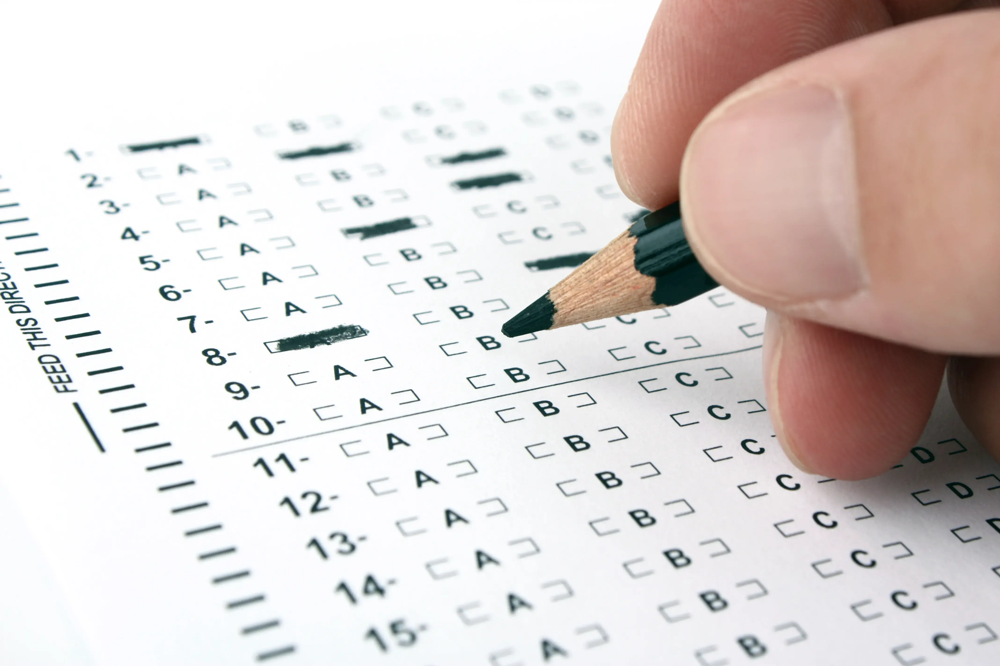

**注意：這不是一篇「如何準備多益／托福？」的文章。**

*這篇文章是我去年一月初在 Facebook 上發表的，最近打算開始在 Medium 上寫寫東西，就想說順便把這篇搬過來好了。這篇只是經驗分享，我不是什麼考過多少次的多益／托福大師，我的經驗也可能有點舊，如果有過時或荒謬的地方，真的抱歉啊～*

## 進入正題

「我該不該去考多益／托福？」如果還需要問，那你大概不用去考。考多益或托福都要錢，而且是真的不少錢，除非你的錢跟時間都多到沒地方花，不然沒事真的別浪費時間準備。要是你依然遲疑，看一下[多益](https://www.ets.org/toeic/listening_reading/about)或[托福](https://www.ets.org/toefl/ibt/about)的官網上的介紹，你大概就能知道這些考試是不是為你準備的了。下面我只會列出我認為沒有在那些網站上提到的考量。

常見的一個藉口是「反正英文很重要」，但是這並不代表你需要考試；對我而言，「考試英文（qua a testing instrument）」跟「英文（qua a language）」是有顯著差別的，你可以在考試英文非常強，但是在實際情況下根本不會用英文。沒錯，練習考試英文確實會在某種程度上增進你的英文本身，但是這樣就已經偏離原本「英文很重要」的藉口了，對吧？

如果到目前為止，我都已經成功說服你了，而你依然擔心未來需要準備考試，我認為這樣的擔心是錯置的。這些美國人搞的考試，都是非常用心縝密設計過的，他的考試會符合他的目標，而受測者得到的成果，也會直接反映在其規格下的位置。但是考試依然是考試，每個人參與考試，多少都想拿高分，所以研究考試的動作依然是必要的。關於這個，如果你的英文程度足夠，不需要多作擔心。因為等到時候到了，你只需要準備「英文考試」，也就是題型、策略等。如上所述，這些考試都是設計過的，而他們也都非常開放地推出官方的攻略本，基本上那些東西就已經足夠讓你了解題型和時程安排，並且讓你有充裕的資源來獨力擬定策略了。

雖然這樣說，我覺得依然有非常多的好理由，是我覺得值得花時間，去為了準備英文考試，而去準備考試英文的。接下來提到的內容，是從我自身以及周遭朋友的經驗統整而成。

## 自尊

首先，**這個理由是非常 OK 的**。你可以因為想要某種證明，來補足自我內在的擔憂以及不確信而去考；你不需要極盡思考，去塑造出一個因為外在環境的必要性，而迫使你去準備的幻想。如果你是因為各種[社會比較](https://www.wikiwand.com/en/Social_comparison_theory)，不斷感受到身旁同儕的競爭壓力，而降低了個人的自尊，你也可以嘗試用這個方式，來平衡你的焦慮，但是小心，這可能會是一條無止盡的[滑坡](https://www.wikiwand.com/en/Slippery_slope)。去準備考試會佔掉你很多時間，讓你感覺你在軌道上，而且正在邁向自我確認的路上。考量到長期的結果，我會建議不要這樣；如果能夠對自己感到自在，這還是比較好的辦法，也就是明白並相信自己的程度，且不再在意他人的看法，瞭解到你不需要考試來證明你比其他人有價值。也有可能，最後你考完了，也不見得會得到你想要的自尊。

## 證明

在[信號傳遞理論](https://www.wikiwand.com/en/Signalling_(economics))裡面，這種像是學歷的證明能夠非常有效的傳遞自己的能力水平。如果你想要發出一個類似這樣的訊號，你可以去考，但你可以考全民英檢（就我所知是比較便宜）。甚至，學測／指考的成績也很有公信力，對某些族群而言，更是具有說服力。**不管你的能力好或是壞，考出來最後是幾分**，這也是一個能非常快解決以下話題的方法：「你英文好嗎？」「我自認不錯啊」「是多不錯？」「我 \_\_\_ 考 \_\_\_ 分」

另外，**在投履歷／申請學校等時，這也都是非常有效而且強力的證明**，所以如果你有這種需求，當然很建議去考。

## 工作與學校

如果你的工作或學校（或你想要的工作或學校）要求你拿出某種程度的英文能力證明，你也不用問到底要不要考的問題了。但是你可以問的是，「比起其他的選項，要不要考多益／托福？」

首先討論多益：如果公司／學校同時也認可全民英檢或其他考試，關於這個選擇，首先必須檢視的自己的能力，**看看你的優勢在哪種考試的格式比較能夠發揮**。多益的考試（大部分人）只考聽和讀，而且情境都非常現實，在他的聽力測驗，說話速度跟正常對話是差不多的，閱讀測驗題目部分也超多，基本上你必須反應夠快，而且毫不遲疑。其他的考試的規格不一，我只舉我考過的全民英檢：考試的方式非常台式，像是聽力測驗你都有充裕的時間考慮，但是如果你要證書，就必須通過聽說讀寫四項的檢測，如果你的說／寫不 OK，那你可能就得考慮別的途徑了。

再來，托福：首先我必須再次強調的是，**托福真的很貴**。但如果是要出國念書，特別是美國，大部分人都還是考托福。值得注意的是，**並不是美國就一定只看托福**，學術機構通常還會認可一些別的考試，像是雅思或 PTE Academic（這個好像台灣沒辦）。不過，最保險的辦法依然是，先研究好你想要去的地方要求的成績，不管是托福或雅思。我對其他那幾個考試沒經驗，所以我也不能做什麼分析。但是依照我對托福的了解，我認為他是我考過最有鑑別力的考試，會完全測出你的程度，且是在他設計考試的目標以及評量方法的分級裡。如果要猜，我會認為這種為了學術而設計的考試應該都差不多，所以是否要考托福的問題，影響較大的可能是考程和學校的要求。

## 鞭策自己

有個目標很棒，在沒有考試壓力的環境下，我們常常怠惰，如果在報考英文考試後，你認為自己更有動力念書，那就去吧！只是必須放在心裡的問題是：當這個試考完了，接下來呢？

## 測試自己

我覺得這兩個考試都很棒，都是非常好的鏡子，可以拿來測試自己英文能力到底有幾兩重。我覺得這也可以像某種儀式，代表這一路走來的成果。只是小心不要[自我設障](https://www.wikiwand.com/en/Self-handicapping)；多益跟托福等的考試難易度不同，也有像是[小托福](http://www.toefl.com.tw/junior/)這種考試的存在，**挑選適合測驗自己程度的考試是關鍵**。

---

## 決定

千萬不要因為「是我說的」就做決定。說真的，我說得算什麼呢？上述的都只是建議，你要為你自己的投入負責；我沒有辦法承擔這個責任，如果你後悔，我最多也只能說聲抱歉。**準備英文要花時間，準備英文考試也要花時間，前者的程度會大大決定後者的長短。**如果你還不確定到底要不要考，那就先別想這麼多了，扎實自己的能力比較實在！
