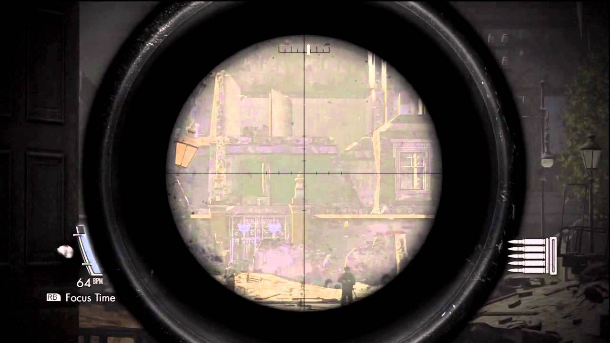

射擊遊戲（通常是 FPS）裡面，螢幕中央通常會有一顆小小的圓形或是十字線條協助瞄準，而狙擊槍之類的武器可能有望遠鏡可以放大瞄準，一般台灣玩家叫那些標記「準心」（或是有些地區叫准星）。例如：

如果你去查「準心」的英文，網路通常會告訴你，他叫做 sight，但是這其實不太正確。Sight 是指瞄準器，現實中的槍通常都有瞄準器，例如：

Sight 在這裡指的是那個裝在槍上，幫助你瞄準的裝置。Sight 本身也可以分很多種，任何協助你瞄準的東西都可以叫做 sight；通常一般槍上是 iron sight，有雷射的叫 laser sight，而可以望遠的就叫 telescopic sight（或是 scope）。

這裡可以討論很多，但總之重點是，sight 指的是那個「瞄準器」，是指那個裝置，而不是那些標記。

當我們在討論遊戲裡面的準心時，我們通常指的是那個螢幕上的那個圈圈或是那些標記，而不是瞄準器本身。那些標記叫做 reticle。

例句：Assisted aiming, such as “friction”, which slows down the player’s turn rate as the reticle passes over an enemy, among other seminal features introduced in the Halo franchise, defines the smooth modern First-Person-Shooter gaming experience.

這個字用在這也是衍伸來的，現實中的情況是，狙擊鏡上面畫的輔助線條叫做 reticle。在遊戲裡面 reticle 通常屬於 HUD 的一部分，有些人把他翻成抬頭顯示器，但總之就是代表在螢幕上，非遊戲環境，顯示資訊的部分。
