該如何開始一年？在日曆上的初春與氣候上的末冬互爭的尾聲，或許能夠給一年的最好開始，就是在澄淨的湖邊，靜靜凝視著自然勾勒出的頌春圖，不管他想表達什麼意思。

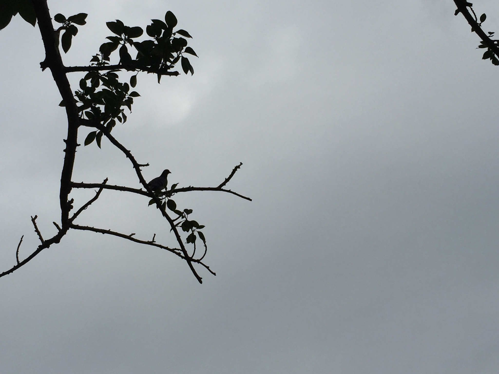

在所有故事，為整部故事定調的都是初章。他們讓你熟悉接下來一段時間的節奏和語調，但更重要的是，讓你好奇前方還尚未探索到情節中，迷霧之後的世界。

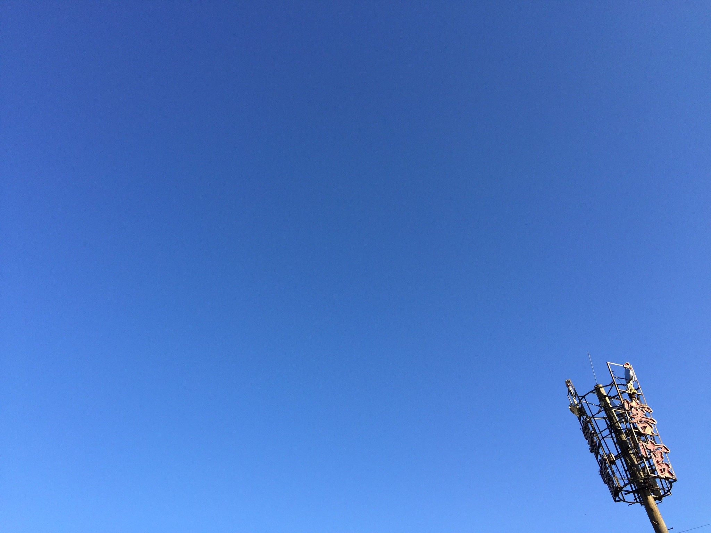

期待不只是一種心態，期待是一種過程。在場邊熱血為場上球員加油的人，可能有他踏上場的一天；羨慕在台上領獎、拍手道賀的人，不時也會期待當自己也能夠奮鬥一搏的時候。就如同小孩在壁上觀，躍躍欲試地窺望這個大觀世界，等待著。

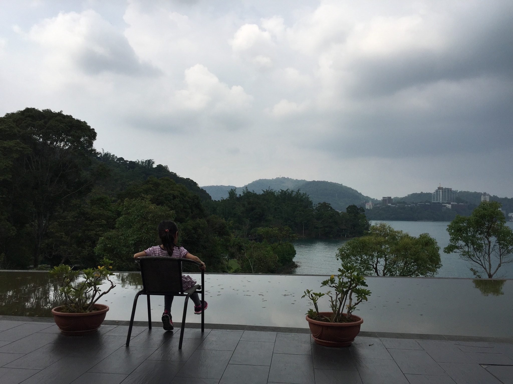

如果天和地是一樣的廣袤，藝術與宗教是否對於崇尚的目標會有所不同？曾有西方詩人在搜索自身信仰時，迷惘地質疑道：如果地上的世界因為大自然，能夠跟天上一樣美，那麼這天空也就再也不是一道阻隔的藍牆，而是屬於整體神性的一部分了。

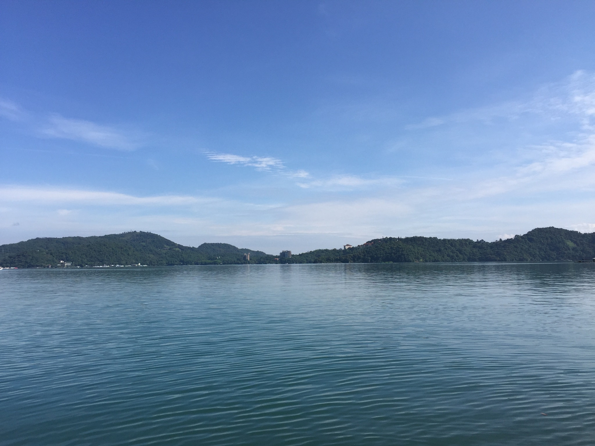

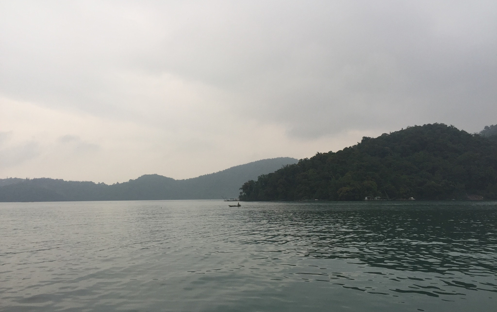

翳滅進入天際是怎樣的一個過程？當炊煙緩緩升起，縈迴繚繞著，究竟是煙者，還是觀者入天？百年前將種子沒入土壤的先人，多半都已不復在，但他們的樹卻都直貫天際，衝上雲霄。而或許，這也是遁入星辰的一種成仙秘法。

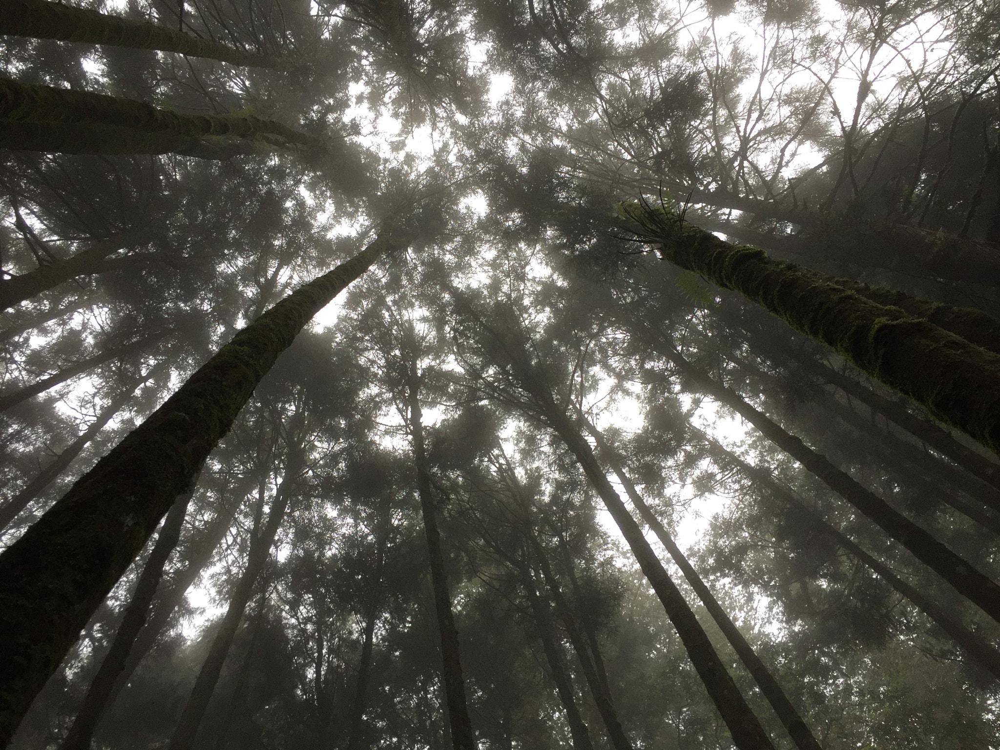

<figure style="display: flex; flex-direction: column; align-items: center;">
  

    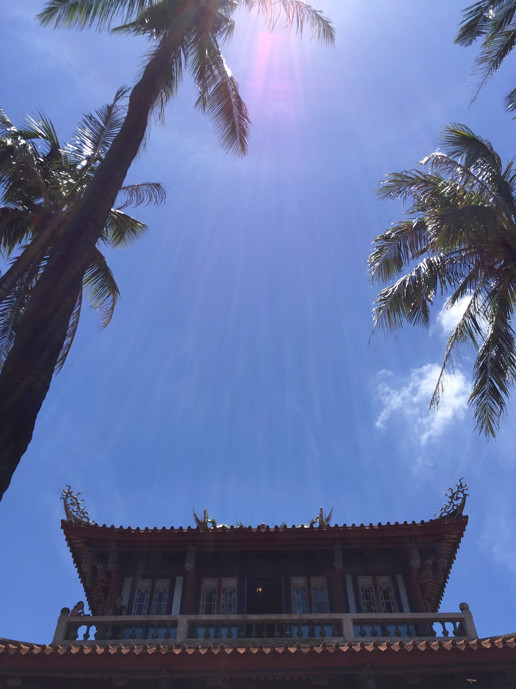
    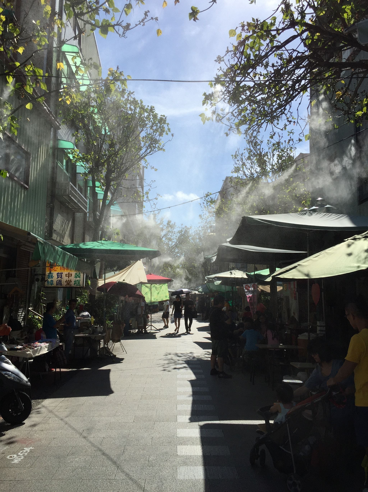
  

</figure>

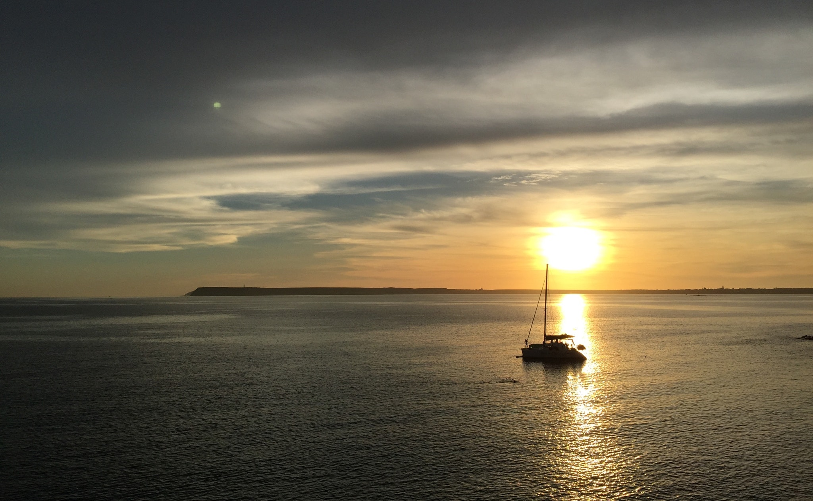

不管在一起的時間激盪出多少火花，當分手告別，人去樓空以後，又能留下什麼？空無一人的小巷內，那些曾經的動容似乎不著痕跡，過去的已經逝去，未來的也尚未抵達，獨留伊人佇立在這廣闊世界的孤寂角落。

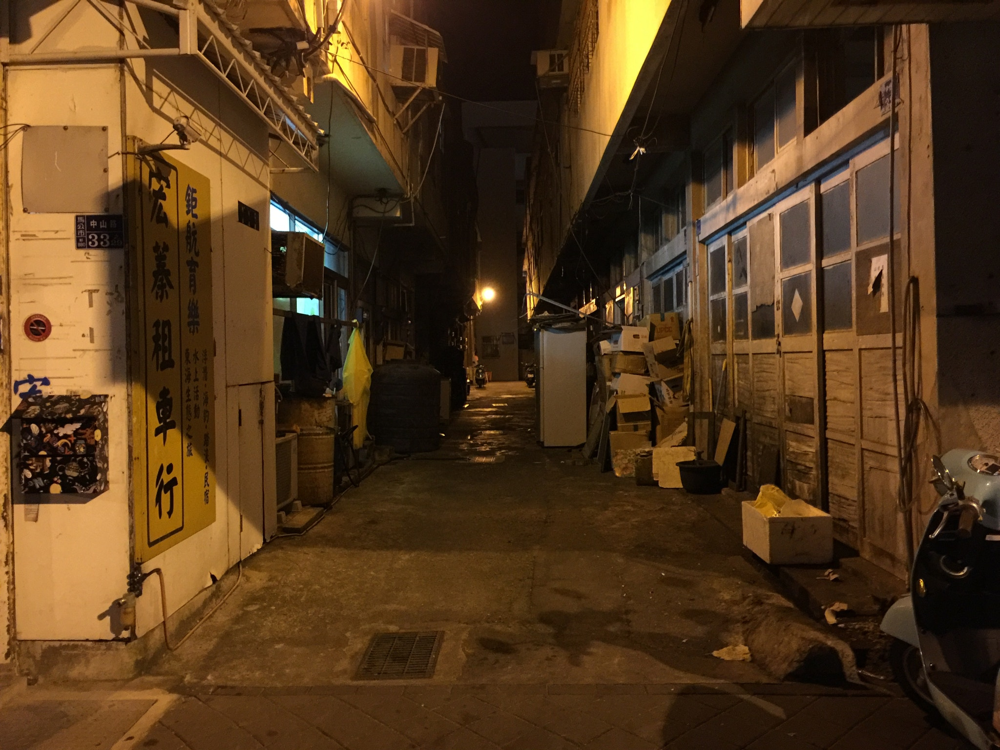

如果以教會來比喻華爾街，其實差不遠矣。信仰的幾何是由先輩們的骨灰以及成就的樓塔所組建而成，任何在個人信念追逐路上的人，不管是在什麼樣的場所，都是在逆著水流渡舟競逐，用力伸長手臂抓向那綠光，並無止盡地被推回到過去。

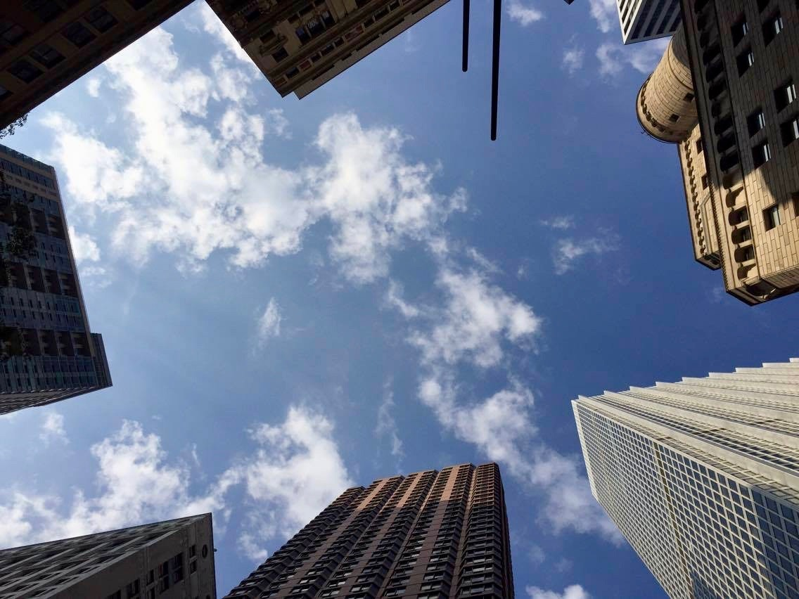

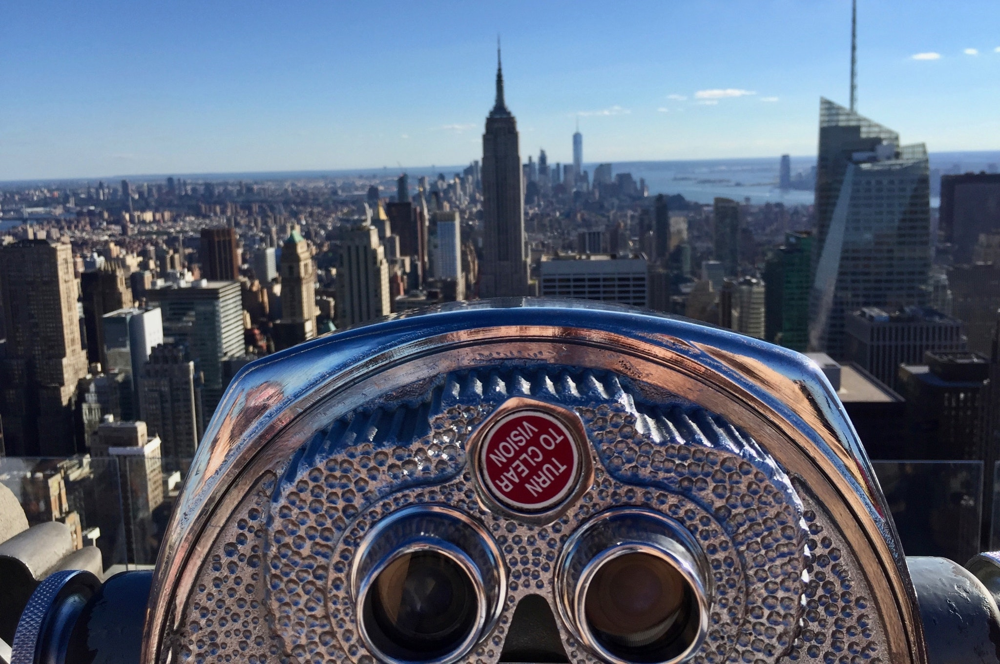

伴侶的功能是否就如字面上所意，為單純的陪伴？假設如此，為何我們如此辛勤並義憤地找尋親近感？就算撞地頭破血流，人們還是為了一親芳澤勇往直前。但或許燈火柵欄處從來就沒有人，而終極的圓滿就封在了解世上唯有自己是真正能夠陪伴自己的？

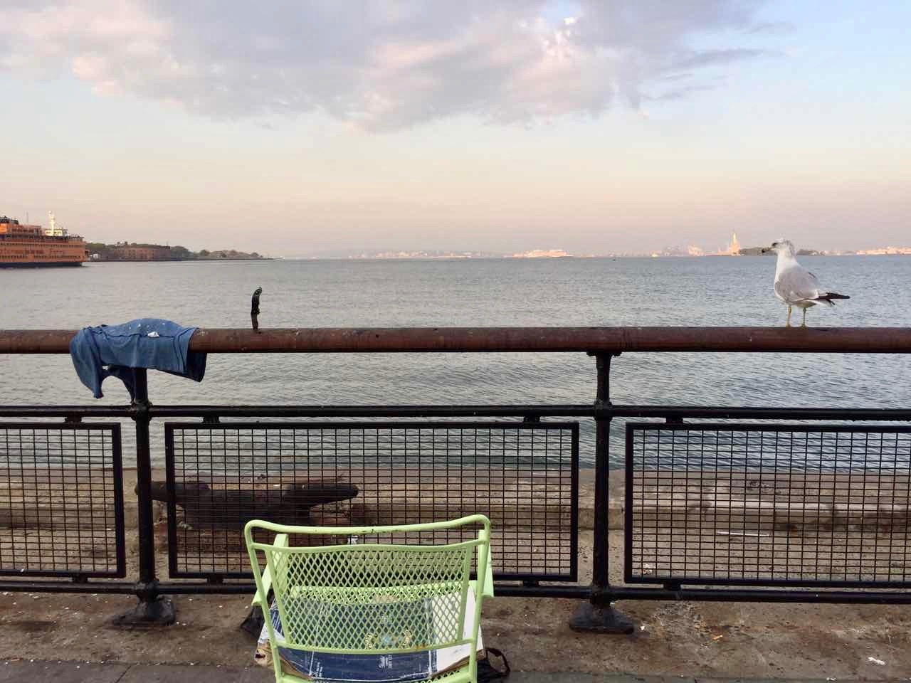

科學與工程進展的影響從來就不只存在科技，而是漫流到人類社會的每一個角落，大至造成共產主義宣言的時間軸模型，小至改變人與人之間鍵結方式的纖維。社交與組織行動容易造成團體甚至主義教會，而要是今日的寺宇不是彩繪玻璃也不是榫頭卯眼，而是玻璃落地窗與木質桌子，由如使徒般深諳教義的上級領導近乎激進狂熱的店員們，使著極簡易用的使用者經驗設計風格，和以天才地精密設計的軟硬體為贖罪券，承載著拯救世界的任務，不斷如瘟疫般地病毒式傳播，以實體旗艦店為中心，散流到各地。

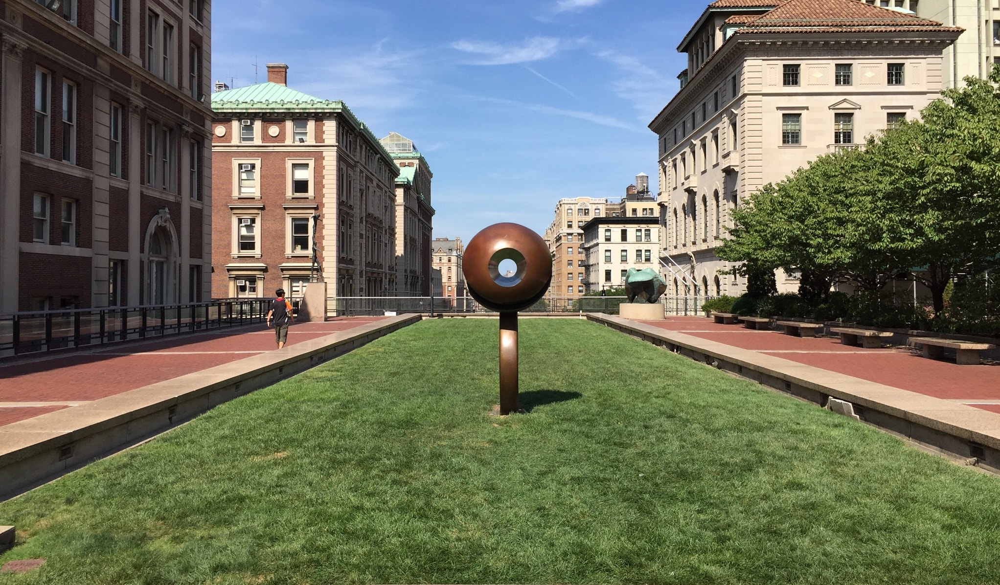

如果書籍是知識的寶藏，那麼語言應該就是大門的鑰匙了。不同歷史與文化背景的人們所精釀出來的成果有所不同，但要去探索自己舒適圈以外的世界，取得這些鑰匙的門檻有時候可能很高。在巴別塔完成後，誰又能夠瀏覽自如世間一切的智慧呢？

沒有文化或是社會是完美的，每個地方都有它的好處，每個地方也都有他的壞處，有些事情很明顯，有些則不。坐在這山，很容易發現這山哪不舒服，而那山哪裡更好，但人們常常忘了，那山的好，伴隨而來的，也是那山不完美的地方。

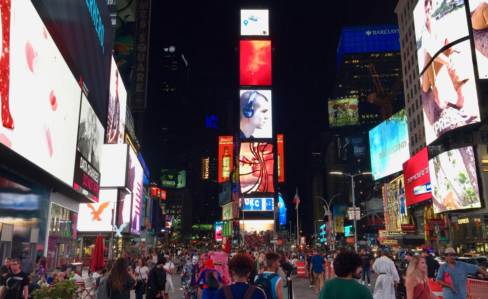

邂逅有多難？我們總是抱怨找不到適合自己的人，要嘛是個性不合，要嘛是沒有共同的興趣或嗜好。但抱怨很簡單，實行很難，唯有當我們真正踏出家門，去嘗試、去失敗，才有機會成功。或許自己完美的另一半天天都在跟我們擦身而過，等待著任何一方開口。

有人說，在城市裡面，我們每天都擦肩而過數百數千的人，在路上、在車上、或是在教室裡。我們鮮少想過，這些人和我們一樣，擁有著同樣豐富精彩的人生故事，充滿了各種他們的喜悅、悲傷、驚喜和痛苦。蛙以管窺天，我們以管觀社會，多少奇遇正等著被發現。

成長過程中，社會透過媒體和家中長輩告訴我們，成功追逐的遠方就在「國外」。到底哪裡是國外，而國外又有什麼是這麼好的？或許每個人的答案不同，但一個將夢想建構在離開的地方——當「台灣夢」就是離開台灣，我們又該如何看待自己？

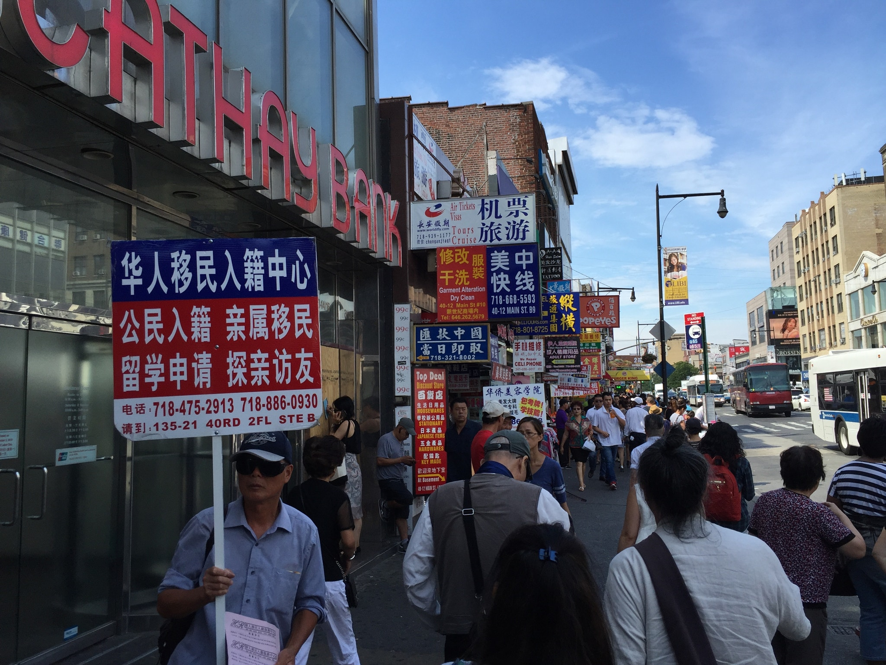

人的追求到底在哪裡可以結束，是在經過承襲傳統的各個階段後，抵達最後的美好。還是這段旅程本身就是目標？那會是一個愛你而美滿的家庭？一份高薪而有成就的工作？還是簡簡單單的一個午後，能夠靜靜坐在海邊，望向遠方的愜意？

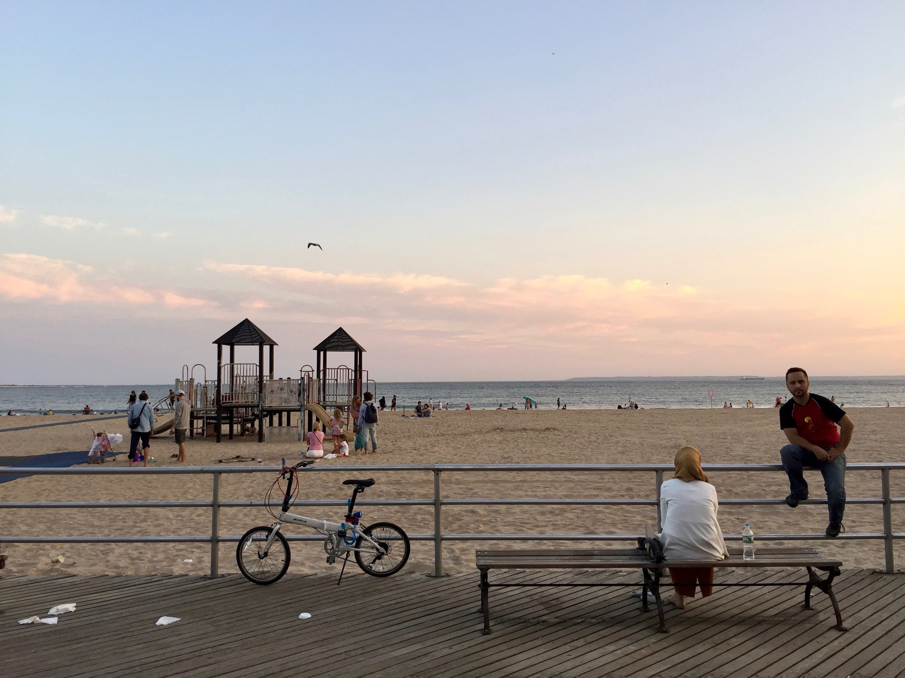

