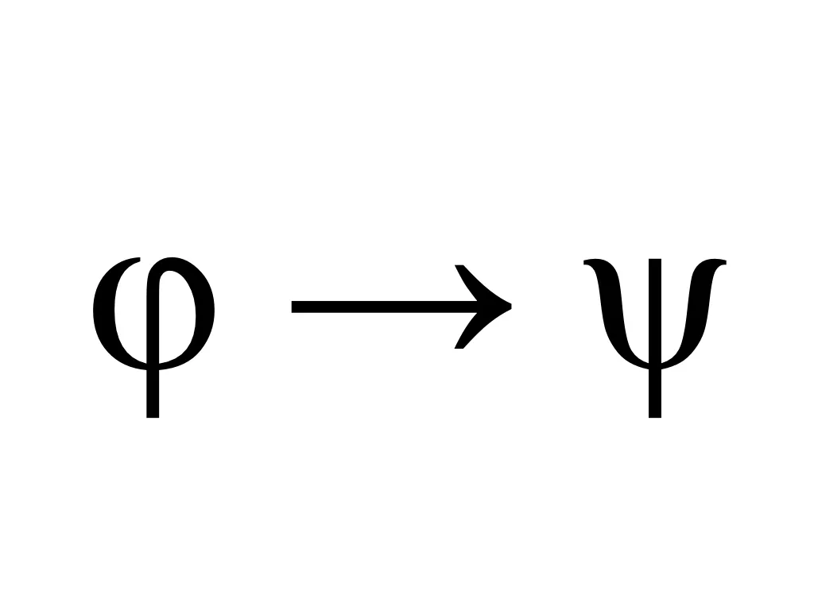
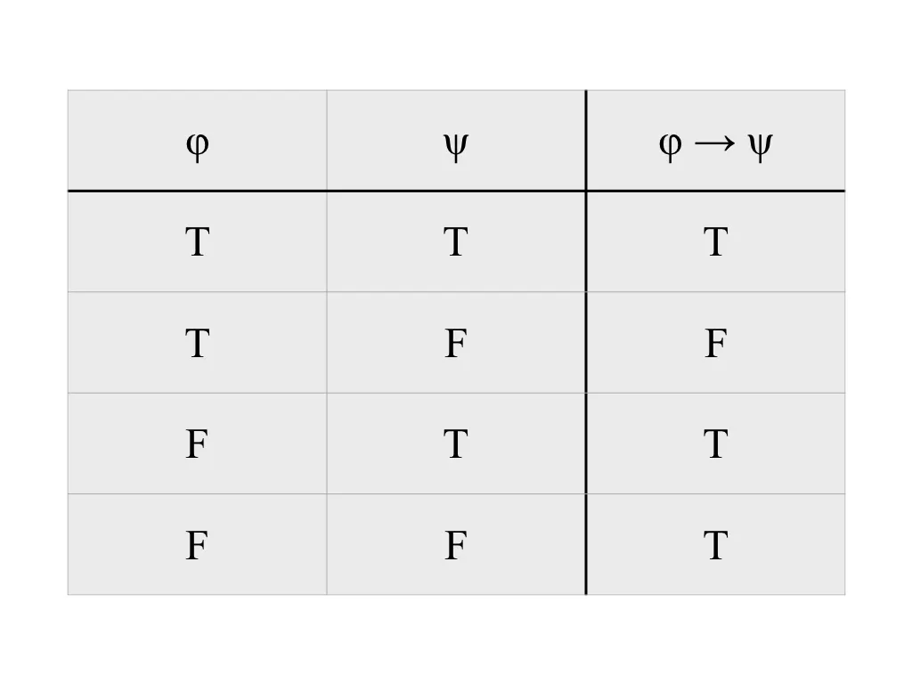
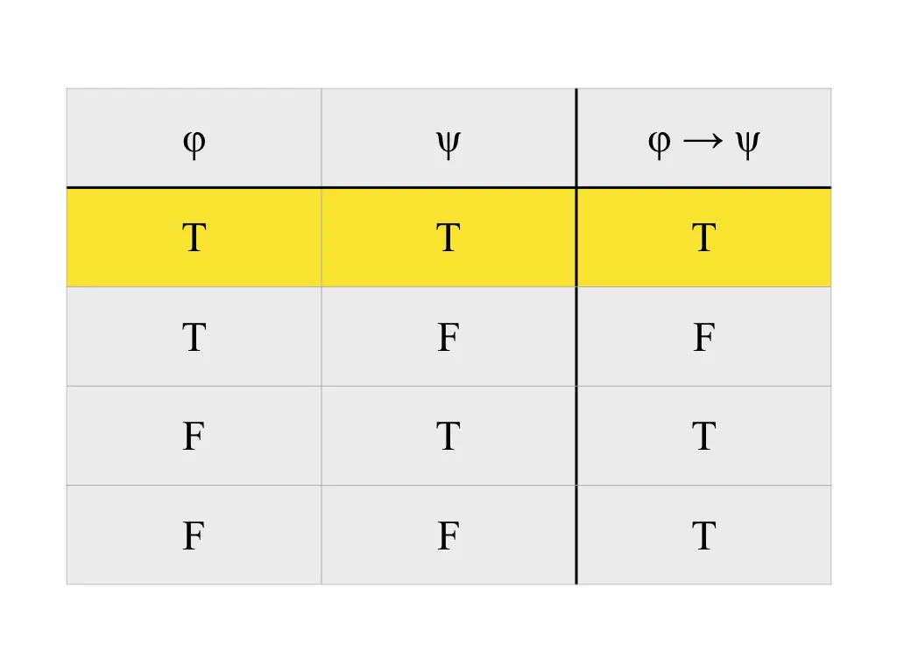
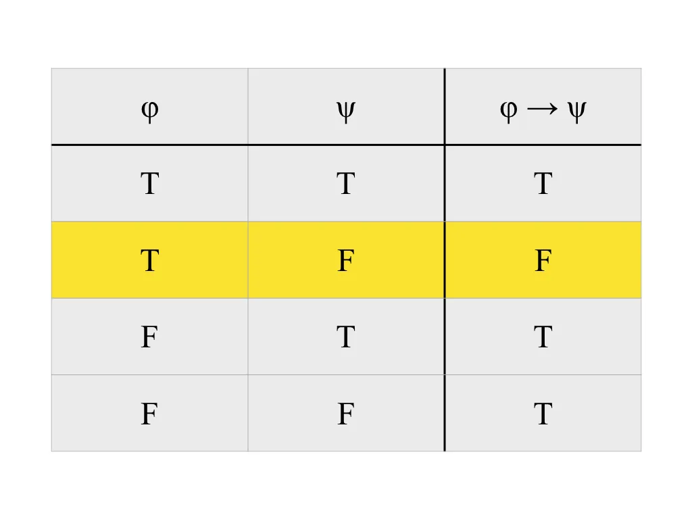
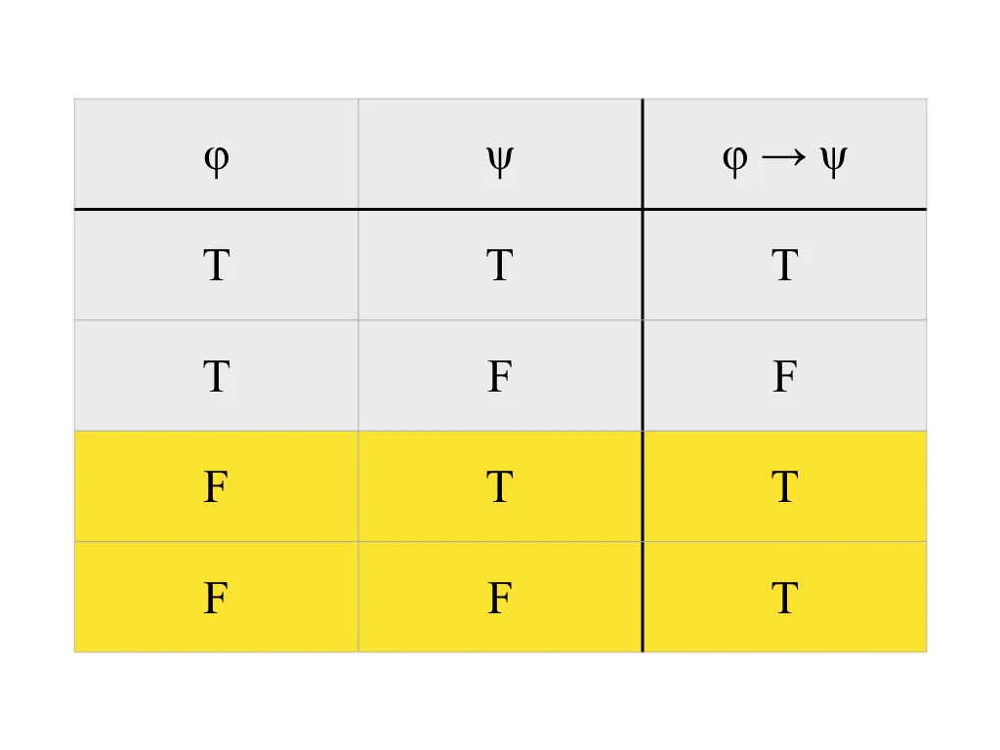
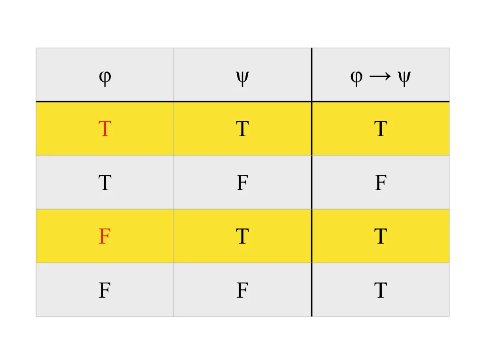
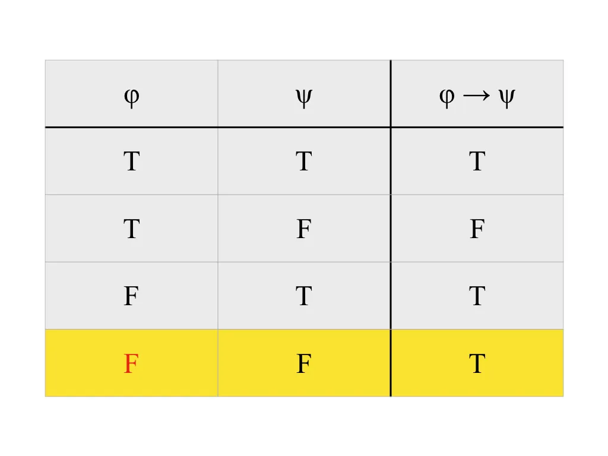

如果今天下過雨，那麼地板就會是濕的。如果今天地板是濕的，代表剛剛下過雨嗎？

不一定喔！也有可能是剛剛有掃街車經過，在路上灑水了呀！我們只知道下雨就會地濕，但是我們不知道，是不是有其他事發生時，地板也會濕。所以，如果我們知道地是濕的，我們最多只能說，剛剛可能下過雨，但是不能確定。

這樣聽起來應該滿合理的吧！不過，那如果再問，如果今天地板是乾的，代表剛剛沒下過雨嗎？

答案是正確的喔！因為呀，如果地板是乾的，下雨就不合理了，所以他必然沒發生；不然，地板應該是濕的吧！所以，如果在這個情況，說有下雨不合理，那麽勢必是沒下過雨。從這裡，我們同時也可以判斷，剛剛應該也沒有掃街車經過。

覺得剛剛這段論證有趣嗎？你會發現，從短短一句「如果今天下過雨，那麼地板就會是濕的」可以引出這麼多討論。討論像這樣的事，基本上就是邏輯學家們的主業，而他們也在探究的過程中，發展出很多套做這類論證的系統，來協助系統性的思考。我們今天要討論的主題，就是其中相當重要的命題邏輯（propositional logic）。

## 命題

他既然叫做命題邏輯，你可能馬上就想問，那啥是命題（proposition）？命題就是我們討論的東西。而在邏輯裡面，我們關心的是，某句話是真還是假。因此，命題就是那些可以被討論是真還是假的句子。有點模糊嗎？看點例子：

「地球是圓的」跟「太陽從西邊出來」這兩句話，在現實中，一句是真的，一句是假的，我們可以說他真或說他假，所以他們是命題；注意我們也可以討論例如「地球不是圓的」或「太陽不從西邊出來」的真假，在現實情況就是前假後真。「明天會下雨」不一定是真的或假的，但是我們可以討論他是真或是假，所以他也是命題。

「小明」是個名字，根本不是句子，「課本」是物品，也不是句子，這兩個都不是命題。「捷運站在哪？」是在問一件事，他本身沒有真假，「哈哈」只是表達情緒，也沒真假可以討論，所以這兩個也都不是命題。

## 符號

要進入正題前，我們還得先看一件事，就是符號。符號（symbol）是用來表達想法的載具，你現在在讀的這些中文字是符號。你在學校學數學時，用來寫方程式變數的 x, y, z 這些英文字母也是符號；我們大可選擇甲乙丙甚至是 #, %, $ 來當符號，實際選擇都是習慣與慣例而已，而在邏輯裡面，我們也有一套符號的慣例，表達命題就是用希臘符號 φ 跟 ψ，發音是 phi（ㄈㄞ）跟 psi（ㄙㄞ）。

回到一開始的例子。為了討論方便以及嚴謹，我們想要把這句話「如果今天下過雨，那麼地板就會是濕的」簡化以及抽象化，轉換成符號的表達法。分析一下這句話的內容，可以發現他的結構大概是這樣的：「如果 (\_\_)，那麼 (\_\_)」，其中空格前項是「今天下過雨」，後項是「地板就會是濕的」。

看到這裡，你應該知道我們要幹嘛了吧？我們可以把「今天下過雨」用 φ 替代，把「地板就會是濕的」用 ψ 替代。而「如果 (\_\_)，那麼 (\_\_)」的結構則用一個箭頭的符號「→」寫在空格之間來替代，所以結構變成這樣「(\_\_) → (\_\_)」。寫出來就是「φ → ψ」。

另外，我們用 T 跟 F 分別來代表真跟假這兩個值，英文原本是代表 True 跟 False。

## 蘊涵

其實我們從剛開始討論到現在，一直用的這個結構「如果 (\_\_)，那麼 (\_\_)」（現在你知道是「→」）在邏輯裡面非常常見。正確來說，他的名字叫做「蘊含（implication）」，剛剛說的「φ → ψ」就是 φ 蘊含 ψ。如果覺得這樣講很陌生，可以看看他的英文原文「imply」的意思；如果你不知道，也不用緊張，我剛剛也查了一下 Google 翻譯。總之，他就是「意味著」的意思。套回去剛剛的範例再想想看：「(今天下過雨)意味著(地板就會是濕的)」有沒有覺得合理多了呢？（為了慣例起見，以下我還是會用「蘊含」這二字）

知道了蘊含的概念，我們可以正式來定義他的結果。這是要幹嘛？還記得我們剛剛說命題就是真或假的句子，「今天下過雨」跟「地板就會是濕的」這兩個句子可以討論真假沒問題，我們就去窗外看看就好。但是往上一個層級，我們可以討論「如果今天下過雨，那麼地板就會是濕的」是真或假。

討論蘊含語句的真假的方式，是先檢查他裡面包的內容，就是那些下一層級的子語句的真假，再藉由一套定義好的規則，決定整句話的結果。對於 φ → ψ，他裡面子語句組件就是 φ 跟 ψ。

雖然 φ 跟 ψ 不一定是代表下雨跟地濕，但是 → 的意義是不會變的。以下表格是對於任意命題 φ 跟 ψ 來說，φ → ψ 的真假值：

這個表格是這樣：標頭中，右邊列出我最後要的結果，左邊列出他裡面有哪些東西；下面的每一行，左邊是每個組件的可能真假值的所有排列，右邊是當我的組件在這樣的情況時，最後結果的真假值為何。例如第一行寫的「T T T」意思就是：當 φ 是 T 而且 ψ 也是 T 時，φ → ψ 是 T。

因此這樣解讀下來，你會發現，唯有當 φ 是真而且 ψ 是假的時候，φ → ψ 才是假的。覺得這樣的定義有點奇怪嗎？別著急，我們再次拿出範例來想想看！

「如果今天下過雨，那麼地板就會是濕的」這句話的意思是，如果情況是今天下過雨，那麼同時，在這個情況，地板會是濕的。注意到他的「如果」侷限了這句話的力量，因為這代表不管他後面「那麼」要說什麼，都只是在「如果」的情況下的描述。

換句話說，要檢查這句話有沒有成立，我們只要檢查一件事：在今天下過雨的情況，地板是否為濕的？如果是濕的，那這就是圖裡第一行的狀況，當 φ 跟 ψ 皆為 T，φ → ψ 就是 T，因為 φ 跟 ψ 的真假值符合 φ → ψ 描述的限制。如下圖：

同理，如果在今天下過雨的情況，地板是乾的，那自然整句蘊含語句就是假的。因為在今天下過雨的情況裡，如果地板不是濕的，那就違反了整句話的描述。這對應到圖裡第二行的狀況，也就是當 φ 是 T 而 ψ 是 F 的情況，我們認為 φ → ψ 是假。如下圖：

最後，我們考慮另外一方面，如果今天根本沒下過雨，這個情況就沒有違反「如果今天下過雨，那麼地板就會是濕的」這句話的描述，因為他根本沒有符合他的「如果」。在命題邏輯裡面，命題要嘛真，要嘛就是假，沒有其他選擇，也沒有灰色地帶（有其他的邏輯系統會討論那些）。因此，既然他沒有違反，所以他不是假，那勢必他就是真啦！這對應到圖裡第三、第四行的情況，當 φ 是 F，不管 ψ 是 T 還是 F，φ → ψ 都是真。如下圖：

## 回到原點

把定義搞懂了後，我們回到最一開始的一些問題，來看看這可以怎麼用。考慮「如果今天下過雨，那麼地板就會是濕的」成立時，我們問「如果今天地板是濕的，代表剛剛下過雨嗎？」跟「如果今天地板是乾的，代表剛剛沒下過雨嗎？」的答案是什麼。先通通換成符號，然後再來對照剛剛的定義圖研究。

考慮當 φ → ψ 是 T 時，如果 ψ 是 T，φ 是 T 嗎？在圖中有兩行是 ψ 跟 φ → ψ 都是 T 的情況，也就是第一、第三行，在這兩行中，φ 分別是 T 跟 F，代表他都有可能，因此答案是不一定。如下圖：

考慮當 φ → ψ 是 T 時，如果 ψ 是 F，φ 是 F 嗎？在圖中只有第四行是這樣的情況，而在這行 φ 是 F，因此答案是對的，φ 只有可能是 F。如下圖：

## 結語

目前為止，應該已經對命題、符號以及蘊含語句有個大概的概念了。不過我們離命題邏輯的完整基礎還有些距離，我估計應該會在二到三篇內講完，請敬啟期待～
