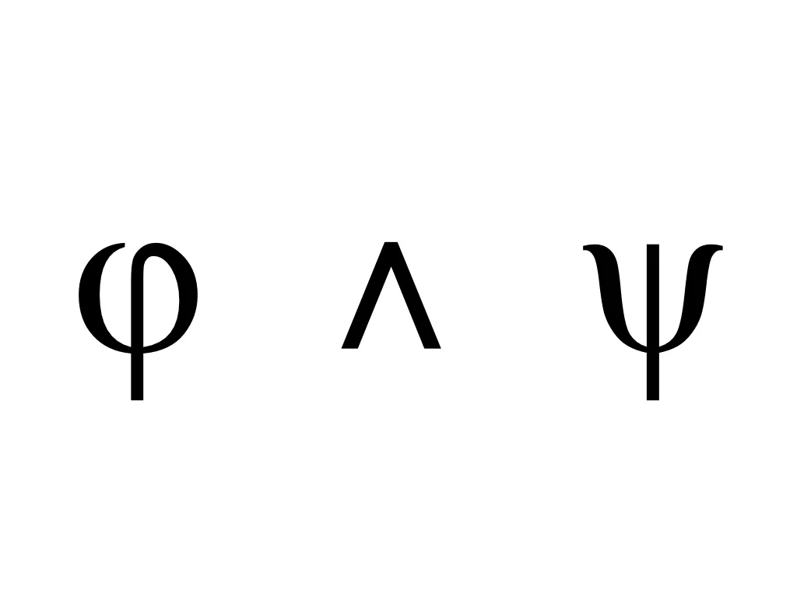

看完[上一集](/2017/07/27/logic-1/)，現在你應該對命題邏輯有大略的印象了，不過命題邏輯絕對不只有這樣而已！

除了「如果 (\_\_)，那麼 (\_\_)」的結構（還記得他的符號就是「→」），我們很合理也有其他不是這樣結構的想法，為了要表達其他的句子，命題邏輯裡面也有其他幾種結構。結合這些結構，我們可以做出很複雜的句子，例如：「如果要考試而且沒有唸書，那麼就會被罵或者被當」。

那除此之外，還有哪些結構？這個問題，就是這篇文章的核心。在這篇裡，我們會正式來看命題邏輯的語法。先別擔心這個是什麼東西，請容我娓娓道來。

## 運算元

我先介紹剛剛才提到，命題邏輯剩下來的結構。首先，正確來講，這些結構在命題邏輯裡面叫作「運算元（operator）」（或是「連結詞（connective）」）。而既然現在大家都已經知道命題邏輯是作用在符號上的，我們就直接用他們的符號來看了。

命題邏輯的運算元有除了「→」以外，還有「¬」、「∧」、「∨」和「↔」。我承認他們長得有點怪。

先複習一下，「→」的意思是「蘊含（material implication）」。「若 φ 則 ψ」寫作「φ → ψ」。

「¬」的意思是「非（negation）」。如果把「唸書」用 φ 替代，「沒有唸書」就是「¬φ」。跟「→」不同的是，他前面沒有放東西，只有後面放一個。只接受一個東西的運算元，叫做「一元（unary）」的運算元。所以你大概也猜到「→」就是一個「二元（binary）」的運算元了。

「∧」的意思是「而且（conjunction）」，他是二元運算元。把「唸書」用 φ 替代，「要考試」用 ψ 取代，「要考試而且沒有唸書」就是「ψ ∧ ¬φ」。

「∨」的意思是「或者（disjunction）」，他也是二元運算元。一樣把「唸書」用 φ 替代，「要考試」用 ψ 取代，「要考試而且沒有唸書」就是「ψ ∨ ¬φ」。

「↔」唸起來比較潮一點，叫作「等價（material equivalence）」，也是個二元運算元。不過跟前幾個比較不一樣的是，像是「→」在中文裡面通常用「如果 (\_\_)，那麼 (\_\_)」或「若 (\_\_)，則 (\_\_)」表達，而「↔」通常唸作「(\_\_) 若且唯若 (\_\_)」（if and only if）。按照上面的取代方式，「要考試若且唯若要唸書」，就是「ψ ↔ φ」。光是看「若且唯若」這四個字，你可能還是搞不太清楚，這個符號的「意義」到底是什麼。這是因為我目前提到的都只是「語法」；不用擔心，之後會講到他們的「語意」，也就是上一篇稍微提過的「真假值」。

有了這些知識後，我們終於可以回過頭來，用命題邏輯的符號，寫出在一開始我承諾大家的複雜句子「如果要考試而且沒有唸書，那麼就會被罵或者被當」。

1. 一開始，發現他「如果 (\_\_)，那麼 (\_\_)」的結構，馬上可以切成「要考試而且沒有唸書」→「會被罵或者被當」。
2. 再來先研究前半部的「要考試而且沒有唸書」，發現他有個「而且」的結構，馬上改寫成「要考試」∧「沒有唸書」。
3. 至於看到後半部的「會被罵或者被當」，發現他有個「或者」的結構，就能改寫成「會被罵」∨「被當」。
4. 「要考試」、「沒有唸書」、「會被罵」、「被當」都不能再切分了，因此我們拿符號來代換，在這邊我用英文字母 P、Q、R、S。
5. 「如果要考試而且沒有唸書，那麼就會被罵或者被當」完整翻譯的結果就是「 P ∧ Q → R ∨ S」。

## 語法

在一個語言裡面，符號結合的規則就叫做他的語法（syntax）。我們學英文的時候，討論的「文法」規則，像是「句子至少要有主詞和動詞」，就是英文的語法之一。

當我們要有條理、有系統的，用符號清楚表達一系列事物時，我們就需要語法。數學算術也有他的語法，例如傳統上，加法符號「+」是寫在兩個數字之間，像是「1 + 2」而不是「＋ 1 2」或「1 2 +」，這也是算數的語法之一。我們通常用語法來規定那些合理的句子，所以有了語法，我們就可以知道哪些是「合法（well-fromed）」的句子，例如「+ 1 -」就很明顯不是一個合法的數學式，因為他違反了語法。

所以啦，命題邏輯是一個符號系統，那他自然也就有他的語法。命題邏輯的語法規則是，一個合法邏輯式（formula）有幾種可能的形式：

1. <strong>他是一個基本的原子式（atom）。原子式通常用符號 P、Q、R … 代表。這些原子式是命題邏輯的基本單位，不能再被切分。所有的原子式都合法。</strong>
2. <strong>他是用 ¬ 運算元，加上一個合法邏輯式 φ 做出來的複合式（compound）。而 φ 可能是原子式，也可能是複合式。組合的方式是 「¬φ」。</strong>
3. <strong>他是用 ∧ 運算元，加上兩個合法邏輯式 φ 和 ψ 做出來的複合式。而 φ 和 ψ 可能是原子式，也可能是複合式。組合的方式是「φ ∧ ψ」。</strong>
4. <strong>他是用 ∨ 運算元，加上兩個合法邏輯式 φ 和 ψ 做出來的複合式。而 φ 和 ψ 可能是原子式，也可能是複合式。組合的方式是「φ ∨ ψ」。</strong>
5. <strong>他是用 → 運算元，加上兩個合法邏輯式 φ 和 ψ 做出來的複合式。而 φ 和 ψ 可能是原子式，也可能是複合式。組合的方式是「φ → ψ」。</strong>
6. <strong>他是用 ↔ 運算元，加上兩個合法邏輯式 φ 和 ψ 做出來的複合式。而 φ 和 ψ 可能是原子式，也可能是複合式。組合的方式是「φ ↔ ψ」。</strong>

而其他的組合方式通通都不合法。

你可能發現後面幾項有點冗長，但把他們清楚定義出來，會讓我們之後要做的事情輕鬆得多。另外，你可能發現到，複合式的定義是遞歸式（recursive）的定義；如果你是資工或是數學背景，這絕對不陌生，但你大概也不需要讀這篇文章了。所以要是那個部分你看不太懂，可以參考下一個小節的解釋。

另外，就如同算術裡面，「1 + 2 × 3 × (4 − 5) ÷ 6 + 7」這個式子中的運算元符號有先後順序（precedence）（或是「連結力（binding power）」），如果把順序明寫出來，這個式子會是「((1 + (((2 × 3) × (4 − 5)) ÷ 6)) + 7)」，因為括號最大，再來乘除先於加減，而同樣順序的則是越往左越先。

我們的命題邏輯裡面也有同樣的先後順序，順序最大的是一樣是括號，再來是 ¬，之後是 ∧ 和 ∨，最後則是 → 和 ↔。 因此「P ∧ Q → R ∨ S」代表「(P ∧ Q) → (R ∨ S)」。

## 遞歸

遞歸（recursion）是一種讓你可以用很簡潔的語言，去描述可能龐大（甚至無限）的東西的方法。想像這個情況：今天有一排人在排隊買票，而我要描述什麼叫做「一排人」，並且能夠有結構的去做一些運算（例如算數）。

一個很直覺的做法是，我可以用自然數 1, 2, 3, 4 … 來描述這排人。但很快地，你會發現這樣我們其實沒辦法區分排隊前後的順序，頂多描述這排人的「人數」而已。

再換一個方法，要是用高中學到的「序列（sequence）」呢？例如一排人可以用 [小明, 小華, 小美] 表示。這看起來不錯，但我們能夠寫出他的「語法」嗎？

假設我們說一排人的表示是 [x, y, z]，立刻遇到的問題就是要是這排人的人數不是三個怎麼辦？畢竟排隊的人數很自然可以是 0≤人數<∞，對吧？你可能會說，那就寫成 [x, …]，但這樣寫其實是不太 ok 的，因為他不夠準確。

因此，對於一排人的隊伍，比較漂亮的定義會是：

<ol type="A">
<li><strong>[] 是一個隊伍。我們用 [] 這個符號來代表空的隊伍，也就是零個人的狀況。</strong></li>
<li><strong>如果 L 是一個隊伍而 X 是一個人，那麼 X | L 也是一個隊伍。我們用 X | L 代表在 X | L 這個隊伍中，X 排第一個，在他之後就是 L 原本的那些人。</strong></li>
</ol>

為了方便起見，我們將用 [X] 代替 X | []，並且用 [X, Y] 代替 X | [Y]，以此類推；也就是 X | L = [X, L的內容]。

用這樣的語法定義，我們可以拆解一下剛剛的隊伍「[小明, 小華, 小美]」的結構，來看看他到底是不是合法的。注意到在每一步拆解過程中，我們都遵守語法規則，從結果往回看：

1. 如果要讓「[小明, 小華, 小美]」是一個隊伍，依照規則 B，「小明」必須是一個人，「[小華, 小美]」必須是一個隊伍。
2. 如果要讓「[小華, 小美]」是一個隊伍，依照規則 B，「小華」必須是一個人，「[小美]」必須是一個隊伍。
3. 如果要讓「[小美]」是一個隊伍，依照規則 B，「小美」必須是一個人，「[]」必須是一個隊伍。

規則都走完了，檢查成功，發現都沒問題。另一方面，我們可以回推回去看：

1. 「[]」是一個隊伍，「小美」確實是一個人，因此「[小美]」是一個隊伍。
2. 「[小美]」是一個隊伍，「小華」確實是一個人，因此「[小華, 小美]」是一個隊伍。
3. 「[小華, 小美]」是一個隊伍，「小明」確實是一個人，因此「[小明, 小華, 小美]」是一個隊伍。

由這些步驟，我們確認了 [小明, 小華, 小美] 是一個隊伍。

這個語法能夠定義任何長度（0≤人數<∞）的隊伍，因為給定任意排序方法，我們都可以從規則 A 得到 []，並且持續用規則 B，往前排直到排好排滿。

在規則 B 中，我們定義一個新的隊伍的方式，是建構在假設已經有了一個隊伍，而這就是遞歸！如果新的東西是建構在舊的東西之上，我們勢必要有個最初的第一個立足點，而這就是為什麼還要設定規則 A 作為基礎（basis）！

## 回到原點

有了語法規則，我們可以來檢查剛剛用「P ∧ Q → R ∨ S」來代表的「如果要考試而且沒有唸書，那麼就會被罵或者被當」是否合乎文法了。第一步，先把他的順序明寫出來「(P ∧ Q) → (R ∨ S)」。

1. 如果要讓「(P ∧ Q) → (R ∨ S)」是合法的，依照「→」的規則，「P ∧ Q」和「R ∨ S」都必須是合法的。
2. 如果要讓「P ∧ Q」是合法的，依照「∧」的規則，「P」和「Q」都必須是合法的。
3. 依照原子式的規則，「P」是合法的。
4. 依照原子式的規則，「Q」是合法的。
5. 如果要讓「R ∨ S」是合法的，依照「∨」的規則，「R」和「S」都必須是合法的。
6. 依照原子式的規則，「R」是合法的。
7. 依照原子式的規則，「S」是合法的。

規則都走到底了，都檢查成功，代表「P ∧ Q → R ∨ S」確實是合法的！恭喜你，你現在已經學會命題邏輯的語法了！

## 下回預告

下次，我們將會解釋這些邏輯式的「語意」，對命題邏輯來說，那就是他們的真假值，上一篇裡面解釋了 → 的真假值，下次將會把其他運算元的真假值也都討論一下！而知道了語意之後，對於第一篇的範例問題「如果今天地板是濕的，代表剛剛下過雨嗎？」我們就能有新的觀點來理解它！
