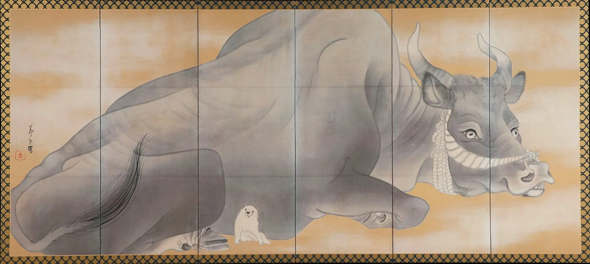

It was the morning of December 5th, 2018. I was sitting in the very back of a dimly lit classroom, chuckling at silly memes while browsing Reddit on my iPhone 6 Plus. The projector traced a grey cone of dust onto a dilapidated screen with some ill-calibrated color settings.

It was a course about the art history of Japan that I took only for the credits. The lecturer was mumbling about something. I didn’t listen or care. “It’s just another random piece of drawing probably”, I thought to myself, and then, I looked up. I noticed a tiny dog sitting conspicuously before the backdrop of a humongous black cow. A masterpiece.

I was in absolute awe. I started to listen to what the instructor was saying. He was saying something about how the shapes and curves of the black cow make it so great but then he added that this artist, for some reason, had had a peculiar penchant for putting goofy little creatures within an otherwise serious and somber artwork.

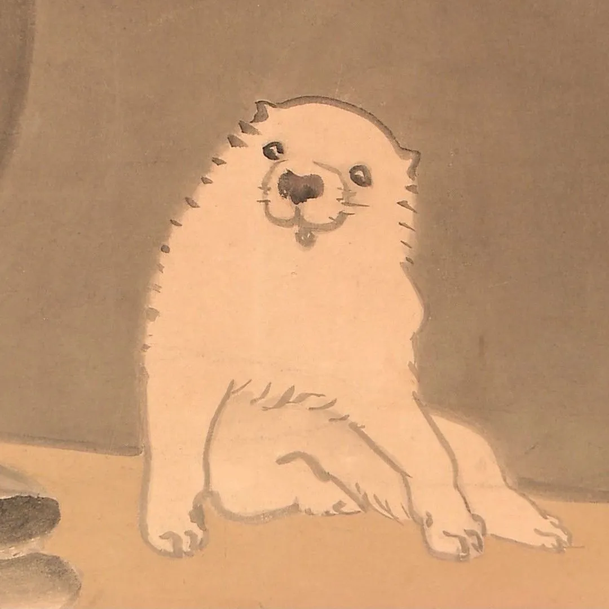

That white little dog drew all my attention. It was as if I saw the cosmos formed and galaxies destroyed in that stupid dog. It was all. I couldn’t take my eyes off it. It looked so ridiculous and eerily misplaced, yet it fitted perfectly right there. It’s almost ludicrous how well it’s composed.

“Perfection”, I gasped. I couldn’t move. All I could do was feast my eyes on the masterpiece. It was the best thing I’ve ever seen.

---

That is the story of how I was shown to [Hakuzō Kokugyū-zu Byōbu](https://commons.wikimedia.org/wiki/File:Hakuz%C5%8D_kokugy%C5%AB-zu_by%C5%8Dbu_by_Nagasawa_Rosetsu_(Part_of_the_bull).jpg) (白象黒牛図屏風), literally Byobu with White Elephant and Black Cow, which is now stored in [Sendai City Museum](https://global.canon/ja/tsuzuri/works/27.html) (仙台市博物館) in Japan. It was painted in the 18th century, during the Edo period, by the artist [Nagasawa Rosetsu](https://en.wikipedia.org/wiki/Nagasawa_Rosetsu) (長沢芦雪), one of the “[Three Eccentrics](https://www.metmuseum.org/art/collection/search/39658)” labeled so for their [flamboyant social lives](https://www.metmuseum.org/art/collection/search/40459). He was best known for incorporating the Western Realism style into his own works.

To write this article, I painstakingly went through and excavated years of Facebook Messenger messages and dug out the one message that I had sent to my friend immediately after seeing the dog during the class.

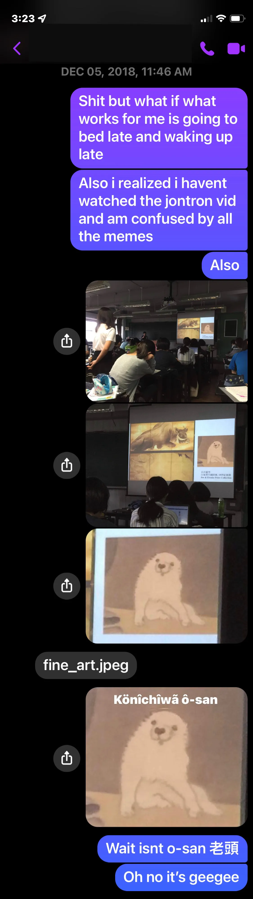

It is pretty cringe. I have no idea why I did that edit, but it is what it is.

---

Couple weeks later, I was Googling reviews on the animes I was watching at the time, and I noticed a Discord invite which would ultimately lead me down a rabbit hole of a new circle of social life. On the evening of 17th December, I joined a then Reddit-affiliated fan-made Discord server for the anime [Seishun Buta Yarou](https://en.wikipedia.org/wiki/Rascal_Does_Not_Dream_of_Bunny_Girl_Senpai) (青春ブタ野郎シリーズ), also known as Rascal Does Not Dream of Bunny Girl Senpai, which was one of the most popular shows in that cour.

Although I had registered my Discord account years prior in 2016, I had barely used it for anything, which would explain the lack of a profile picture. I browsed my album and, to no one’s surprise, that little white dog caught my attention again. So I went online and cropped the best quality version of that image and set it as my profile picture. I was very satisfied with it. Ever since then, the dog has been my go-to image whenever I need an avatar picture.

After that, over the years, I have had several variations of that picture. There was one with a Christmas hat on that I paid Marv#5144 from the Discord server to make in the holiday spirit, there was one with red glowing eyes that I myself made just for laughs, and then there were those with certain flags or filters layered atop it. The dog has been a versatile base.

<figure style="display: flex; flex-direction: column; align-items: center;">
  

    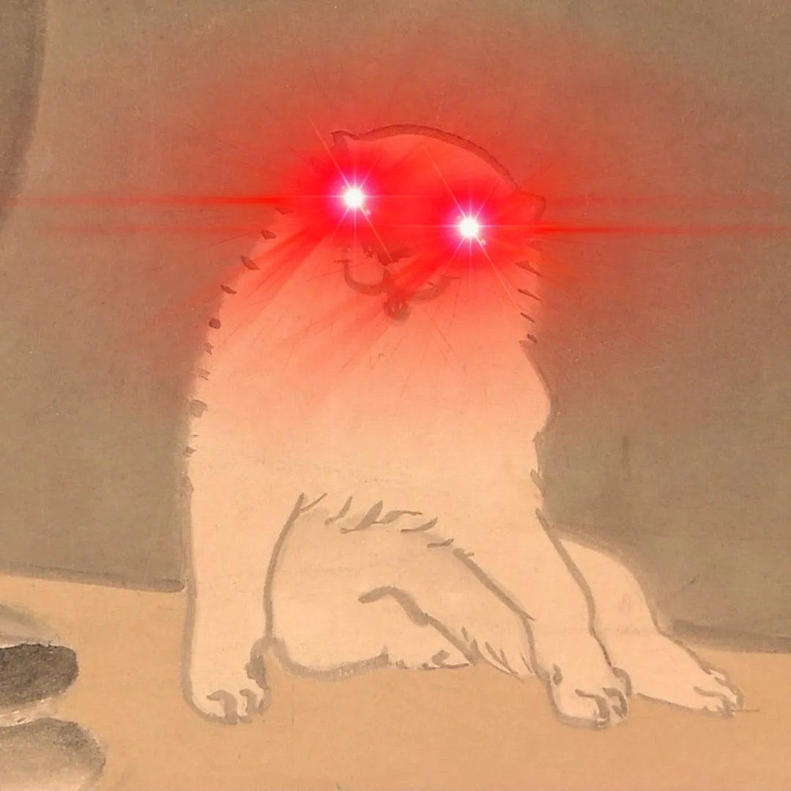
    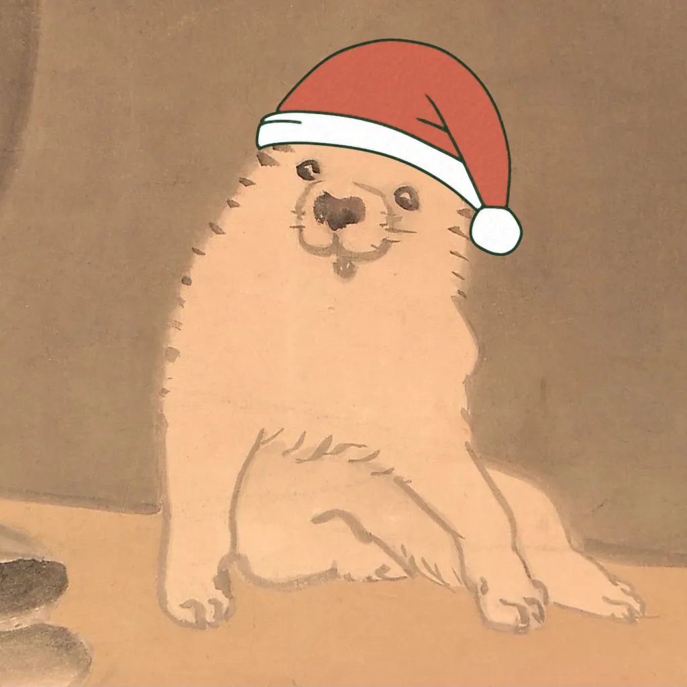
  

</figure>

Since my discovery of that hidden gem, it has enjoyed some modest amount of fame, but mainly only within the Japanese cyberspace. In addition to the custom-made artist craftworks, there have also been commercial products released over the years.

There is a [pen pouch](https://note.com/f_museumbu/n/n232b046a14f6):

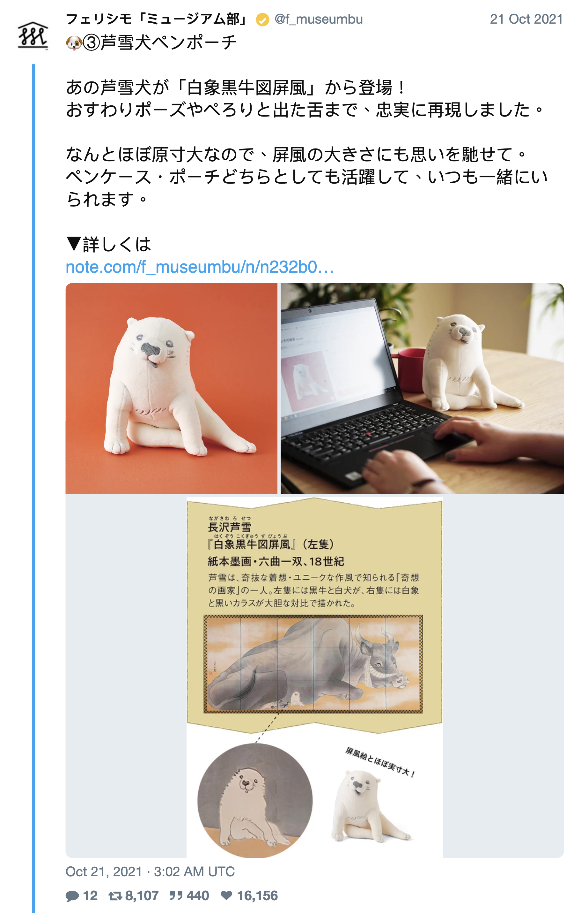

And there is this set of [mini-figures](https://news.livedoor.com/article/detail/19031148/):

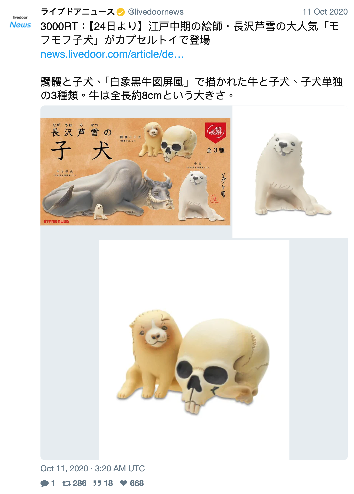

I haven’t had the chance yet, but I will most definitely jump at the first opportunity to get my hands on these forthwith.

---

Thus concludes the origin story of how I got my profile picture, whence many stories have ensued, where there is no doubt going to be more. I fondly look forward to them.

---

It was September 26th, 2022. My cat somehow recreated the art.

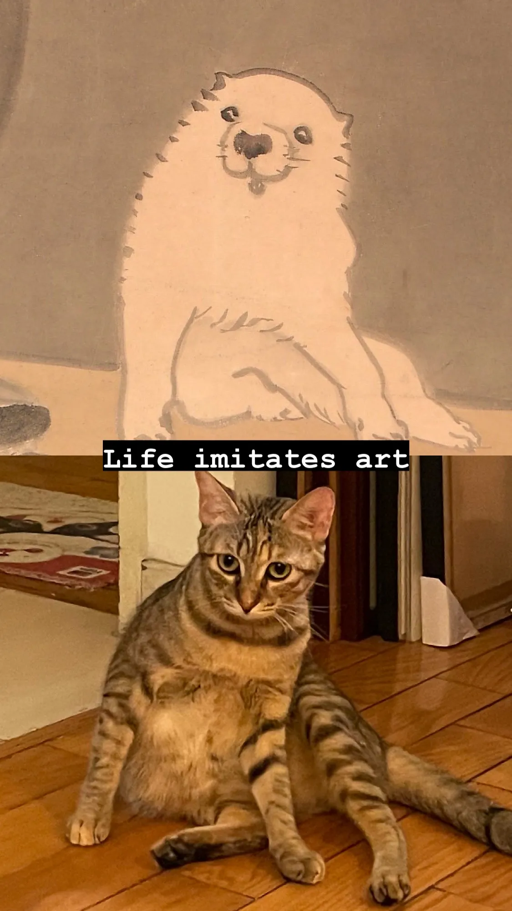

---

It was October 13th, 2022. I acquired the full set of gacha figurines from Taobao, and they are just perfect.

---

It was December 14th, 2022, days before my 27th birthday. The hottest anime at the time was Chainsaw Man and I loved it. I decided to give myself as a gift a Pochita drawn with the pose of the dog. I went on Twitter and found the talented [@levinky_art](http://twitter.com/levinky_art) and commissioned it made. What he delivered is amazing. I used this as my pfp everywhere.

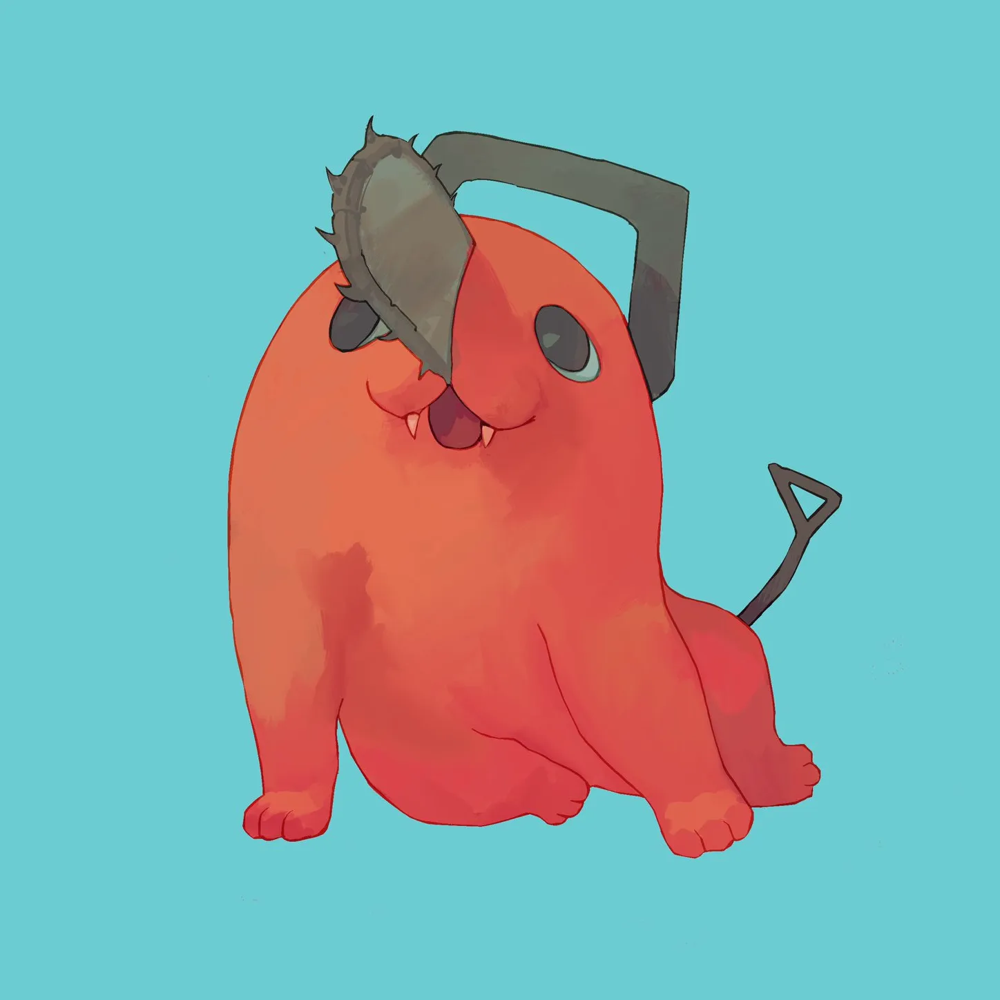

---

It was January 16th, 2023. I received the package of the long-awaited pouch plush. Awww, just look at it! Just so damn cute! The quality of the plush is pretty nice to the skin too. Now I just have to find somewhere to place it.

From the back, it kind of looks like you’re disemboweling him. Cute, nonetheless.

It comes with a nice sheet of paper that gives a little more details about this piece. I ran it through Google translate and screenshotted the results.

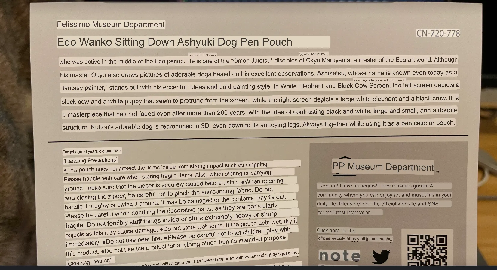

---

It was March 3rd, 2023, two days after Pikamee, my favorite VTuber, announced that she would be retiring at the end of the month. I was saddened but wanted to have some art of her made before she left, so I went back to the reliable [@levinky_art](http://twitter.com/levinky_art) and commissioned a Pikamee in her kaiju suit sitting in the pose of the dog. A couple of days later, he delivered another great piece of art. I am using it as my pfp now.

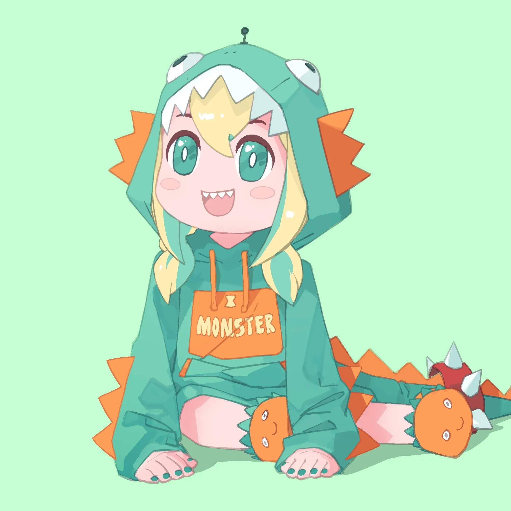

---

It was October 7th, 2023. I decided to get myself another commission for my 28th birthday as a gift. I decided to use my favorite image, [Asuka in 2019 Radio Eva outfit](https://twitter.com/RADIOEVA_SHOP/status/1197767590317195265), as the base. I again went to [@levinky_art](http://twitter.com/levinky_art) for it, and he delivered an amazing job. This is now my current profile pic and I can see myself using it for a very long time.

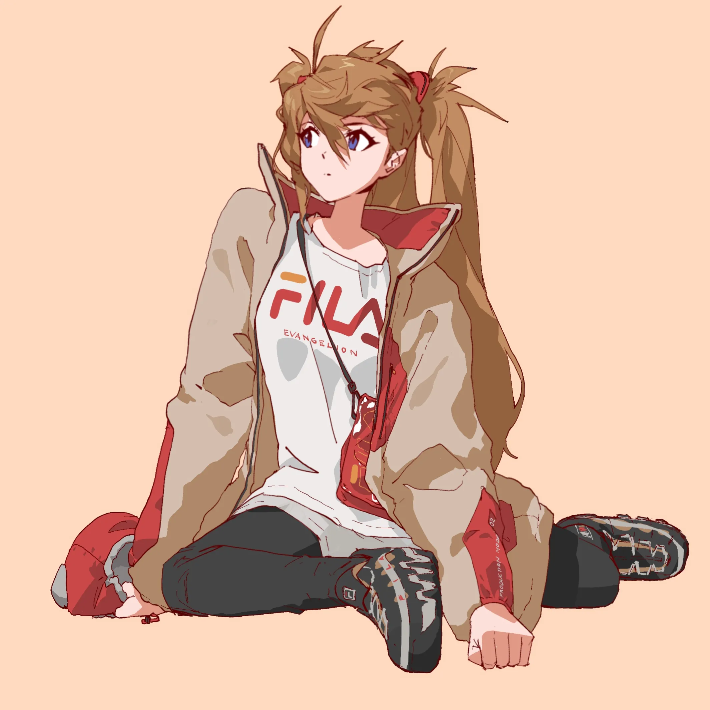

---

It was October 1st, 2024. I decided to make the pfp change an annual tradition. I commissioned another pfp for my 29th birthday. I chose my favorite Arknights character, [Nian](https://prts.wiki/w/%E5%B9%B4), for the pic. This time I went to [@mayu221354](https://twitter.com/mayu221354) because I was really impressed by his art of Dusk earlier. He delivered an amazing job. This will be my 2025 pfp.

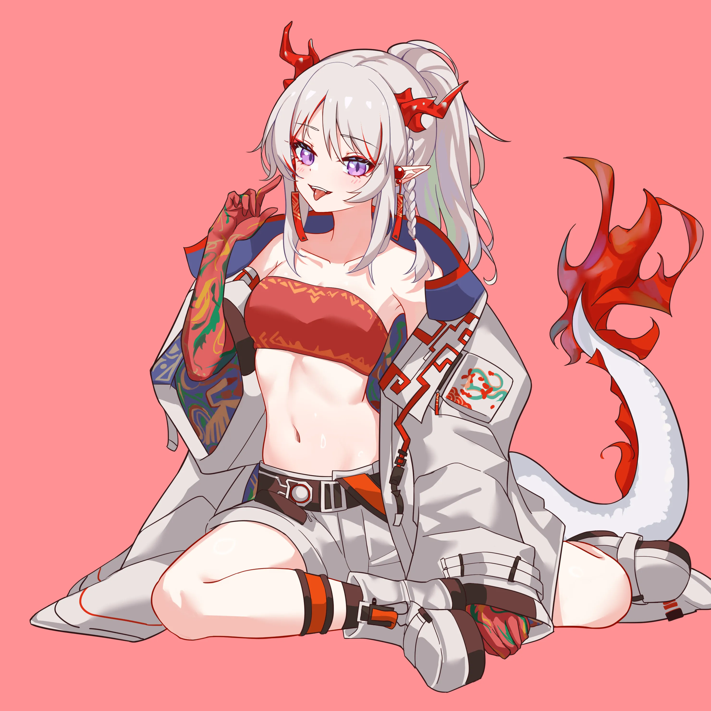

Soon after that, at the start of December 2024, [@mayu221354](http://twitter.com/mayu221354) announced that he would be increasing his pricing for commissions. So, I decided to commission another piece from him. This time, I chose [Schwarz](https://prts.wiki/w/%E9%BB%91), who is also from Arknights. I decided to leave Nian on as pfp for the upper half of 2025, and use Schwarz for the lower half.

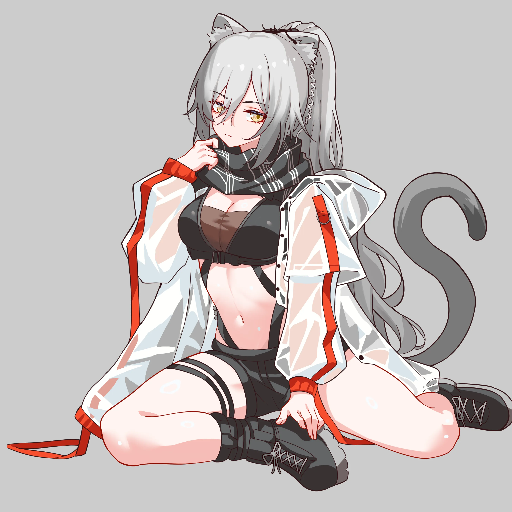
