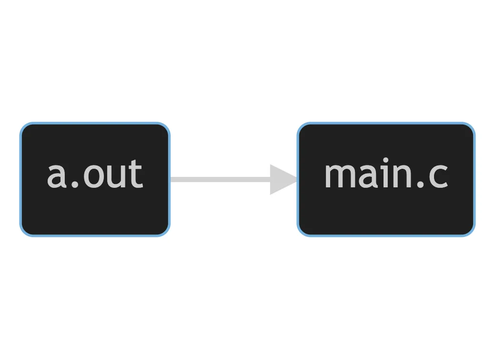
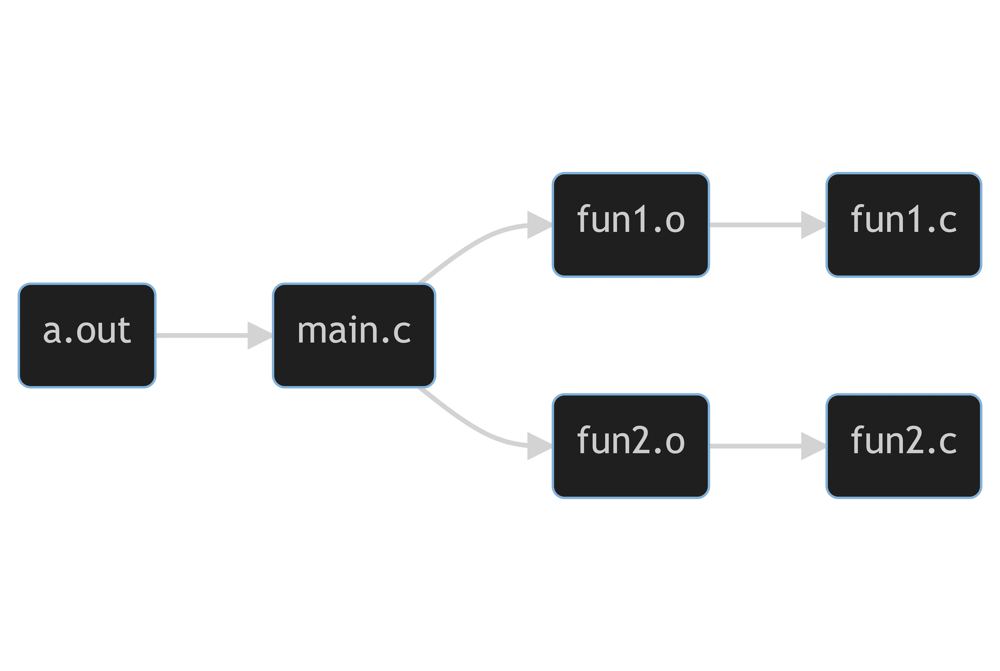

<figure>
  
  <figcaption>Source: <a href="https://www.pixiv.net/en/artworks/98592557">geralt7</a></figcaption>
</figure>

Imagine yourself repeatedly debugging a program, convinced that you have already solved the problem, but the damned bug persists nonetheless, and only after much needless investigation, do you realize that it was simply because you forget to re-compile the program.

That is exactly the kind of situation that Stuart Feldman, the creator of Make, [originally intended](http://www.catb.org/~esr/writings/taoup/html/ch15s04.html) to deal with more than two score years ago. The problem is that, because the executables derive from the sources, there is a certain relation between them; the former must be re-compiled if the latter was changed. This relation decrees the order in which we operate. We may violate this order when we lose track of things and forget when to update what.

## Dependency

Consider a project of this structure:

```text
.
├── Makefile
├── main.c
└── a.out
```

For this example, if `a.out` is the executable compiled from `main.c` , we say that `a.out` *depends* on `main.c`. This [*dependency*](https://www.gnu.org/software/make/manual/html_node/Prerequisite-Types.html#Prerequisite-Types) dictates that when `main.c` is updated, so should `a.out`. We can express this dependency graphically:



To assert this property in a Makefile, we use another form of [rules](https://www.gnu.org/software/make/manual/html_node/Multiple-Rules.html#Multiple-Rules):

```makefile
a.out: main.c
```

It says that `main.c` is a *prerequisite* of the target `a.out`. Taking into account what we had in the [last post](/2022/09/06/makefile-1), our Makefile would now look like this:

```makefile
a.out: main.c
a.out:
	gcc -std=c11 -Wall -Og -g3 -D LOGGING main.c -o a.out
```

Note that Make is declarative in this respect, meaning you can either write the prerequisites before or after the recipes and they would have the same semantics. We can also combine these two parts:

```makefile
a.out: main.c
	gcc -std=c11 -Wall -Og -g3 -D LOGGING main.c -o a.out
```

When we run `make a.out`, Make examines the timestamp of `main.c` and `a.out`, and if `main.c` has a newer timestamp than `a.out`, it runs its recipe. Note that, if `a.out` does not yet exist, then it always runs.

## Dependency Graph

Now consider an example such as this, where `fun1.o` and `fun2.o` are, respectively, the executables of `fun1.c` and `fun2.c`, and `main.c` uses functions from both of them:

```text
.
├── Makefile
├── a.out
├── fun1.c
├── fun1.o
├── fun2.c
├── fun2.o
└── main.c
```

Here we have multiple dependencies on our hands. There are: `fun1.o` depends on `fun1.c`, `fun2.o` depends on `fun2.c`, `a.out` depends on `main.c`, and `main.c` depends on `fun1.o` and `fun2.o`; *transitively*, in turn, `main.c`, and thus `a.out`, also depends on `fun1.c` and `fun2.c`. Expressed in a Makefile, these dependencies would be:

```makefile
fun1.o: fun1.c
fun2.o: fun2.c
a.out: main.c
main.c: fun1.o
main.c: fun2.o
main.c: fun1.c
main.c: fun2.c
a.out: fun1.c
a.out: fun2.c
```

We can group multiple dependencies together if they share the same target:

```makefile
fun1.o: fun1.c
fun2.o: fun2.c
main.c: fun1.o fun2.o fun1.c fun2.c
a.out: main.c fun1.c fun2.c
```

This is still pretty cumbersome. With the nature of transitivity of dependency, things can get very ugly very fast. Luckily, Make understands this transitivity and can reason with it. Enter [*dependency graph*](https://www.gnu.org/software/make/manual/html_node/Reading-Makefiles.html#Reading-Makefiles).

A dependency graph is a compact representation of all the dependency information collected in a [transitively reduced](https://en.wikipedia.org/wiki/Transitive_reduction) graph. Here is the dependency graph of the above example, visualized:



Since Make constructs the dependency graph internally, we can further simplify our Makefile to:

```makefile
fun1.o: fun1.c
fun2.o: fun2.c
main.c: fun1.o fun2.o
a.out: main.c
```

Notice here we can merge the last two lines by replacing the prerequisite `main.c` in the last line with `fun1.o fun2.o` because `main.c` isn’t a target we’re concerned with. Putting everything together, we get this Makefile:

```makefile
fun1.o: fun1.c
	gcc -c -std=c11 -Wall -Og -g3 -D LOGGING fun1.c -o fun1.o
fun2.o: fun2.c
	gcc -c -std=c11 -Wall -Og -g3 -D LOGGING fun2.c -o fun2.o
a.out: fun1.o fun2.o
	gcc -std=c11 -Wall -Og -g3 -D LOGGING fun1.o fun2.o main.c -o a.out
```

And it runs as expected: Make examines the Makefiles and constructs the dependency graph; next, it traverses the graph from the top and checks the timestamps of files, and if it finds inconsistent dependencies, it executes the recipes, starting from the bottom and cascading upwards. When all three targets do not exist, we can see the chain reaction:

```console
$ make a.out
gcc -c -std=c11 -Wall -Og -g3 -D LOGGING fun1.c -o fun1.o
gcc -c -std=c11 -Wall -Og -g3 -D LOGGING fun2.c -o fun2.o
gcc -std=c11 -Wall -Og -g3 -D LOGGING fun1.o fun2.o main.c -o a.out
```

Compare this with the below, where we update one of the targets first:

```console
$ make fun1.o
gcc -c -std=c11 -Wall -Og -g3 -D LOGGING fun1.c -o fun1.o
$ make a.out
gcc -c -std=c11 -Wall -Og -g3 -D LOGGING fun2.c -o fun2.o
gcc -std=c11 -Wall -Og -g3 -D LOGGING fun1.o fun2.o main.c -o a.out
```

You can now see the potential time saved with Make by always doing minimal work and updating only what’s needed. (This behavior can be changed so that it does [more](https://www.gnu.org/software/make/manual/html_node/Options-Summary.html#Options-Summary) or [less](https://www.gnu.org/software/make/manual/html_node/Avoiding-Compilation.html#Avoiding-Compilation) and it will be covered later.)

---

Sometimes, if we’re not careful, we may inadvertently introduce *circular dependency*; that is, there’s something that depends on itself, forming a loop in the dependency graph. This circularity could get us in [big trouble](https://en.wikipedia.org/wiki/Dining_philosophers_problem), deadlocking the whole process.

Recall the execution order of rules when dealing with dependency. With circular dependency, the backtracking could go on forever and get us stuck in an infinite loop of re-making prerequisites. Fortunately, this is not the case. Make solves this issue by [marking](https://github.com/mirror/make/blob/3.81/remake.c#L45) what is being updated as it walks back, and, if it encounters something already marked, it [drops that dependency](https://www.gnu.org/software/make/manual/html_node/Error-Messages.html#Error-Messages).

```makefile
a: b
	echo a
b: a
	echo b
```

With this Makefile, when there is neither `a` nor `b`, if we try to update `a`, Make will stop backtracking the second time it sees `a`, as shown below by running Make with [option](https://www.gnu.org/software/make/manual/html_node/Options-Summary.html#Options-Summary) `-d` , which instructs Make to print steps taken in detail while it goes: (irrelevant messages omitted)

<pre><code class="language-console">$ make -d a
Updating goal targets....
Considering target file `a'.
 File `a' does not exist.
  Considering target file `b'.
   File `b' does not exist.
<strong>make: Circular b &lt;- a dependency dropped.</strong>
   Finished prerequisites of target file `b'.
  Must remake target `b'.
echo b
b
  Successfully remade target file `b'.
 Finished prerequisites of target file `a'.
Must remake target `a'.
echo a
a
Successfully remade target file `a'.</code></pre>

Another useful option when debugging is `-n` , the “dry run” option, which tells Make to print what it would have done but don’t actually do anything.


