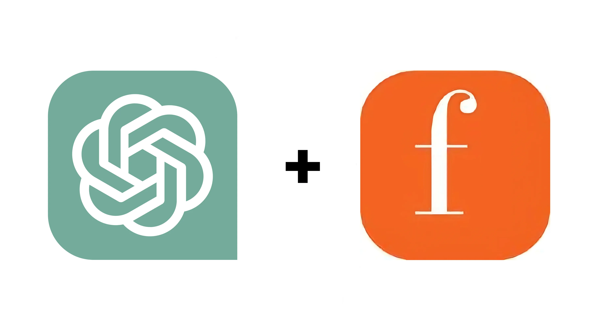

I’ve been using ChatGPT for the past few months and I love it. It’s really been life-changing how quickly you can study a new topic or consume a ton of information with it.

Many people have reported that it’s a pretty good programmer. However, as someone trained in formal methods, I wanted to know how reliable of a programmer it is too.

I came up with a straightforward idea: try to formally verify some programs it writes. Considering how these AI models are trained with data, I wanted ChatGPT to implement something common. Sorting naturally comes to mind.

However, with even the simplest of algorithms, program verification becomes magnitudes harder when loops are involved; you’d have to mingle with loop invariants and all that jazz. So general sorting algorithms that rely on loops are out of the question.

What about sorting algorithms that are not so general and are without loops? Sorting networks fit the bill. [Sorting networks](https://en.wikipedia.org/wiki/Sorting_network) are sorting functions that sort a fixed-length array. They’re built with one simple construct: comparator, basically an if-then-else swap function.

Take this sorting network from Wikipedia for example:

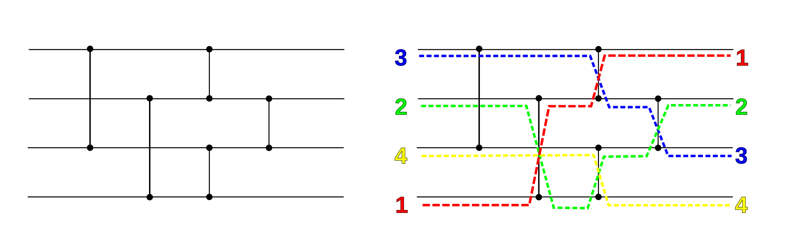

This is a 4-input sorting network that uses 5 comparators. Taking the top as index `0`, they are linked `comparator(0,2)` , `comparator(1,3)` , `comparator(0,1)`, `comparator(2,3)`, and `comparator(1,2)`. The right side of the image illustrates it sorts an example input array `[3,2,4,1]`.

Let’s ask ChatGPT to implement a 4-input sorting network. ChatGPT also just released a new feature that lets you [share conversations](https://www.pcmag.com/news/you-can-now-share-links-to-your-ridiculous-chatgpt-conversations) so I can take advantage of this right away: [conversation link](https://chat.openai.com/share/22f1a2a9-b461-473b-908a-ce09522de362). This attempt at implementing a 4-input sorting network results in this:

```c
#include <stdio.h>

void compareAndSwap(int *arr, int i, int j) {
    if (arr[i] > arr[j]) {
        int temp = arr[i];
        arr[i] = arr[j];
        arr[j] = temp;
    }
}

void fourInputSortingNetwork(int *arr) {
    compareAndSwap(arr, 0, 1); // Compare and swap elements at indices 0 and 1
    compareAndSwap(arr, 2, 3); // Compare and swap elements at indices 2 and 3
    compareAndSwap(arr, 0, 2); // Compare and swap elements at indices 0 and 2
    compareAndSwap(arr, 1, 3); // Compare and swap elements at indices 1 and 3
    compareAndSwap(arr, 1, 2); // Compare and swap elements at indices 1 and 2
}

int main() {
    int arr[] = {4, 2, 3, 1};
    int size = sizeof(arr) / sizeof(arr[0]);

    printf("Before sorting: ");
    for (int i = 0; i < size; i++) {
        printf("%d ", arr[i]);
    }

    fourInputSortingNetwork(arr);

    printf("\nAfter sorting: ");
    for (int i = 0; i < size; i++) {
        printf("%d ", arr[i]);
    }

    return 0;
}
```

Let’s compile and run and test it.

```
$ gcc example.c -o a.o; ./a.o
Before sorting: 4 2 3 1
After sorting: 1 2 3 4
```

Looks pretty good, isn’t it? But we’re not here to admire it succeeding on a simple test case. We want it formally verify it.

To this end, I will use [Frama-C](https://frama-c.com/), an industrial-strength C code analyzer. The first step of verification is the specification. Frama-C uses a specification language called ANSI/ISO C Specification Langage (ACSL). It’s quite easy to get started with it. You’ll see in a second.

I Googled around and found [this example](https://mathsanew.com/programs/sorting_network.html) of using Frama-C to verify a 5-input sorting network. It’s easy to adapt their code to fit our needs.

We’re only concerned about `compareAndSwap` and `fourInputSortingNetwork`. For the specification of `compareAndSwap`, it’s this:

```c
/*@ requires \valid(arr+i) && \valid(arr+j);
    assigns arr[i], arr[j];
    ensures arr[i] <= arr[j];
    ensures (arr[i] == \old(arr[i]) && arr[j] == \old(arr[j])) ||
            (arr[i] == \old(arr[j]) && arr[j] == \old(arr[i]));
 */
void compareAndSwap(int *arr, int i, int j) {
    if (arr[i] > arr[j]) {
        int temp = arr[i];
        arr[i] = arr[j];
        arr[j] = temp;
    }
}
```

The `/*@ ... */` comment block contains the ACSL specification. The first line says that, as a pre-condition, the input pointers `arr+i` and `arr+j` must be [valid](https://stackoverflow.com/questions/17202570/c-is-it-possible-to-determine-whether-a-pointer-points-to-a-valid-object) pointers, i.e., safe to dereference. The second line says that the function `compareAndSwap` can, and can only, modify `arr[i]` and `arr[j]` . The third line says that, as a post-condition, after the function `compareAndSwap`, `arr[i]` must be less than or equal to `arr[j]`. The fourth line says that it must be the case that, as a post-condition, either `arr[i]` and `arr[j]` were swapped, or they are unchanged as before.

Let’s throw this at Frama-C and see what happens.

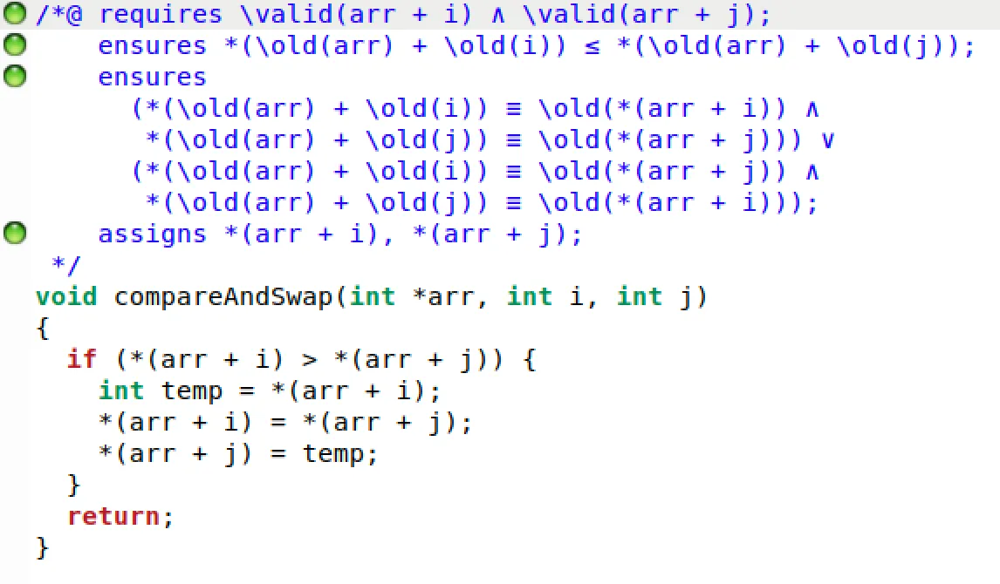

It checks out! The green bullets left to the ACSL lines indicate that those properties are proven to hold.

However, this is an unsurprising result, as this function is so simple that you can tell it’s correct just by looking at it. What really matters is the `fourInputSortingNetwork` part. For its properties, we have:

```c
/*@ requires \valid(arr + (0..3));
    assigns arr[0..3];
    ensures \forall integer i; 0 <= i <= 2 ==> arr[i] <= arr[i+1];
    ensures \forall integer i; 0 <= i <= 3 ==>
            (\exists integer j; 0 <= j <= 3 && arr[i] == \old(arr[j]));
    ensures \forall integer i; 0 <= i <= 3 ==>
            (\exists integer j; 0 <= j <= 3 && \old(arr[i]) == arr[j]);
 */
void fourInputSortingNetwork(int *arr) {
    compareAndSwap(arr, 0, 1); // Compare and swap elements at indices 0 and 1
    compareAndSwap(arr, 2, 3); // Compare and swap elements at indices 2 and 3
    compareAndSwap(arr, 0, 2); // Compare and swap elements at indices 0 and 2
    compareAndSwap(arr, 1, 3); // Compare and swap elements at indices 1 and 3
    compareAndSwap(arr, 1, 2); // Compare and swap elements at indices 1 and 2
}
```

The first ACSL line says that, as a pre-condition, all the pointers in the range of `arr` to `arr+3` must be valid. The second line says that the function can, and can only, modify the contents of `arr[0]` to `arr[3]`. The third line says that, as a post-condition, the array `arr` is sorted in a non-decreasing order. The fourth line and sixth line together say that, as a post-condition, the sorted array must contain, and only contain, the elements of the original array. In other words, they are permutations of each other.

Let’s see what Frama-C thinks:

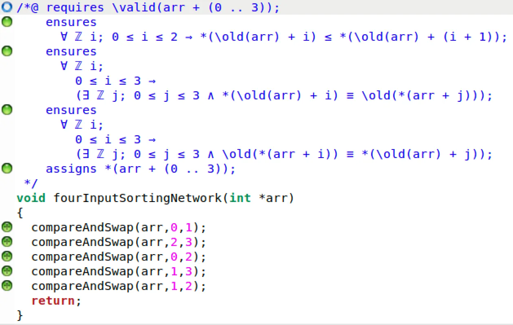

It also checks out! Now we are confident that this function is indeed a correct sorting network. ChatGPT did write a program that’s proved correct. Hooray!

---

Can we do better, though? Let’s see how ChatGPT fares when we ask it to write a 5-input sorting network ([conversation link](https://chat.openai.com/share/759cd929-2ff4-4e9a-9c4f-3a8837df82b9)). I also want to be more precise this time, so I prompted **“write a sorting network program of 5 element in c. use the “void SWAP(int a[], int i, int j)”** swap function.” and it wrote:

```c
#include <stdio.h>

void SWAP(int a[], int i, int j) {
    int temp = a[i];
    a[i] = a[j];
    a[j] = temp;
}

void sortNetwork(int a[]) {
    SWAP(a, 0, 1);
    SWAP(a, 3, 4);
    SWAP(a, 2, 4);
    SWAP(a, 2, 3);
    SWAP(a, 0, 3);
    SWAP(a, 0, 2);
    SWAP(a, 1, 4);
    SWAP(a, 1, 3);
    SWAP(a, 1, 2);
}

int main() {
    int arr[] = {5, 2, 4, 1, 3};
    int size = sizeof(arr) / sizeof(arr[0]);

    printf("Before sorting: ");
    for (int i = 0; i < size; i++) {
        printf("%d ", arr[i]);
    }

    sortNetwork(arr);

    printf("\nAfter sorting: ");
    for (int i = 0; i < size; i++) {
        printf("%d ", arr[i]);
    }

    return 0;
}
```

Uh-oh. We can immediately tell something’s gone awry, as it wrote an unconditional `swap` instead of a comparator. Let’s see if we can spot this bug with Frama-C though by feeding this to Frama-C:

```c
/*@ requires \valid(a+i) && \valid(a+j);
    assigns a[i], a[j];
    ensures a[i] <= a[j];
    ensures (a[i] == \old(a[i]) && a[j] == \old(a[j])) ||
            (a[i] == \old(a[j]) && a[j] == \old(a[i]));
 */
void SWAP(int a[], int i, int j) {
    int temp = a[i];
    a[i] = a[j];
    a[j] = temp;
}
```

Unsurprisingly, it fails. The orange bullets indicate that Frama-C cannot verify those properties; note that it only means that it cannot establish proofs, and it could be because it is indeed wrong or it could be because it timed out (the timeout here is set by default to 10 seconds).

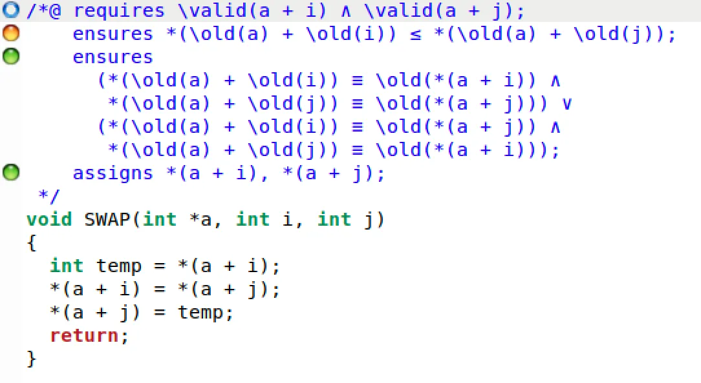

Although the verification result is unknown, we can tell there’s a bug. I gave the prompt **“There is a bug in the function SWAP. Keep the function signature but fix the bug”** and the result was:

```c
void SWAP(int a[], int i, int j) {
    if (i != j) {  // Only swap if the indices are different
        int temp = a[i];
        a[i] = a[j];
        a[j] = temp;
    }
}
```

It looks like it’s getting better, but not quite yet. Let’s give it some hints from our specifications. I gave the prompt **“There is still a bug in the function SWAP. It does not ensure a[i] <= a[j]. Keep the function signature but fix the bug”** and its result was:

```c
void SWAP(int a[], int i, int j) {
    if (a[i] > a[j]) {
        int temp = a[i];
        a[i] = a[j];
        a[j] = temp;
    }
}
```

This is looking more like it. Let’s try to verify it:

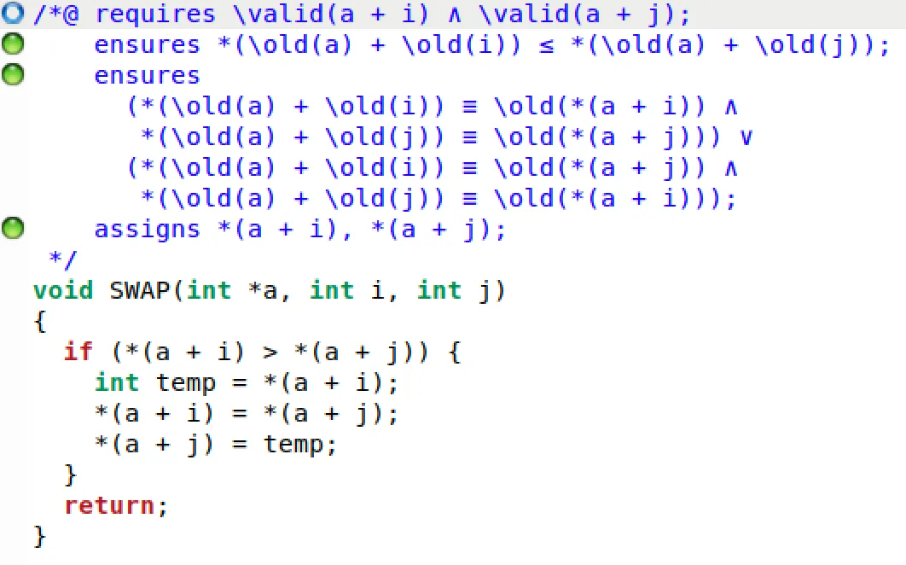

Now it checks out! Let’s move on to the sorting part by feeding this:

```c
/*@ requires \valid(a + (0..4));
    assigns a[0..4];

    // the array elements at method return are sorted
    ensures sorted : \forall integer i; 0 <= i <= 3 ==> a[i] <= a[i+1];

    // the array elements at method return are a permutation of the initial elements
    ensures \forall integer i; 0 <= i <= 4 ==>
            (\exists integer j; 0 <= j <= 4 && a[i] == \old(a[j]));
    ensures \forall integer i; 0 <= i <= 4 ==>
            (\exists integer j; 0 <= j <= 4 && \old(a[i]) == a[j]);
 */
void sortNetwork(int a[]) {
    SWAP(a, 0, 1);
    SWAP(a, 3, 4);
    SWAP(a, 2, 4);
    SWAP(a, 2, 3);
    SWAP(a, 0, 3);
    SWAP(a, 0, 2);
    SWAP(a, 1, 4);
    SWAP(a, 1, 3);
    SWAP(a, 1, 2);
}
```

to Frama-C:

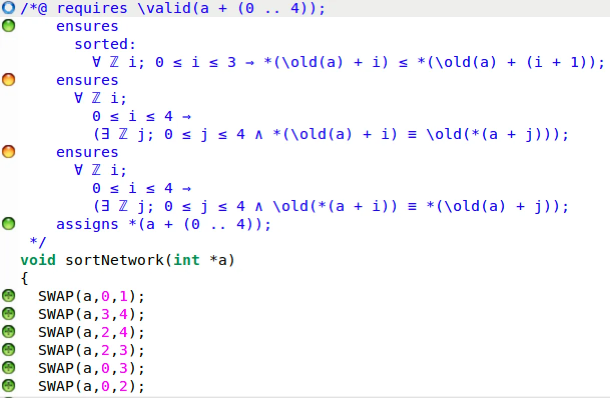

Now we are in an interesting position. It established that the first post-conditions hold but don’t know about the others; that is, it proved that the output array will be sorted, but it can’t prove that the output array is a permutation of the input array. This doesn’t quite make sense to me, so I increased the timeout to 10 minutes and tried again. Now it works:

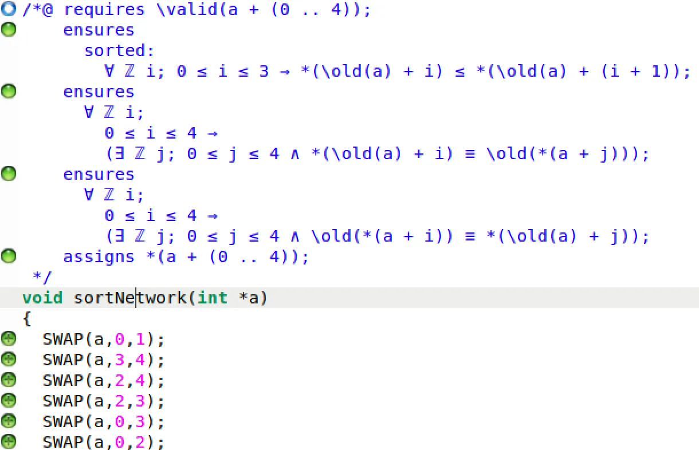

---

This obviously begs the question of how far we can go with this approach. Next, I will attempt sorting 6 elements ([conversation link](https://chat.openai.com/share/a6aa8a75-8ef3-4c53-888d-59a33b441b19)).

I learned from my experience and in the first command told it to be careful with the swapping function and it did work. My prompt was **“write a sorting network program of 6 element in c. use the “void SWAP(int a[], int i, int j)” swap function. make sure a[i] <= a[j] after SWAP”** and ChatGPT generated:

```c
#include <stdio.h>

void SWAP(int a[], int i, int j) {
    if (a[i] > a[j]) {
        int temp = a[i];
        a[i] = a[j];
        a[j] = temp;
    }
}

void sort6Elements(int a[]) {
    SWAP(a, 0, 1);
    SWAP(a, 2, 3);
    SWAP(a, 4, 5);
    SWAP(a, 0, 2);
    SWAP(a, 1, 3);
    SWAP(a, 2, 4);
    SWAP(a, 3, 5);
    SWAP(a, 1, 4);
    SWAP(a, 0, 3);
    SWAP(a, 2, 5);
    SWAP(a, 2, 3);
    SWAP(a, 4, 5);
    SWAP(a, 0, 1);
    SWAP(a, 2, 3);
    SWAP(a, 4, 5);
    SWAP(a, 0, 2);
    SWAP(a, 1, 3);
    SWAP(a, 2, 4);
    SWAP(a, 3, 5);
    SWAP(a, 1, 4);
    SWAP(a, 0, 3);
    SWAP(a, 2, 5);
    SWAP(a, 2, 3);
    SWAP(a, 4, 5);
    SWAP(a, 0, 1);
    SWAP(a, 2, 3);
    SWAP(a, 4, 5);
}

int main() {
    int a[] = {6, 2, 4, 1, 5, 3};

    printf("Before sorting: ");
    for (int i = 0; i < 6; i++) {
        printf("%d ", a[i]);
    }
    printf("\n");

    sort6Elements(a);

    printf("After sorting: ");
    for (int i = 0; i < 6; i++) {
        printf("%d ", a[i]);
    }
    printf("\n");

    return 0;
}
```

I’m just going to re-use the specification from the last attempt and run them by Frama-C:

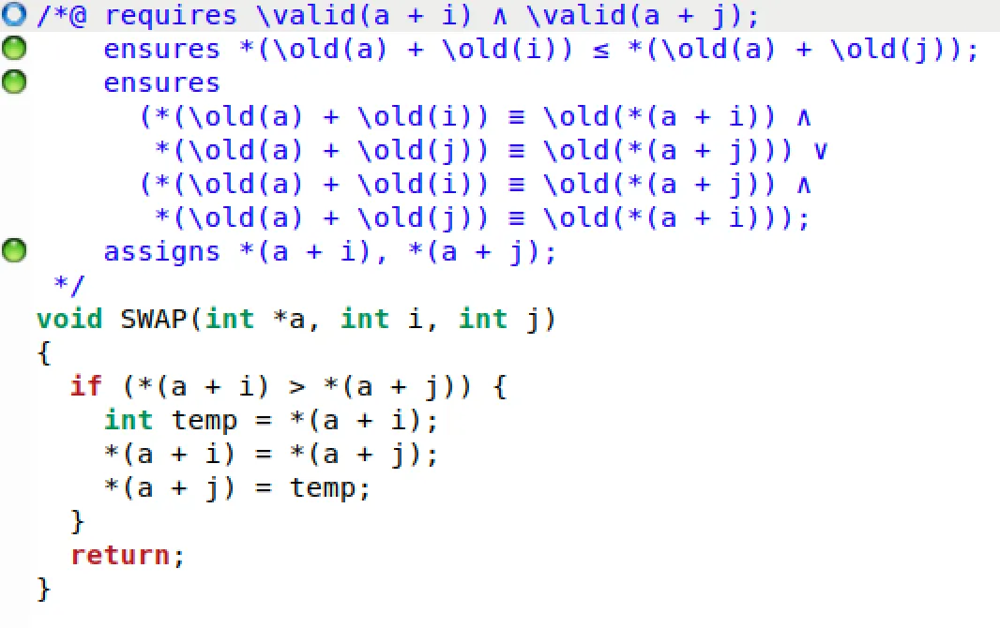

The comparator function checks out.

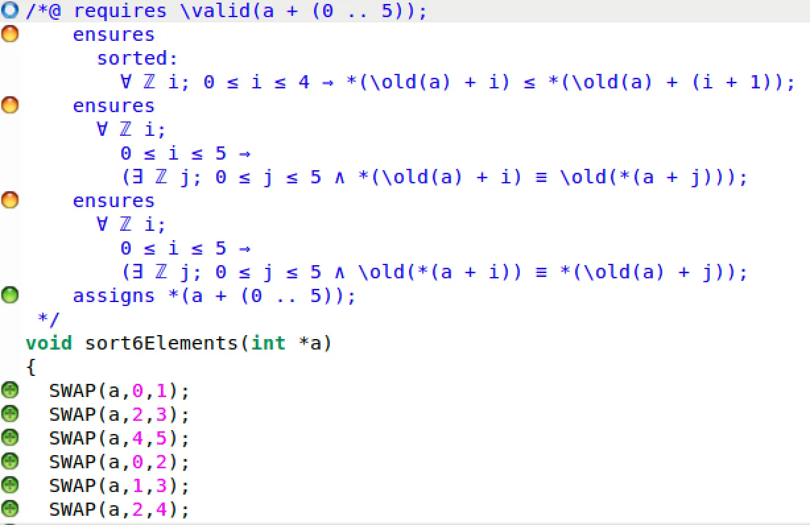

But now the sorting network doesn’t check out at all. I increased the timeout to 10 minutes and it still couldn’t prove the properties, which led me to suspect the implementation is wrong.

So I compile the program and run the example test case provided by ChatGPT itself, and, voila, a mistake. ChatGPT claimed the output of the program would be:

```
Before sorting: 6 2 4 1 5 3
After sorting: 1 2 3 4 5 6
```

but it turned out to be:

```
Before sorting: 6 2 4 1 5 3
After sorting: 1 3 2 5 4 6
```

Now we have a counter-example. For my next prompt, I instructed **“There is a bug in sort6Elements. Make sure it sorts 6 2 4 1 5 3 to 1 2 3 4 5 6”** and it gave a modified program that still fails this counter-example, so I decided to give it the same prompt again. This time it generated a program that satisfies the counter-example:

```c
void sort6Elements(int a[]) {
    SWAP(a, 0, 1);
    SWAP(a, 2, 3);
    SWAP(a, 4, 5);
    SWAP(a, 1, 2);
    SWAP(a, 3, 4);
    SWAP(a, 0, 1);
    SWAP(a, 2, 3);
    SWAP(a, 1, 2);
    SWAP(a, 3, 4);
    SWAP(a, 0, 1);
    SWAP(a, 2, 3);
    SWAP(a, 1, 2);
    SWAP(a, 0, 1);
    SWAP(a, 4, 5);
    SWAP(a, 3, 4);
    SWAP(a, 2, 3);
    SWAP(a, 1, 2);
    SWAP(a, 0, 1);
    SWAP(a, 4, 5);
    SWAP(a, 3, 4);
    SWAP(a, 2, 3);
    SWAP(a, 1, 2);
    SWAP(a, 4, 5);
    SWAP(a, 3, 4);
    SWAP(a, 2, 3);
    SWAP(a, 4, 5);
}
```

Frama-C could not tell us anything about this program, even after I set the timeout to 1 hour.

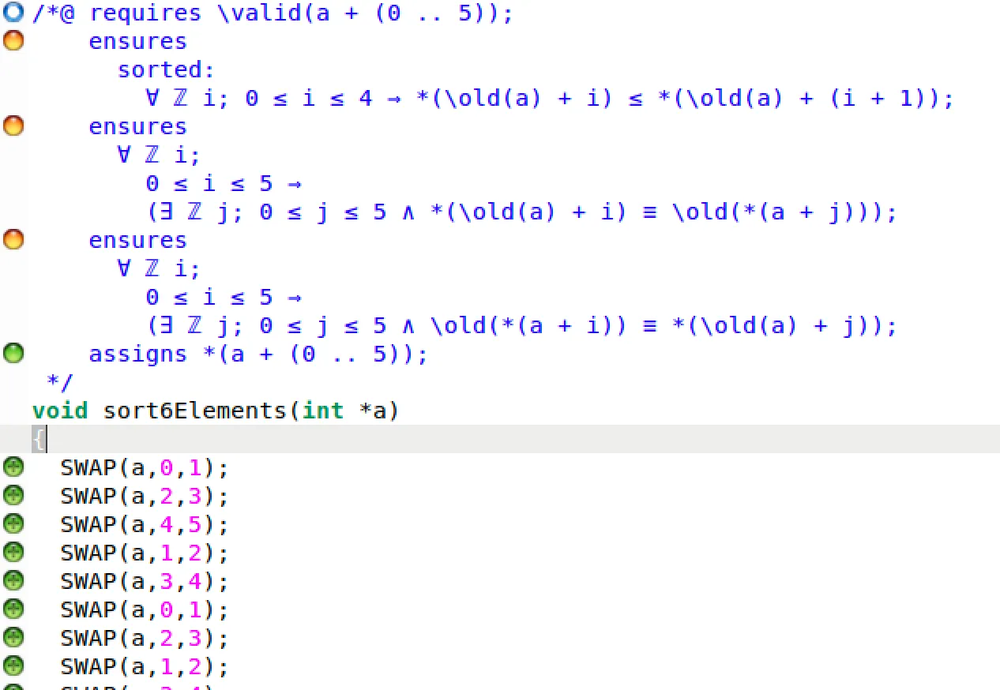

I am pretty on the fence now. I have no idea if the program is just wrong or if Frama-C couldn’t handle this. So I thought I’d test it exhaustively. Luckily, by the [zero-one principle](https://en.wikipedia.org/wiki/Sorting_network#Zero-one_principle) of sorting networks, if a network can sort all the arrays that only contain 0s and 1s, it can sort all the arrays that contain any numbers.

Thus, by enumerating all 2ⁿ binary sequences, and run the sorting function on each sequence, and checking the output is sorted, we can exhaustively test if a sorting network is correct.

After implementing such a routine (with ChatGPT) ([conversation link](https://chat.openai.com/share/9ad2ad76-0647-4c39-bdf8-5083878f0603)), I put ChatGPT’s program to the test. To my surprise, it passed and it is indeed correct. It was just that Frama-C couldn’t prove it.

---

## Conclusion

We’ve just combined an AI tool with a formal verification tool for software engineering purposes. More precisely, we’ve combined an LLM and a static analyzer to try to synthesize formally verified programs.

So what have we learned from this little experiment? Honestly, I don’t know. The results could very well be because ChatGPT is a very good programmer with proper guidance, or that the formal tools don’t really scale well with algorithmic programs like sorting.

At any rate, I wish to see a new paradigm of programming where a user can utilize the fast generation and iteration of LLMs outputs but also has the reassured guarantee of formal verification.
