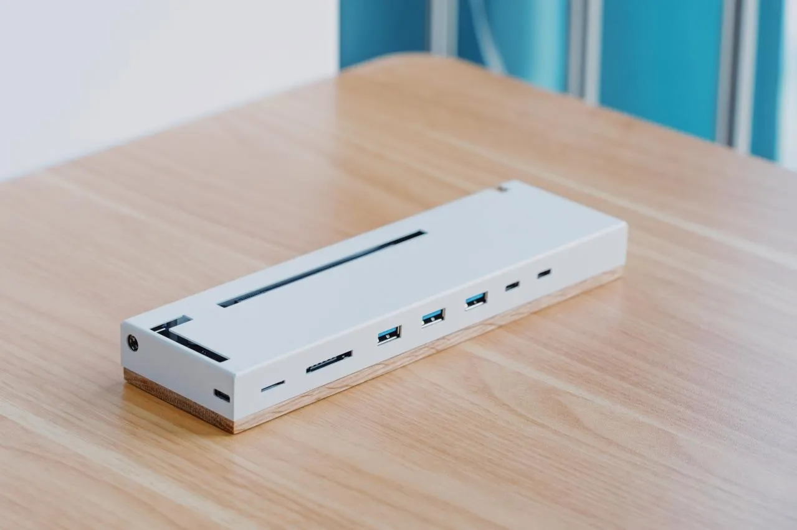

  <a class="youtube-button" href="https://www.youtube.com/watch?v=dQw4w9WgXcQ">
    Watch on YouTube
  </a>

For the past few months, I’ve been playing with Stable Diffusion on my [2019 16-inch MacBook Pro](https://support.apple.com/kb/SP809?locale=en_US)’s CPU. The generation process is painfully slow. It takes about 10 minutes to generate an image with LoRAs, while people with GPUs can generate an image within minutes if not seconds. My Macbook actually has a dGPU, but it is an AMD card, when everything AI needs CUDA, thus an Nvidia card. Naturally, I started looking for upgrade options.

Ideally, I would get a brand new PC with something like RTX 6000 Ada, but I immediately realized I was overwhelmingly outpriced. A friend of mine recently got an RTX 4090 and his experience was great, which was very tempting though it’s still quite expensive to build a whole PC around it. My next thought is to get an eGPU and a cheaper card. I plan to use Boot Camp Windows 10 on my MacBook Pro with an Nvidia card.

With some Googling, I immediately realized there is going to be some [performance loss](https://www.youtube.com/watch?v=NlYHPj-0DTE) to it. So I was very much torn about whether to go with an eGPU. The eGPU enclosures themselves aren’t cheap, either, though I’ve seen some used [Razer Core Xs](https://www.mobile01.com/marketcommodity.php?id=2209602) on my local marketplaces that are going at over 50% off of retail. My plan was to hunt for a used Razer Core X and an RTX 3060 with 12GB VRAM.

## Zotac RTX 4070 AMP AIRO

Another day, however, by pure coincidence, I came across the new [RTX 4070 from Zotac](https://www.youtube.com/watch?v=3tnIEToAr4s) which features an Across the Spider-Verse theme. It also has 12GB VRAM. My plan instantly changed. I was getting that.

I ordered it right away and it arrived the next day. I made [an unboxing video](https://www.youtube.com/watch?v=6G8ELPnAgm0). But now with that in mind, I didn’t want a full enclosure anymore because I want to show it off.

I saw some [builds](https://egpu.io/best-external-graphics-card-builds/?table_filter=%22%22EXP+GDC+TH3P4%22+%22) on egpu.io with “EXP GDC TH3P4G3”(¥868), which was [ranked #2](https://egpu.io/best-egpu-buyers-guide/) on the site after Razer Core X, so I went on [Taobao](https://m.tb.cn/h.5avXPqd?tk=Zu7PdHHyE1X) to check it out. Surprisingly, from the search results recommendations, I found some more enclosures that are not covered on egpu.io, like the “[Jin Jie Hai Liang eGPU enclosure](https://m.tb.cn/h.5ZTq0SL?tk=M226dHlmmnw)”(¥889-¥2799) and the “[Xiao Yao Jun DIY eGPU dock](https://m.tb.cn/h.5ZTKGV4?tk=YAbadHlNgn2)”(¥553-¥647). Both of them have decent user reviews. There’s also the “[X-STATION Graphix eGPU enclosure](https://www.x-station.cn/store/#/detail/26)”(¥2399) with fewer user reviews but it has a [customizable LCD screen on the side](https://post.smzdm.com/p/a8xv35v6/) which looks super cool.

My research continues. I went on Bilibili, and again by coincidence, I stumbled upon a [teardown video](https://www.bilibili.com/video/BV1xc411g7X2/) of an eGPU dock uploaded just last month. The design of the dock instantly caught my eye. It looks so sleek and elegant, much unlike the other docks.

The uploader didn’t mention the brand of the dock, but someone in the comments pointed out that it is the “[ROTATOR Labs Hummingbird 2 eGPU dock](https://m.tb.cn/h.50DcYgi?tk=vUmadHlQY8N)”.

Although the uploader of that video ended up using it to connect to an SSD drive instead of a GPU, the reviews on Taobao seemed legit. So I thought I’d give it a shot.

The dock with the metal case itself is priced at 899 CNY(~125 USD), and there are several options with a PSU included(¥799-¥1499). I chose the more premium option of a GaN charger with 330W because the [TGP of 4070 is 200W](https://news.xfastest.com/review/review-05/126468/nvidia-geforce-rtx-4070/), which together with the dock is priced at 1499 CNY(~200 USD).

## Thunderbolt 3 vs Thunderbolt 4

The dock supposedly supports Thunderbolt 4 where the entire 40GB bandwidth can be utilized for data transfer, unlike Thunderbolt 3 where [the data bandwidth is capped at 22GB](https://www.youtube.com/watch?v=gXEnJSoP3vM) because there’s a 18GB bandwidth reserved for display.

Its controller chip, [JHL7440](https://www.intel.com/content/www/us/en/products/sku/97401/intel-jhl7440-thunderbolt-3-controller/specifications.html)(Titan Ridge), is a Thunderbolt 3 Controller and [it has 4 lanes of PCIe Gen 3](https://www.thunderbolttechnology.net/sites/default/files/18-241_Thunder7000Controller_Brief_FIN_HI.pdf), which amounts to a bandwidth of 32GB. The next generation of that chip, [JHL8440](https://www.intel.com/content/www/us/en/products/sku/189982/intel-jhl8440-thunderbolt-4-controller/specifications.html)(Goshen Ridge), a Thunderbolt 4 Controller, only has 1 lane of native PCIe Gen 3, which only provides a measly 8GB bandwidth; the [32GB PCIe data requirement](https://www.engadget.com/intel-thunderbolt-4-details-130016474.html) by the TB4 specification is instead [tunneled over the Thunderbolt link](https://www.reddit.com/r/Surface/comments/v4uifg/comment/ib9tgzw/). Thus, per [the conversation between u/SurfaceDockGuy and u/GetThunderbolt](https://www.reddit.com/r/UsbCHardware/comments/uwypqf/comment/ibevsf4/), eGPU designs should keep using JHL7440.

While the difference between TB3 and TB4 is negligible on the side of eGPU, [it does matter on the side of the computer](https://www.youtube.com/watch?v=gXEnJSoP3vM). At any rate, my MacBook only supports Thunderbolt 3, so it doesn’t really matter to me after all.

The customer support also asked me if I wanted their new white color which hadn’t been officially released and I said yes.

## Hummingbird 2 eGPU dock

Several days later, the dock arrived. It looked every bit as perfect as in the pictures. I immediately got to work. The first problem is that the charger’s outlet is Type I, whereas all my outlets are Type A. This was easily resolved by going downstairs and getting an adapter.

Next, to install the GPU onto the dock, I simply insert the 4070 into the PCIe slot and it just fits perfectly. However, I was slightly confused when it came time to connect the PCIe power cables. The RTX 4070 uses a newer 12-pin connector while the dock only has an 8-pin one.

The 4070 comes with a 12-pin to dual 8-pin cable and the dock comes with a 8-pin to dual 8-pin cable. I wasn’t sure if it was safe let alone if it would work, but I went ahead and connected them all up anyway. My reasoning was that, since the dock is supposed to power 2 8-pin slots and the card is supposed to take the power of 2 8-pin slots, it should work out.

The instruction manual that came with the dock said to connect the power cable before connecting the Thunderbolt cable, so I did. When I connected the power cable, the fans turned on and the RGBs lit up and I was as relieved as I was excited.

Then came the moment of truth — connecting the Thunderbolt cable to my Macbook. I plugged in the cable, and an alert popped up saying “Setting up a device: We’re setting up ‘Video Controller (VGA Compatible)’”. Device Manager showed that there’s a “Microsoft Basic Display Adapter”.

After a couple of minutes, another alert popped up saying “Device is ready: ‘PCI Device’ is set up and ready to go”. Device Manager now showed that there’s an “NVIDIA GeForce RTX 4070”! Then NVIDIA Control Panel popped up asking me to agree to some license. After that, another alert popped up asking me to restart the computer.

After restarting, I opened Device Manager again, and before the NVIDIA GeForce RTX 4070 listing showed a yellow bang triangle symbol. I double-clicked it and my heart sank. It was the infamous Code 12 error I’ve been reading so much about on egpu.io.

## Code 12 Error

I took a deep breath and started working on it. I had prepared for this. The egpu.io community had worked on this error for quite a while. Different versions and different machines needed different fixes.

The [Boot Camp eGPU Setup Guide](https://egpu.io/boot-camp-egpu-setup-guide/) said that the iGPU of my machine is completely disabled and that I need to use “Windows Hybrid graphics” but I didn’t find much information about this. For my particular machine, there’s a [well-organized guide on r/eGPU by u/GamingMadeStrange](https://www.reddit.com/r/eGPU/comments/lb3bhe/complete_egpu_guide_2019_16inch_macbook_pro_6core/), which involves using specific bootloaders and switching between the left and right sides of ports, which, as the Setup Guide also mentioned, is probably because of the different PCIe lanes bandwidth.

I’ve read some user builds and people’s experiences differ. A [user with AKiTiO Node Duo](https://egpu.io/forums/builds/late-2016-15-macbook-pro-2xrx580s32gbps-tb3-akitio-node-duo-win10-itsage/) with older MacBooks used custom drivers and bootloaders developed by the community. For people with the same MacBook as me, there is a [user with Razer Core X Chroma](https://egpu.io/forums/builds/2019-16-macbook-pro-rp5500m-9th6ch-rtx-3060-32gbps-tb3-razer-core-x-chroma-macos-12-6-3-win10-22h2/) that just restarted a few times and it worked, and there is another [user with AORUS Gaming Box](https://egpu.io/forums/builds/2019-16-macbook-pro-i99th8c-aorus-gaming-box-3080-win-10-pro-10-0-19045-macos-ventura-13-4/) that also got a plug-and-play experience. My expectation was my setup shouldn’t be too difficult either.

After only several hours of trial, I found my solution. It is “almost” plug-and-play. [This post](https://egpu.io/forums/pc-setup/step-by-step-guides-to-install-nvidia-and-amd-egpu-cards-on-bootcamp-15-inch-MacBook-2017-and-2018/) says that for Nvidia cards you should hot-plug and disable and then enable it in the Device Manager. The solution is:

1. Boot up Windows.
2. Power the eGPU dock and plug the Thunderbolt cable into the **lower left** Thunderbolt slot on the MacBook. Only this particular slot works.
3. Disable the NVIDIA driver in the Device Manager.
4. Enable the NVIDIA driver. This will prompt you to restart the computer. Click “Yes”.
5. After restart, we are done! There’s no more yellow bang!

It is interesting that the AMD and the NVIDIA GPUs can co-exist. With an external monitor plugged into the 4070, the AMD will handle the MacBook's internal display while the NVIDIA will handle the external display. When only using the external display, you can disable the AMD driver.

Note that I have to go through this process every time I want to use my eGPU, but the success rate has been very consistent.

I downloaded Zotac’s fine-tuning software, Firestorm, and to my pleasant surprise, they even themed the interface with the Across the Spider-Verse! I tested the configuration and everything seemed to work properly. The RGB light effects aren’t as smooth as I had seen on Razer’s products, but I don’t really mind.

From the looks of HWiNFO64, everything’s good to go. Now that I’ve got my eGPU set up. It’s time to test it!

## AI

I thought to test the very thing I had bought it for — AI. I set up Stable Diffusion and tried to generate an image. And *my oh my* does it work great. It takes mere seconds to generate an image, and it takes less than a minute to generate a batch of 8 images while using LoRAs and embeddings. It serves its purpose well.

## Benchmark

I thought I’d run some benchmarks. I launched AIDA64 Extreme and ran the GPGPU benchmark. The Single-Precision FLOPS is 32803 GFLOPS and the Double-Precision FLOPS is 516 GLOPS. Compared to [4Gamers’s review of the Founders Edition](https://www.4gamers.com.tw/news/detail/57630/nvidia-geforce-rtx-4070-founders-edition-review) where they are 31762 and 514.9, the numbers seem reasonable. The card looks good.

Then I connected the GPU to my 4k monitor, Acer ET322QK, and launched 3DMark. I ran the latest Time Spy benchmark and [the resulting graphics score](https://www.3dmark.com/3dm/96643307?) was 15259. The [reference score of 4070 on the UL Solution website](https://benchmarks.ul.com/hardware/gpu/NVIDIA%20GeForce%20RTX%204070+review) is 17855; the score of 4070 Founders Edition is 17856 and that of MSI’s 4070 is 17689 according to [a review by HotHardware](https://hothardware.com/reviews/nvidia-geforce-rtx-4070-review?page=3); and the score of the same Zotac card as mine is 17791 according to [Huan’s review](https://www.youtube.com/watch?v=3tnIEToAr4s). On average, **there’s about a 14% performance loss**. This is consistent with [LYi’s experience](https://www.youtube.com/watch?v=gXEnJSoP3vM) where he reported a 15% loss.

For comparison, this is a chart of the reference scores including 4060 Ti and 4070 Ti.

## Gaming

My next idea was to try to game on it. I installed Monster Hunter World and its High Resolution Texture Pack. I cranked up all the graphics settings to the highest. At the beginning of the game in Astera, under 4k resolution, it averages about 35 FPS, and under 2k resolution, it averages about 75 FPS.

Under 2k resolution, with several mods installed and in 4-player multiplayer, it averages about 60 FPS in Ancient Forest.

It averages about 70 FPS in Coral Highlands.

And it averages about 90 FPS in the Alatreon arena.

youtube

All in all, the gaming performance seems to suffer quite a bit, considering 4070 can achieve 120 FPS under 2k resolution in Cyberpunk 2077 according to [Huan’s review](https://www.youtube.com/watch?v=3tnIEToAr4s). I would test Cyberpunk 2077 too but I’m not really interested in that game and I am not buying it just to test a GPU. On top of that, my monitor only has a refresh rate of 60Hz, so I don’t really mind.

Conclusion
In conclusion, the eGPU dock works great. The design is clean. The setup wasn’t as painful as I had expected. AI runs on it smoothly. The gaming performance loss seems to be around 15% according to the benchmarks but, in reality, it seems to be more. I may test some more stuff in the future and update this post with new information.

---

## Underperformance

After [publishing my build to egpu.io](https://egpu.io/forums/builds/2019-16-macbook-pro-rp5500m-9th8ch-rtx-4070-32gbps-tb4-hummingbird-2-win10-22h2/), a senior user, nando4, brought my attention to the fact that my bandwidth seems lower than expected. The AIDA6 4benchmark exhibits a bandwidth of around 17xxMB/s which indicates that it is running at 16Gbps instead of 32Gbps, at which Thunderbolt 3 should be running with 4 lanes of PCIe 3.0, which should show a bandwidth of at least 22xxMB/s. This was unexpected.

I double-checked the benchmark with CUDA-Z and it does indeed shows a consistent performance at 16xxMiB/s.

I contacted customer support, and they informed me that, despite the aforementioned JHL7440 supporting up to 4 lanes of PCIe of 32Gbps, they only utilized 3 lanes which amount to 24Gbps.

This sounds extremely weird because Thunderbolt 4, [by definition](https://www.thunderbolttechnology.net/sites/default/files/Thunderbolt3_TechBrief_FINAL.pdf), should support 32Gbps at a minimum.

I complained that this still doesn’t explain why I only get 16xxMiB/s performance instead of 22xxMiB/s. The customer support told me that they’ll relay the issue to the technical staff. I haven’t had a response yet.

I am pretty disappointed by this, considering they marketed the eGPU as supporting up to Thunderbolt 4.

---

The support responded and confirmed they won’t fix my bandwidth issue. They offered me returns and refunds, but I think I’ll just hang on to it for now, as eGPU really is just a toy to me after all.

As it stands, I do not recommend this product.

---

## Cable Replacement

After I left a negative review on Taobao, the technical support reached out to me again and said it might’ve been the cable and offered to send me a new cable. However, I didn’t trust them anymore so I bought a [new Thunderbolt 4 cable](https://www.nodatw.com/products/noda-thunderbolt%E2%84%A2-4-type-c-cable-200cm) myself. The benchmark now performs at a consistent 22xxMiB/s.

I confronted the customer support. They retorted that they had never said their cable was Thunderbolt, despite our repeated back-and-forth exchange before my purchase. I would say they’d gaslighted me. The below screenshot is in Chinese, but the gist of it is basically this: I asked, “Is the cable Thunderbolt?”, and they replied, “Yes, the cable is 40Gbps.”

They now claimed that the cable is in fact a potentially faulty USB4 40Gbps cable, thus my reduced performance. The company owner himself contacted me and proposed to compensate me 100 CNY for it and I accepted. He also gave me his personal contact and told me to call him directly in case there are any more issues. I feel respected.

Anyway, I [reran the Time Spy](https://www.3dmark.com/3dm/97442787) with the new setup. There is only a minuscule improvement(15259->15361), but I’m happy with it.

I also tested Monster Hunter World again. There are also some slight improvements, most notably in 4k where FPS rises from around 35 to 45.

Notwithstanding the bandwidth and the support issues, I still like this eGPU, especially considering its price and design. I would definitely recommend getting your own Thunderbolt cable to go with it though.

According to the company’s owner, they already have plans to open up an international AliExpress storefront. When they do, I’ll update this article to link to their page.

---

Update: added pictures of the included 330W GaN charger:

---

## Pricing
* (June 2023, 22708 TWD) ZOTAC GAMING GEFORCE RTX 4070 AMP AIRO SPIDER-MAN™: Across the Spider-Verse Bundle 12 GB
* (June 2023, 1529 RMB) ROTATOR Lab Hummingbird 2 JHL7440 eGPU dock with 330W GaN power supply
* (July 2023, 1791 TWD) noda Thunderbolt 4 Cable 2m
* (July 2023, 599 TWD) LINDY ANTHRA DisplayPort 1.4 cable 2m
* (October 2019, 9688 TWD) Acer ET322QK wmiipx 31.5" Monitor
