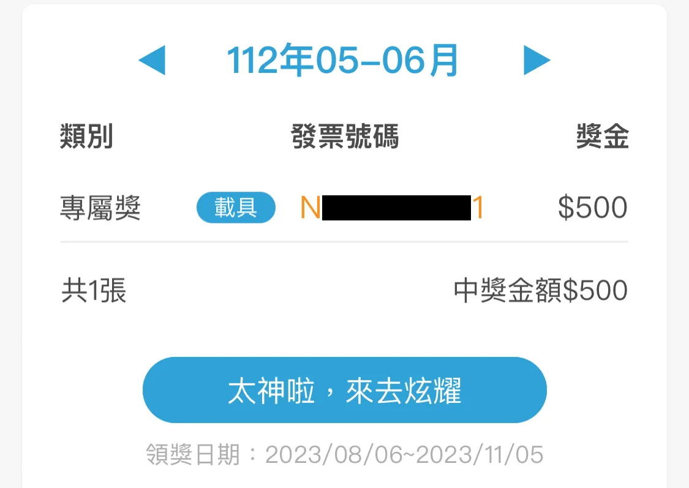
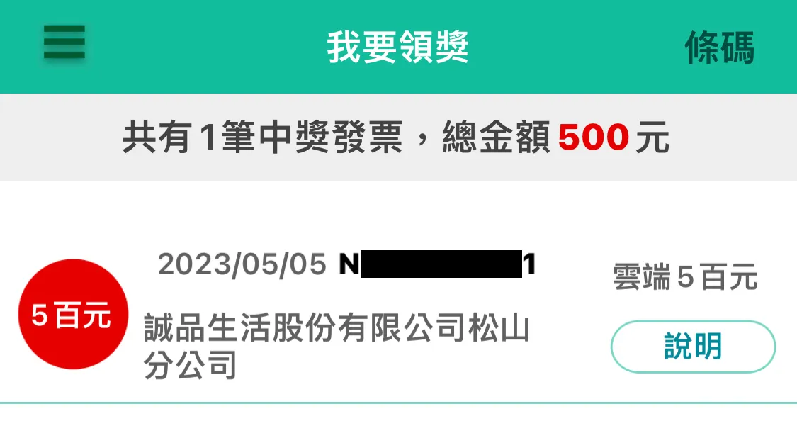
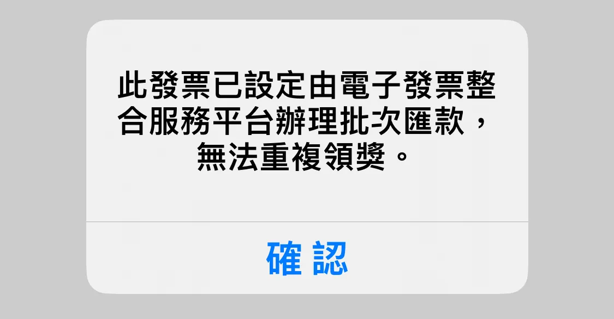
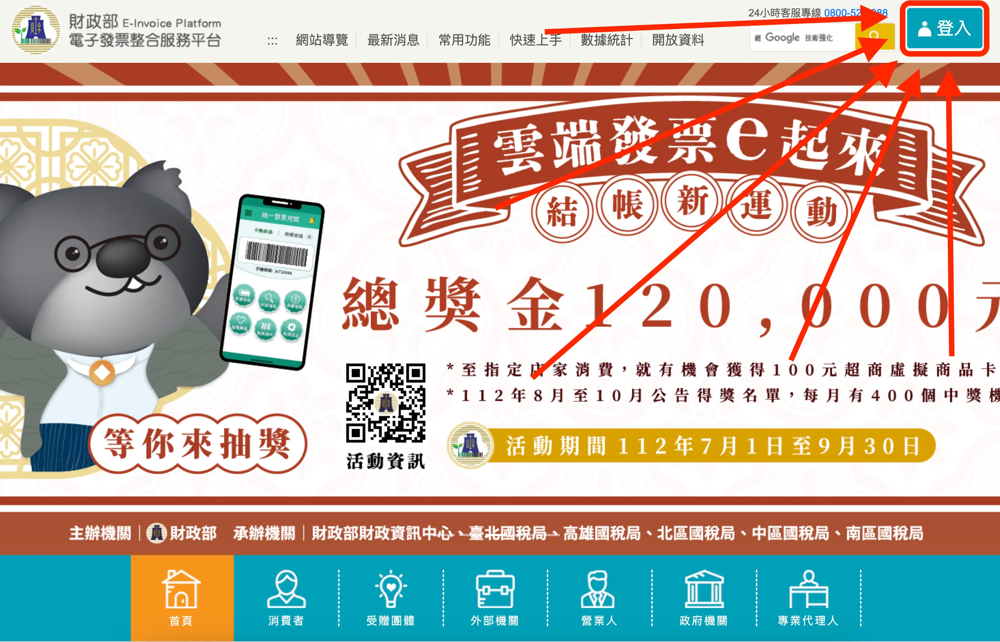
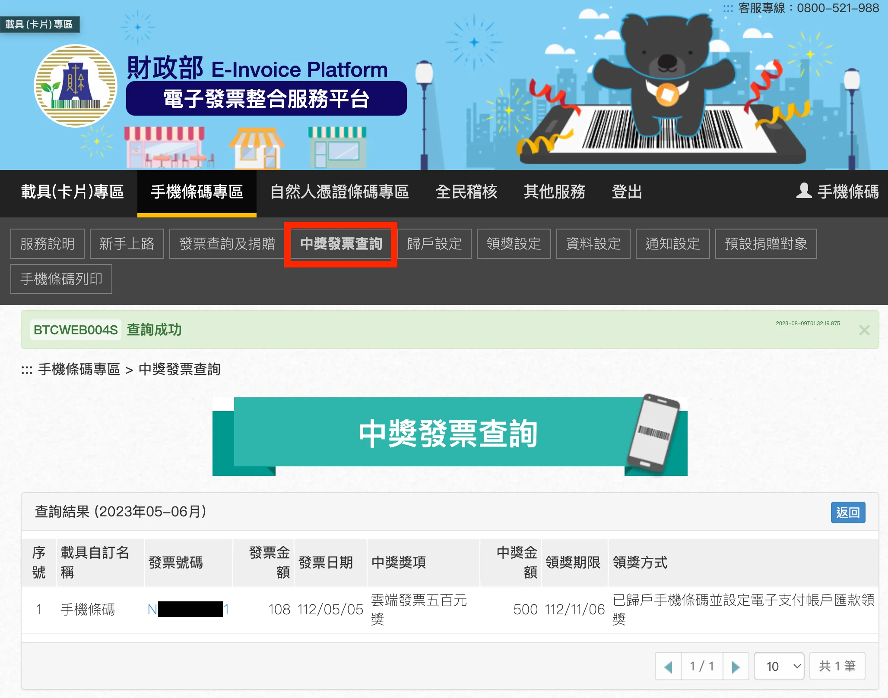
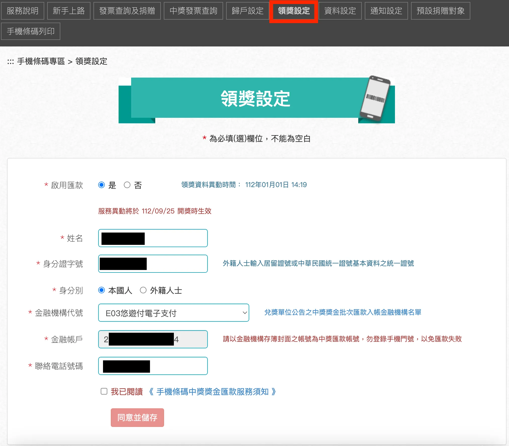
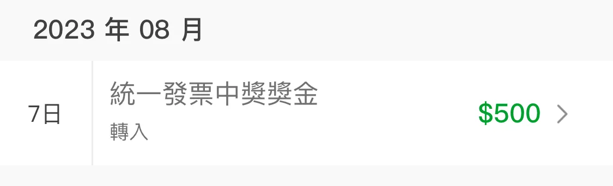

<figure>
  
  <figcaption>Source: <a href="https://www.pixiv.net/en/artworks/110184592">海豹N</a></figcaption>
</figure>

前幾天「[雲端發票](https://apps.apple.com/tw/app/%E9%9B%B2%E7%AB%AF%E7%99%BC%E7%A5%A8/id512920023)」推了一個通知給我，我很開心地看到我中了五百塊。但是我在那裡面怎麼找也找不到兌獎的方式。一查之下才知道，需要下載另外一個財政部官方的「[統一發票兌獎](https://apps.apple.com/tw/app/%E7%B5%B1%E4%B8%80%E7%99%BC%E7%A5%A8%E5%85%8C%E7%8D%8E/id1445981329)」。

載完之後重新查詢，我的確有中獎。但要領獎的時候，卻跳出一個奇怪的訊息。

這下我完全傻眼了，在網上搜尋這段文字出來的結果全是垃圾內容。我只好靠自己研究一下。我先去搜了一下他這個所謂的「電子發票整合服務平台」到底是什麼。

原來他是指「[財政部電子發票整合服務平台（www.einvoice.nat.gov.tw）](https://www.einvoice.nat.gov.tw/)」，在網站右上角可以用手機號碼跟驗證碼登入；如果驗證碼忘記的話，就馬上選忘記驗證碼，用簡訊驗證，重設一個就好。

登入之後可以在「中獎發票查詢」再次確定你的確是有中獎。而這邊會列出一個「領獎方式」，這個就有點有趣了，這邊顯示「已歸戶手機條碼並設定電子支付帳戶匯款領獎」。這代表我曾經把這個手機條碼跟某個電子支付的帳戶串聯在一起，讓這個手機條碼中的發票的錢會直接匯款到那個電子支付的帳戶。

但我左思右想，實在想不到我什麼時候有做過這件事了。好家在，在旁邊的「領獎設定」裡面，有這相關的資料。

啊！原來如此呀！這邊顯示著，原來我不知道在什麼時候，早就把領獎的方式設定位自動匯款至悠遊付了。

把塵封已久的悠遊付載回來後，點開發現的確是這樣沒錯。這中的五百塊錢已經匯到我的悠遊付電子支付帳戶裡了。
