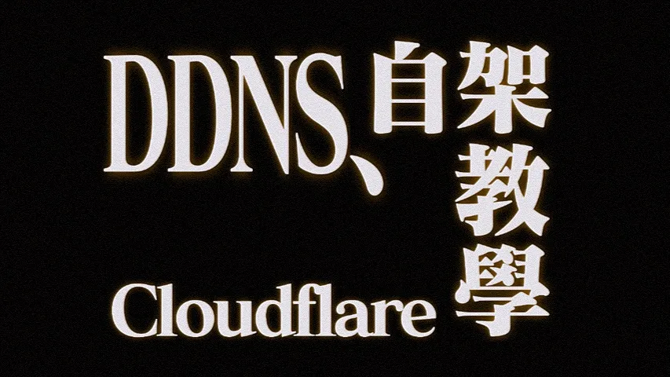
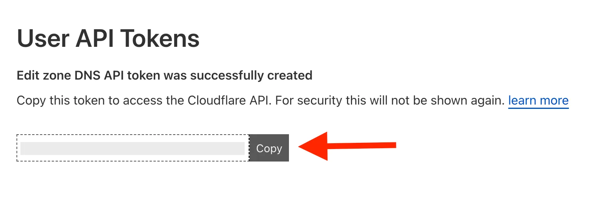
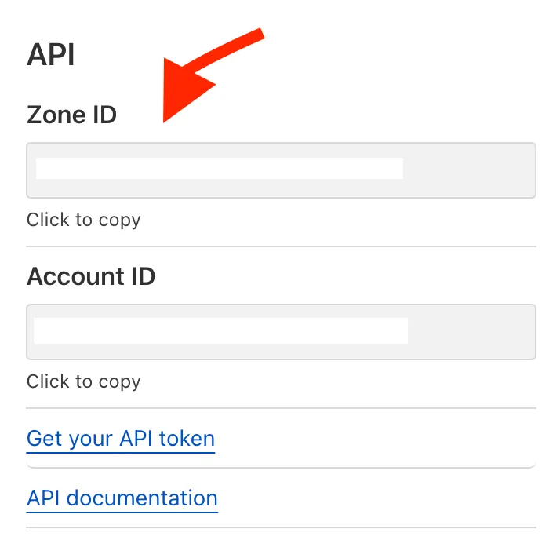



<figure>
  
  <figcaption>Source: <a href="https://lab.magiconch.com/eva-title/">lab.magiconch.com</a></figcaption>
</figure>

2017 年，我把我的家庭伺服器在 NUC 上架了起來，其中一個很重要的目的是為了架自己的 VPN，所以首要任務就是要搞 DDNS，為了要能夠在各地連回來。

當時，經過一番研究後，發現 Cloudflare 有提供 DNS 的 API，而我剛好把我的域名都架在 Cloudflare 上。我上網拼拼湊湊出了[一段 ddns.py 程式](https://github.com/RexYuan/FuXuan/blob/c5340a0536c771d7f337b84f744768eda3fd1647/ddns.py)：

```python
import secret
import requests

ip_r = requests.get('http://icanhazip.com/')
ip = ip_r.text.strip()

headers = {'X-Auth-Email': secret.CF['email'],
           'X-Auth-Key':   secret.CF['key'],
           'Content-Type': 'application/json'}

params = {'type':    'A',
          'name':    'den.rexy.xyz',
          'content': ip}

slugs = {'endpoint': 'https://api.cloudflare.com/client/v4',
         'zone_id':  secret.HOME['zone_id'],
         'id':       secret.HOME['id']}
url = '{endpoint}/zones/{zone_id}/dns_records/{id}'.format(**slugs)

r = requests.put(url, headers=headers, json=params)

if r.json()['success'] == True:
    print('updated')
```

這個程式的邏輯很簡單，就是先從 icanhazip 拿自己的公開 IP，然後發一個更新 DNS 紀錄的 API 給 Cloudflare，讓他重新把我的 den.rexy.xyz 指向我的公開 IP；其中 API 需要用的 email、key、各種 id 都存在另外一個不會放進 git 版本控制的 secret.py 裡。然後我用 cron 設定每幾個小時讓他跑一次，確保資料更新。就這樣，我就一直用這個小程式用到畢業。

直到最近，我開始又對我的小電腦 NUC 產生興趣，想要拿他來做點事情，於是就決定把一切砍掉重來，當然也包括這個 ddns.py 程式。

思考重寫的時候，我想說現在我已經不再是那個對於 shell script 恐懼的我了，就直接寫一段 shell script 好了。於是我就又開始重新研究了一番 Cloudflare API，這次終於比較懂了。先直接貼上[更新後的 ddns.sh 版本](https://github.com/RexYuan/FuXuan/blob/master/ddns.sh)：

```bash
#!/bin/bash

SECRET=$(dirname $(realpath "$0"))/secret.sh
[ -e "$SECRET" ] || (echo "secret.sh does not exist."; exit 1)
. $SECRET

CURRENT_IP=$(curl -s http://ipv4.icanhazip.com)
DNS_IP=$(dig +short "${URLS[0]}" | grep -Eo '([0-9]{1,3}\.){3}[0-9]{1,3}' | awk 'NR==1{print}')

if [ "$CURRENT_IP" != "$DNS_IP" ]; then
    echo "Renew IP: $DNS_IP to $CURRENT_IP"
    for ((i = 0; i < ${#URLS[@]}; i++)); do
        curl --request PUT \
            --url "https://api.cloudflare.com/client/v4/zones/$ZONE_ID/dns_records/${RECORD_IDS[$i]}" \
            --header "Content-Type: application/json" \
            --header "X-Auth-Email: $EMAIL" \
            --header "Authorization: Bearer $KEY" \
            --data "{
        \"type\": \"A\",
        \"name\": \"${URLS[$i]}\",
        \"content\": \"$CURRENT_IP\"
        }"
    done
else
    echo "No change: $CURRENT_IP"
fi
```

這個更新後的版本有很多地方是叫 ChatGPT 寫的，所以我也不清楚是不是萬無一失。首先第一個不一樣的地方是，我這次寫的版本要更新多個 DNS 紀錄，所以我的 secret.sh 長得是像這樣子：

```bash
EMAIL='user@example.com'
KEY='key'
ZONE_ID='zone-id'
RECORD_IDS=('id-for-one'
            'id-for-two')
URLS=('one.example.com'
      'two.example.com')
```

第一步跟之前不一樣的地方是他做了一個優化，我們會先去問 icanhazip 拿我們現在實際的公開 IP，再去查在 Cloudflare DNS 上我們域名登記的 IP，然後比較兩個 IP。如果兩個 IP 一樣，代表不需要更新，如果不一樣，我們才繼續做更新，這樣就不會一直無謂的去做 API call 了。

接下來就是要跟 Cloudflare API 溝通的部分了，我們先去申請好我們的需要的 key 鑰匙。移動到 dash.cloudflare.com/profile > 左邊選 API Tokens > 點選 Create Token > 點選 Edit zone DNS > Use template > 在 Zone Resources 那欄最右邊選擇你要用的域名 > Continue to summary > Create Token。然後他就會顯示給你看你這把鑰匙了，這個一定要複製下來收好喔，因為他之後就不會再顯示了。你可以複製下面那段 curl 命令，測試一下這個鑰匙的確是能用的。



而要更新 DNS 紀錄，我們可以複習一下 [Cloudflare 的 API 文檔](https://developers.cloudflare.com/api/operations/dns-records-for-a-zone-update-dns-record)。

> ```http
> PUT https://api.cloudflare.com/client/v4/zones/{zone_identifier}/dns_records/{identifier}
> ```
>
> Update an existing DNS record.

而這個 zone_identifier 要去哪裡找呢？他在 dash.cloudflare.com > Cloudflare Home > example.com Overview 的右下角：



而後面這個 identifier 是指屬於你這個 DNS 紀錄的 record ID，我們需要特別去連 API 找一下他：

```bash
curl --request GET \
  --url https://api.cloudflare.com/client/v4/zones/{zone_identifier}/dns_records?name={domain_name} \
  --header 'Content-Type: application/json' \
  --header 'X-Auth-Email: {email}' \
  --header 'Authorization: Bearer {key}'
```

這裡的 zone_identifier 跟上面的是一樣的。domain_name 是你這個 DNS 記錄的總名稱，例如 www.example.com。email 就是 Cloudflare 帳號。最後這個 key 就是剛剛申請的鑰匙。而這個發過去後，會得到類似這樣的回覆：

```json
{
    "result": [
        {
            "id": "{identifier}",
            "zone_id": "...",
            "zone_name": "...",
            ...
        }
    ],
    "success": true,
    ...
}
```

這 result 裡的 id 後面那串就是那個 {identifier} 了！

把這些資訊代入一開始準備好的 secret.sh，就大功告成了！接下來就設定讓他每隔一段時間就跑一次，就能達成穩定同步 DDNS 的效果了！例如我的設置就是用 cron 每個小時跑一次。

---

如果你一更新完就去用 dig 檢查 DNS 的話可能會發現沒有改變，這是因為快取還沒更新的關係。我們可以指定要用 Cloudflare 的 name server 就可以[得到不經過快取的](https://serverfault.com/questions/372066/force-dig-to-resolve-without-using-cache)更新後的正確結果：

```bash
dig @bruce.ns.cloudflare.com {domain_name}
```

---

更新：如果是在沒有 dig 的環境上要使用，例如 [BusyBox](https://busybox.net/downloads/BusyBox.html)，可以用以下的 nslookup 取代（ChatGPT 寫的）

```bash
DNS_IP=$(nslookup "$URL" | grep -Eo 'Address: ([0-9]+\.[0-9]+\.[0-9]+\.[0-9]+)' | cut -d' ' -f2)
```
