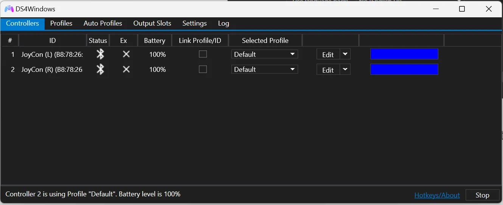

I assume you’ve already installed DS4Windows. If not, there are a lot of articles and videos on how to set it up, so I won’t go over them here.

## Step 1: connect Joy-Con to PC

Hold the pairing button on the side of the Joy-Con until the lights start blinking.

On Windows 11, go to Settings > Bluetooth and devices > add a device > Bluetooth.

Add both of them.

## Step 2: Enable Joy-Con Support

Go to Settings > Device Options.

turn on “JoyCon Controller Support”. Go to the Controller tab and click “Start”. **If you see something like this then you’re done and good to go.**

If you see something like this instead, continue reading.

## Step 3: Configure Joined Mode

This means that your Joy-Cons are in “Split” mode instead of “Joined” mode. Split mode means each Joy-Con gets emulated as its own controller. To emulate both Joy-Con as a single controller. Go to Settings > Device Options. Now you should see your Joy-Con listed under “Detected Controllers”. Click one of them. Change “Link Mode” from “Split” to “Joined”.

Then click “Stop” and then “Start” again to let it take effect, and you should see something like this.

**And you are done!**
