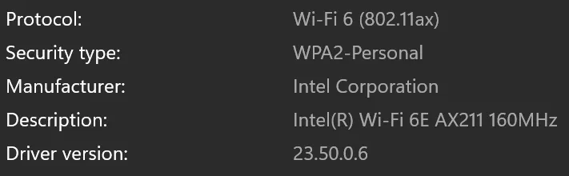

<figure>
  
  <figcaption>Source: <a href="https://www.pixiv.net/en/artworks/117313575">onlookerkuma</a></figcaption>
</figure>

現在台灣已經開放 6GHz 了，但是我還是搞了一陣子才弄出來，在這邊跟大家分享一下我的心得。因為我的路由器是美國買來的，所以有懷疑過是不是這個問題，結果華碩的客服竟然跟我說美國的 WiFi 6E 跟台灣的 WiFi 6E 不一樣，但其實不然，美國買的照樣可以在台灣用，害我瞎晃了一陣子。

## 設備確定

先確定你的裝置是否支援 WiFi 6E，可以參照 [tp-link 的網頁](https://www.tp-link.com/tw/support/faq/3092/)，如果是 PC 的話，就要看 WiFi 介面卡，以下是目前支持的設備：

* Intel AX210/AX211/AX411
* Killer AX1675X/AX1675i
* MTK MT7921K/MT7922
* AMD RZ608/RZ616
* Archer TXE70UH
* QCNFA765

這個可以進 Settings > Network & internet > Wi-Fi > Hardware Properties 去看，像我手邊的雷蛇就是用 AX211。就代表理論上說應該要是可以連的。

<figure>
  
  <figcaption>第四行那個 AX221 就是我的介面卡，代表我理論上可以用</figcaption>
</figure>

如果電腦本身介面卡就不支援，那就連不到了喔。

## 驅動更新

接下來可以用 [Intel Driver & Support Assistant](https://www.intel.com/content/www/us/en/support/intel-driver-support-assistant.html) 掃描一下電腦，檢查是否有更新可以用。要是有的話，這邊建議用手動安裝比較簡單。到這個 [Intel Wireless Wi-Fi Drivers](https://www.intel.com/content/www/us/en/download/19351/intel-wireless-wi-fi-drivers-for-windows-10-and-windows-11.html)，選擇最新的版本，然後打開來安裝。安裝完之後，重新啟動電腦，應該就能看到 6GHz 的頻段了！

順帶一提，你的藍芽可能也需要更新（至少我的需要），所以這裡是連結：[Intel Wireless Bluetooth Drivers](https://www.intel.com/content/www/us/en/download/18649/intel-wireless-bluetooth-drivers-for-windows-10-and-windows-11.html)。
