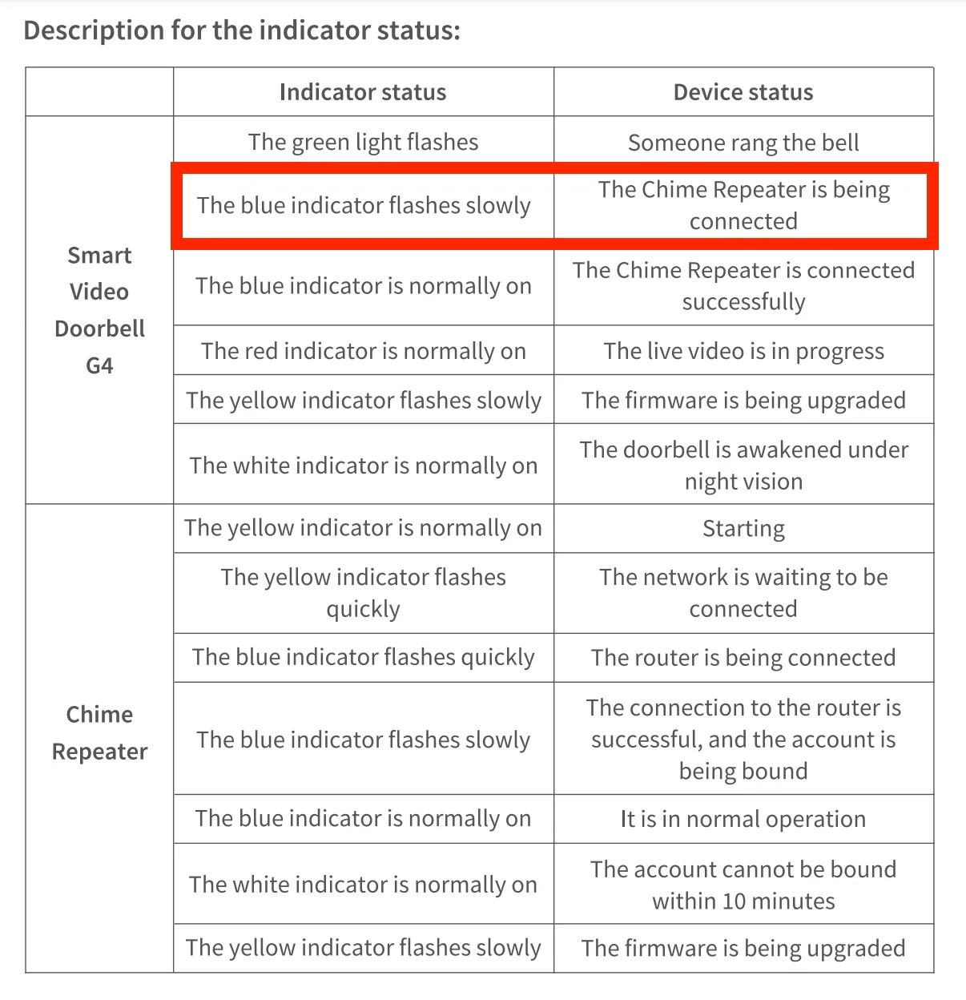
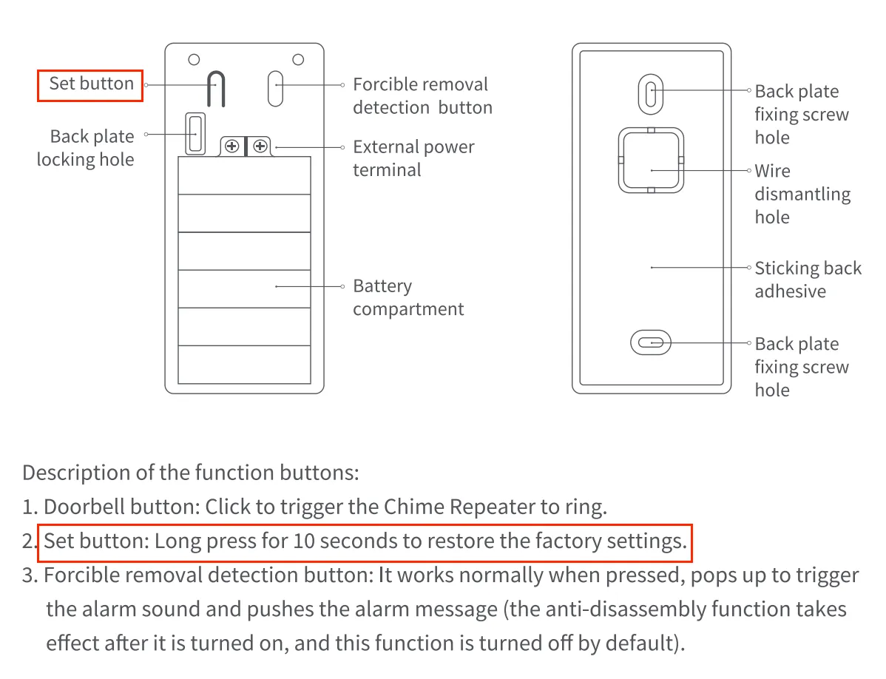
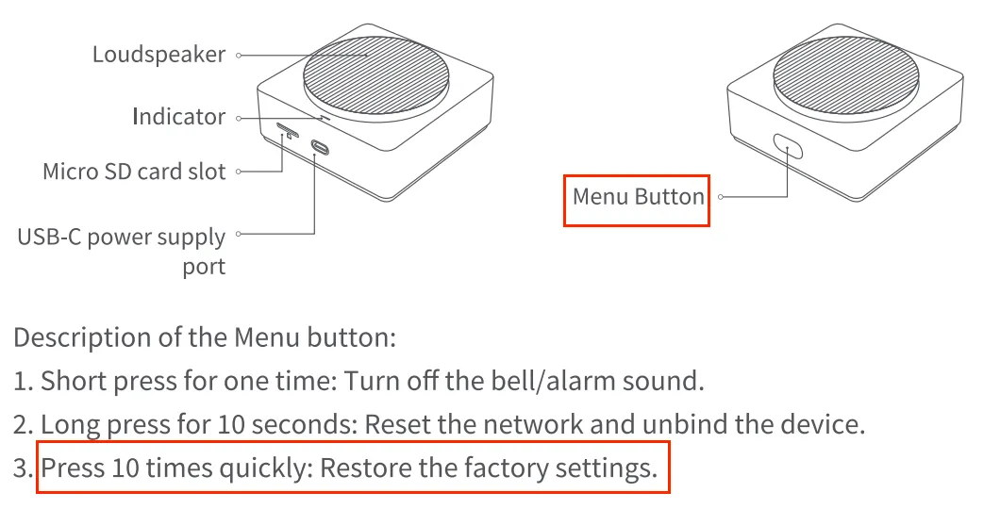

<figure>
  
  <figcaption>Source: <a href="https://www.pixiv.net/en/artworks/119789104">坑爹の草神</a></figcaption>
</figure>

首先先說明一下，我的 Aqara 的東西都是陸版的，不確定國際版會不會有不同的解法或是問題。

我的 Aqara G4 門鈴一直以來都是用電池的而不是牽線的，所以每隔一段時間都要拆下來換電池，等充電電池充飽電，再換上去。

沒想到這次換上去之後，他卻秀逗了。門鈴的按鈕開始閃藍光，Aqara app 跟 HomeKit 也都連不上線。

我查了[官方說明書](https://www.aqara.com/wp-content/uploads/2023/05/1641748780911796226.pdf)，看到這個指示燈的情況代表他正在嘗試連接中繼器（下圖框起來的地方），但是我等了很久，他都沒有連上去的跡象。於是我覺得重置一下。

依照說明書，要重置這組電鈴有兩個地方要按，一個在門鈴上，一個在中繼器上。

在門鈴上的重置按鈕在門鈴後側，拆下來按住十秒就可以了。

中繼器的重置鈕，需要連續按十下。

兩個都重置完了之後，就可以先進去 Aqara app 跟 HomeKit 把他們刪掉了。接下來就可以開始重新初始化。跟著 Aqara app 的步驟重新設置，就能把他們加入回去。然後門鈴就恢復正常啦！

這是我買來四個月第一次發生這種狀況，不知道這種故障的頻率高不高，要是太高的話，我可能會跟客服反應一下。
