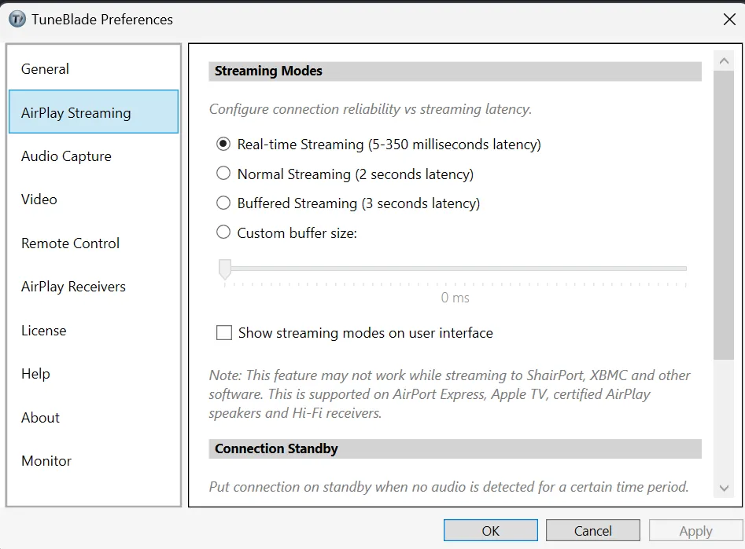

<figure>
  
  <figcaption>Source: <a href="https://www.pixiv.net/en/artworks/114179957">onlookerkuma</a></figcaption>
</figure>

tl;dr, use [TuneBlade](http://www.tuneblade.com/).

So I have a monitor with Apple TV + 2 HomePod mini setup. I watch media on it a lot. Recently, I started gaming on a Windows laptop. I hooked it up to the monitor to use the bigger screen to game, but the internal speaker of the monitor is really underwhelming, so I started looking for a solution.

I read that there’s this thing called ARC(Audio Return Channel) and the latest version is HDMI eARC. What it does is basically for the monitor to take the input video and audio from HDMI and output the audio to another device.

This could work by plugging my Windows laptop into my monitor and plugging my monitor into my Apple TV and setting Apple TV to [forward the audio](https://support.apple.com/en-us/102290) to the HomePods. Unfortunately, my monitor doesn’t support ARC, and neither do most monitors on the market. It’s usually a TV feature.

So, I started looking for a software solution to connect from the laptop to the HomePods directly. That’s when I found [TuneBlade](http://www.tuneblade.com/). There’s a free trial version that you can use for 10 minutes. The full version is 9.99 USD.

It works perfectly. It automatically detects AirPlay devices in the area using Bonjour so there’s minimal setup. The stereo pair functionality also works out of the box. The default latency is really bad(2 seconds) so I highly recommend going to the setting and setting the latency to “Real-time Streaming”, where the latency is not noticeable at all. However, the stability is not ideal. The audio sometimes breaks up, but it’s tolerable for me.

