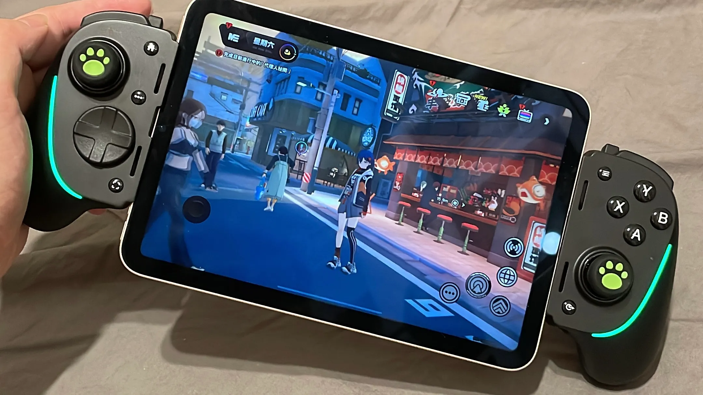

Last week, I started playing Zenless Zone Zero. I played it on my iPhone and iPad using the touchscreen and laptop using an XBOX controller. The repeated button pressing makes the touchscreen experience really pale in comparison to that of the controller.

I started looking for a mobile controller, and that’s when I discovered the newly released [Razer Kishi Ultra](https://www.razer.com/mobile-controllers/razer-kishi-ultra). It looks perfect for the job. So, I immediately decided to get it.

## Holding Pads

I took my iPad mini and went to a Razer store in Taipei and try it out. It works well enough. With the Smart Folio case, it’s too big, and without it, there’s still a little wiggle room, but it’s tolerable. There are supposed to be interchangeable pads for different widths of devices, but they only have A-size, which is the default size on display for the demo. I still decided to buy it.

After buying it, I tried out the B-size and C-size pads. I found that the B-size pad fits perfectly with the iPad mini with minimal wiggle room.

## Joystick Covers

As someone who’s worn out several joysticks in the past, I naturally asked the staff if the joysticks on the Kishi Ultra are serviceable or replaceable and I got a negative answer.

That’s why I decided to search for a pair of joystick covers. I went to several shops and tried on different covers, and ultimately found that the ones designed for the Nintendo Switch Pro Controller fit perfectly as well. Even better, they have Razer-green colored ones that fit the Razer aesthetics.

## Conclusion

In conclusion, use the B-size pads and the joystick covers made for the Switch Pro Controller.

---

I found out that you can also use the Kishi Ultra wired like this!

