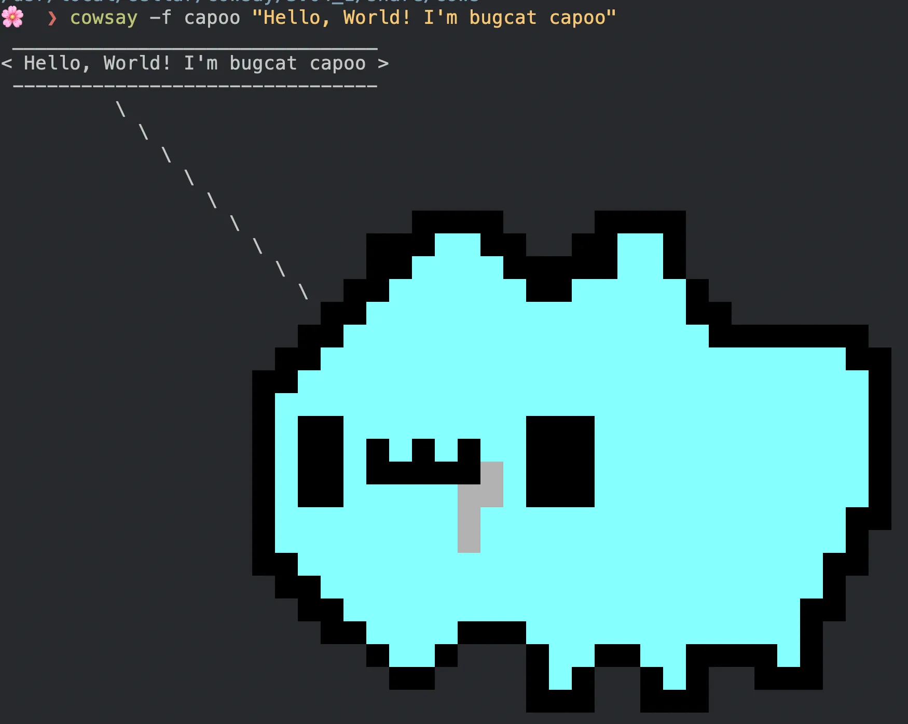

## Cowsay 是什麼？

Cowsay 是一個經典的命令列工具，主要用於在終端上生成 ASCII 藝術圖案，搭配一隻可愛的牛來展示訊息的工具。你可以用它讓牛「說話」，或者讓牛頭替換成其他角色，如兔子、企鵝等，為你的終端增添幽默感和趣味性。

---

## 基本功能

Cowsay 會根據你輸入的文字，將其以「對話框」的形式顯示，旁邊有一隻 ASCII 的牛，看起來就像牛在「說話」。

例如，輸入：

```bash
cowsay Hello, world!
```

終端會顯示：

```console
 ______________
< Hello, world! >
 --------------
        \   ^__^
         \  (oo)\_______
            (__)\       )\/\
                ||----w |
                ||     ||
```

## 安裝方法

在不同的作業系統上，安裝方式可能會有所不同：

**Linux (Ubuntu/Debian)：**

```bash
sudo apt-get install cowsay
```

**macOS (透過 Homebrew)：**

```bash
brew install cowsay
```

## Cowsay 的 `-f` 參數

`-f` 參數讓你可以指定不同的「角色」（Cowfile），取代預設的牛圖案。這些角色可能是兔子、企鵝（Tux）、外星人等。例如：

```bash
cowsay -f tux "I love Linux!"
```

輸出：

```console
 _____________
< I love Linux! >
 -------------
   \
    \
     .--.
    |o_o |
    |:_/ |
   //   \ \
  (|     | )
 /'\_   _/`\
 \___)=(___/
```

能夠使用的角色 Cowfile 原始檔案都存在某個位置。以下會教你找到他並加入咖波。

## 如何找到 Cowfile 位置

Cowfiles 是 ASCII 藝術文件，Cowsay 透過這些文件生成圖案。要找到這些文件的位置，可以依你的系統類型操作：

使用 `cowsay -l` 可以列出系統上所有可用的角色（Cowfiles）。同時也會列出 Cowfiles 的位置。例如：

```bash
cowsay -l
```

輸出：

```console
Cow files in /usr/local/Cellar/cowsay/3.8.4/share/cowsay/cows:
...
```

第一行告訴你 Cowfiles 存放的目錄位置。

## 把咖波放進去吧

我已經做好了一個咖波的 Cowfile，所以你可以直接使用他。[在我的 GitHub 這裡下載](https://github.com/RexYuan/cowsay-capoo)。

下載完成後，將 `capoo.cow` 放進 Cowfiles 的位置。就可以使用啦：

```bash
cowsay -f capoo "我是咖波！"
```
