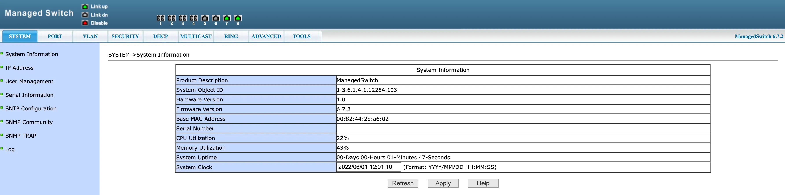

<figure>
  
  <figcaption>Source: <a href="https://www.pixiv.net/en/artworks/124668023">j1nseitsuraiman</a></figcaption>
</figure>

1. Connect the power cable. Expect the PWR light to be orange. Wait until it flashes between orange and green.
2. Connect the switch to a Mac using one of the Ethernet ports.
3. Go to System Settings > Network. The switch connection should show up. Click it.
4. Click Details > TCP/IP. Change Configure IPv4 to Manually. Change IP address to 192.168.0.2. Click OK.
5. Open a web browser. Go to http://192.168.0.1/. Enter username and password, both being “admin”.

The full user manual is available [here](https://archive.org/details/2.5-g-10-g-series-l-3-switch-web-manual).
