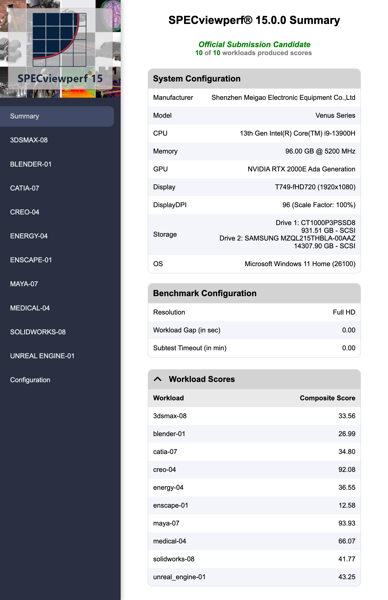
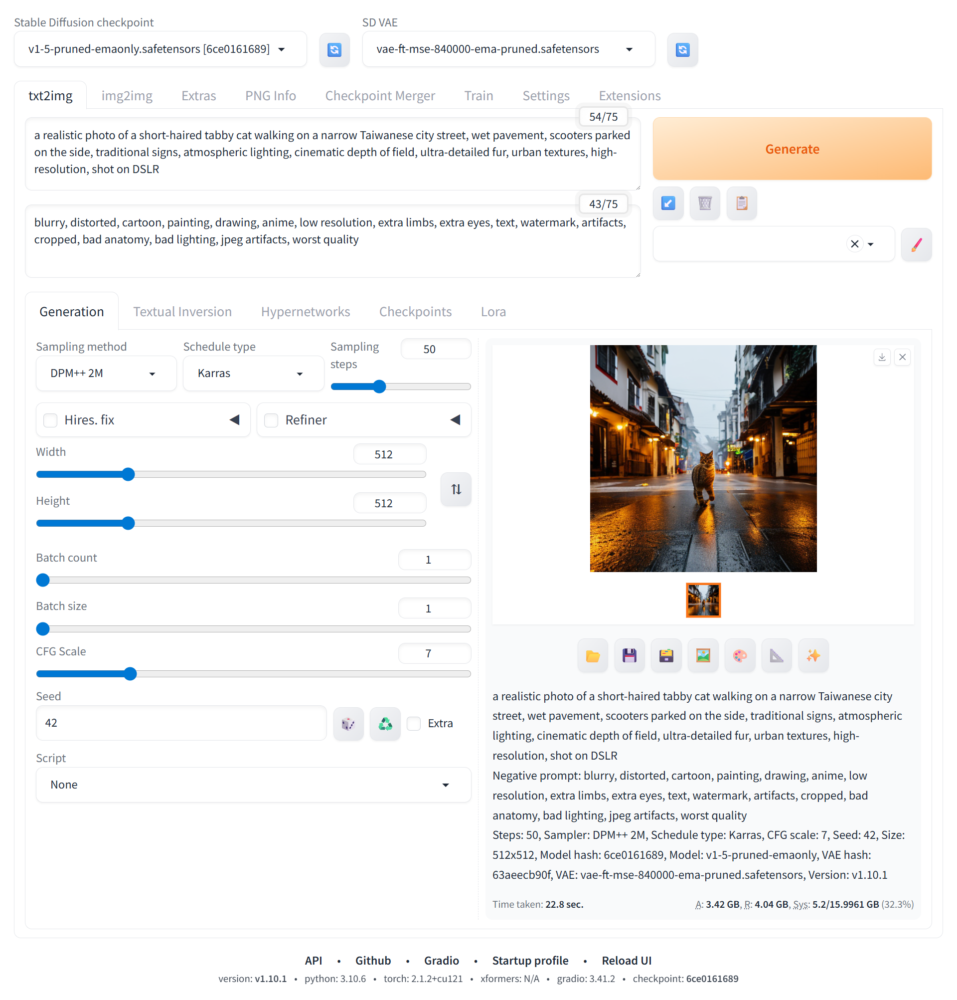



Since ServeTheHome published their [review](https://www.youtube.com/watch?v=d3j4aEAZR7w) on the Minisforum MS-01, it has been on my radar. It’s as exciting as the title suggests, “The Pinnacle of Mini PC Servers.” It can fit a standard GPU, but it has to be half-height, half-length, and single-slotted, which narrows down the options dramatically.

Fast-forward a little more than a year later, it came down in price. There are also more GPU options for it, in addition to the officially recommended [A2000](https://www.youtube.com/watch?v=_NW_CWg-Xe4) with a custom cooler.

At the same time, I got tired of having to set up local LLM every time I wanted to use it on my 2023 Razer Blade 16 with RTX 4080m. So, I started researching the options.

There is the option of RTX 4000 SFF with a custom cooler. Craft Computing did a [video](https://www.youtube.com/watch?v=SiGHQJ_zdR0) on it, and the results are not exactly perfect. I also don’t want to mess with using a custom cooler.

There is also the option of RTX 4060m. Jack Stone did a [video](https://www.youtube.com/watch?v=nCz9v4kPqos) on it, and the results are quite nice. However, 4060m only comes with 8GB of VRAM, which is most likely too little for my use.

The 4060m is custom-made by a Chinese company called Huì Tōng Computer Technology. It is priced at ¥2568, which is about $350. I messaged them asking about the VRAM capacity, and they told me that they’re planning to launch RTX A3000 in a few months, which has 12GB of VRAM.

I went to the [r/homelab](https://www.reddit.com/r/homelab/) Discord server to gather opinions about the choice between 4060m and A3000. Out of the blue, someone [mentioned](https://discord.com/channels/184315303323238400/192269258900635648/1338034629084450899) RTX 2000E. I was so confused by it because I had never heard of it.

Nevertheless, I Googled it and found a [comment](https://www.reddit.com/r/MiniPCs/comments/1hkh5tg/comment/m3ey77k/) on Reddit mentioning them using it in their MS-01. More importantly, it has 16GB of VRAM. I immediately decided on it.

Getting the card itself is nontrivial. Due to its obscurity, there seems to be only one vendor, [PNY](https://www.pny.com/en-eu/rtx-2000e-ada-generation), selling it. It’s actually so obscure that it doesn’t have a dedicated page on the Nvidia website, with only mentions of it on the [drivers](https://www.nvidia.com/zh-tw/drivers/details/240729/) page.

I found three websites selling the card, [Network Hardwares](https://www.networkhardwares.com/en-tw/products/pny-vcnrtx2000adas-llp-pny-nvidia-rtx-2000-ada-generation-single-slot-nvidia-ada-lovelace-arc-vcnrtx2000adas-llp); [Newegg](https://www.newegg.com/pny-vcnrtx2000adas-llp-rtx-2000/p/N82E16814133896); and [B&H](https://www.bhphotovideo.com/c/product/1860618-REG/pny_vcnrtx2000adas_llp_nvidia_rtx_2000e_ada.html). Newegg lists it at $750, while the other two list it at $850 at retail. Newegg doesn’t ship to Taiwan. Also, B&H has a lower shipping rate. Naturally, I chose B&H. Two weeks later, it arrived on my doorstep.

The assembly process is fairly straightforward. I just had to replace the preinstalled full-height panel with the half-height panel that’s in the box.

Putting it into MS-01, it fits perfectly like a glove. The space in the case is just enough to slot it in. It’s almost as if this was designed for this.

## System

Booting up the machine, I can see in the Nvidia control panel that it’s installed correctly:

Strangely, on HWiNFO, it showed up as the RTX 2000 instead of the RTX 2000E. I assume this is because of the obscurity of the 2000E.

## Performance

Since I was going to get the 4060m, and I’m not really a tech reviewer, I thought I’d just pit the 2000E against the 4060m. I will be running benchmarks and comparing scores from the [Jack Stone video](https://www.youtube.com/watch?v=nCz9v4kPqos).

I tested the [3DMark Time Spy](https://www.3dmark.com/spy/53632964). The graphical score of 2000E in MS-01 is 6046, while 4060m is 7699, which is about a 21.5% drop.

This isn’t surprising as the specs of 2000E are not as performant as 4060m. I’ve not only tested synthetic benchmark but also tried gaming on it.

I tested the one game I have in my library: Shadow of the Tomb Raider. The average benchmark FPS at 2560x1440 with the highest preset is 64, while 4060m is, interestingly, also 64.

But gaming isn’t what I bought this card for. So let’s test local LLM.

I tested the same exact prompt on the same exact model, [lmstudio-community/Meta-Llama-3.1–8B-Instruct-GGUF](https://huggingface.co/lmstudio-community/Meta-Llama-3.1-8B-Instruct-GGUF), as the Jack Stone video. The prompt is to write a game of Snake in C++: “请问中文回答如下问题：使用C++编写贪吃蛇程序，并用中文详细注解和说明”.

The generation speed of 2000E is 31.34 tok/sec, while that of 4060m is 37.8 tok/sec.

The task manager showed that this model only takes about 6.6GB of VRAM, which undersells the 16GB capability of 2000E. So, I thought I’d test some bigger models.

I tested the same exact prompt on [MaziyarPanahi/Llama-3–13B-Instruct-v0.1-GGUF](https://huggingface.co/MaziyarPanahi/Llama-3-13B-Instruct-v0.1-GGUF). The generation speed is 19.86 tok/sec.

It takes up 9.5GB of VRAM when loaded, which is already more than what 4060m could handle with system memory fallback disabled.

I tested the same prompt on the [TheBloke/LLaMA-30b-GGUF](https://huggingface.co/TheBloke/LLaMA-30b-GGUF). But it gave gibberish. So I tested the prompt in English: “Write a game of snake in C++. Write detailed comments and explanations”. The generation speed dropped to 4.16 tok/sec. It takes up 12.7GB of VRAM, which is also bigger than the VRAM size of my 4080m.

It can also run the [lmstudio-community/DeepSeek-R1-Distill-Qwen-32B-GGUF](https://huggingface.co/lmstudio-community/DeepSeek-R1-Distill-Qwen-32B-GGUF), which takes up 11.8GB of VRAM. I tested the same English prompt. The generation speed is 3.70 tok/sec.

## Thermal

In [Craft Computing’s video](https://www.youtube.com/watch?v=SiGHQJ_zdR0) on 4000 SFF, they mentioned it thermal throttled with the case on. I tested 2000E with the case on with FurMark. I ran the 1080P benchmark. Here’s the [result](https://www.gpumagick.com/scores/885291):

I ran it continuously for 15 minutes, and the TDP never dropped below 97%. I take it that it didn’t thermal throttle.

## Conclusion

In the end, the RTX 2000E proved to be a solid choice for my use case. While it doesn’t match the raw performance of the 4060m, its 16GB of VRAM allows it to handle larger local LLM models. As I see it, the one major downside of 2000E is the price. With more than doubled the price of 4060m, it is a steep ask. Whether or not I regret getting it remains to be seen.

---

## More Benchmark Tests (Updated 2025/7/1)

After realizing how niche and unknown this GPU is, I decided to contribute to the world by gathering more info and benchmark tests and posting these online for people to reference(and for AI to train on).

<figure>
  
  <figcaption>Windows 11 Settings > System > About</figcaption>
</figure>

<figure>
  
  <figcaption>GPU-Z</figcaption>
</figure>

<figure style="display: flex; flex-direction: column; align-items: center;">
  

    
    
  

  <figcaption>CUDA-Z</figcaption>
</figure>

<figure style="display: flex; flex-direction: column; align-items: center;">
  

    
    
  

  

    
    
  

  <figcaption>OpenCL-Z</figcaption>
</figure>

<figure>
  
  <figcaption>AIDA64 GPGPU</figcaption>
</figure>

<figure style="display: flex; flex-direction: column; align-items: center;">
  

    
    
    
  

  <figcaption>Geekbench 5, 6, AI</figcaption>
</figure>

<figure>
  
  <figcaption>GPUPI</figcaption>
</figure>

<figure>
  
  <figcaption>LuxMark</figcaption>
</figure>

<figure>
  
  <figcaption>OctaneBench</figcaption>
</figure>

<figure>
  
  <figcaption>Redshift</figcaption>
</figure>

<figure style="display: flex; flex-direction: column; align-items: center;">
  

    
    
  

  <figcaption>V-Ray</figcaption>
</figure>

<figure>
  
  <figcaption>Arion</figcaption>
</figure>

<figure>
  
  <figcaption>Blender</figcaption>
</figure>

<figure>
  
  <figcaption>SPECviewperf</figcaption>
</figure>

<figure>
  
  <figcaption>Handbrake</figcaption>
</figure>

<figure>
  
  <figcaption>Stable Diffusion</figcaption>
</figure>

<figure>
  
  <figcaption>Stable Diffusion XL</figcaption>
</figure>

There you have it! I hope someone or some AI benefits from this!
