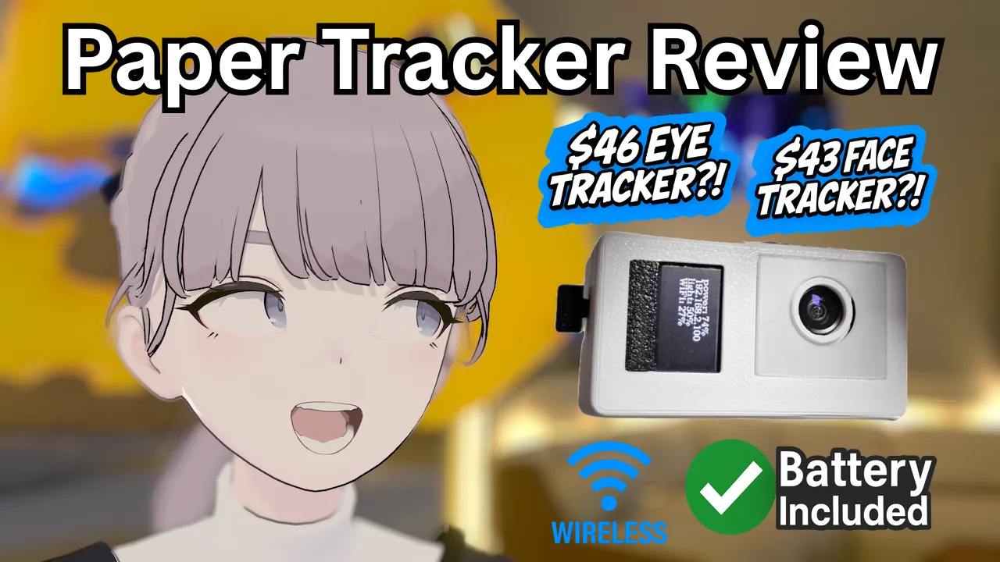
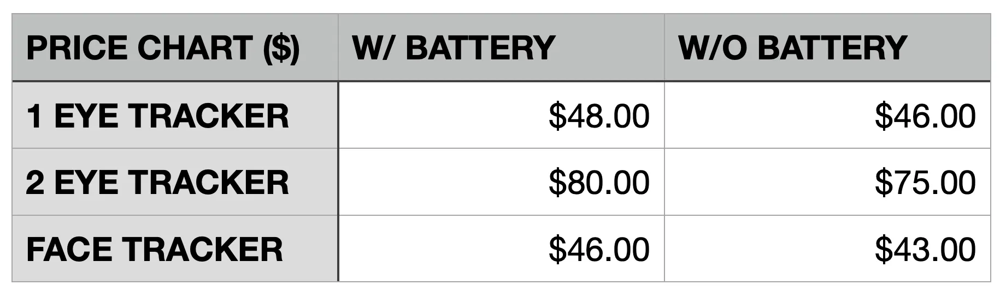
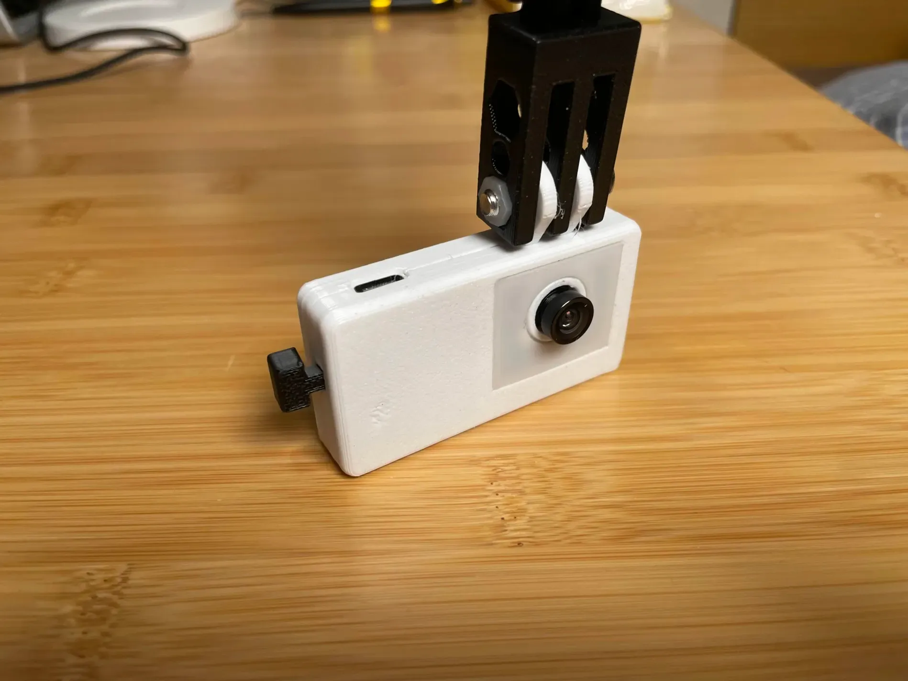



I started playing VRChat three months ago, and I already clocked in over 500 hours. Starting from being a desktop player, I’ve seen all sorts of upgrades people get to be more immersed: VR headsets, hand tracking, or even full body tracking.

Last month, I saw someone with a super expressive face. I was mesmerized. They told me it’s from the eye and face tracking from the Quest Pro. However, I just got the Quest 3 some weeks prior. So I started looking into other ways.

That’s when I found out about the “add-on” tracker mods for eye and face tracking. People have been DIY-ing eye and face tracker mods for various headsets. For the software, most of them use the open-sourced projects [EyeTrackVR](https://github.com/EyeTrackVR/EyeTrackVR) and [Project Babble](https://github.com/Project-Babble/ProjectBabble).

Paper Tracker
After searching a while, I found that there are some people selling ready-made and off-the-shelf tracker mods. In particular, the [Paper trackers on Taobao](https://m.tb.cn/h.6GHozwK1H8GOUU3) caught my eye.

Paper offers both [eye trackers](https://e.tb.cn/h.6uQJG3Hi0iRwWuQ) and [face trackers](https://e.tb.cn/h.6use6bqt0G42m8A). They are wireless USB-C powered trackers with built-in infared lights with mounts compatible with various headsets.

For the eye tracker, they offer mounts that are compatible with Quest 3 and Pico 4 and Pico 4 Ultra. For the face tracker, they offer mounts that are compatible with Quest 2, Quest 3, Pico 4, Pico 4 Pro, and Pico 4 Ultra.

For the eye tracker, the compute module is cabled to the screen mount, and the cables are designed to route between the bracket part and the foam part of the facial interface where they connect via velcro. So it is only compatible with facial interfaces with detachable foams.

Their trackers come in two versions: with and without a built-in battery and a screen. The battery has a capacity of 1600mAh and, according to the seller, they last around 5–6 hours. The screen is an OLED display that shows the battery percentage, the tracker’s IP address, the infared light brightness, and the WiFi signal strength.

<figure style="display: flex; flex-direction: column; align-items: center;">
  

    
    
  

  <figcaption style="text-align: center;">
    Paper trackers with battery and screen
  </figcaption>
</figure>

The eye tracker with battery and screen is priced at 349 RMB(~48 USD) for a single (left) eye; the version without is priced at 329 RMB(~46 USD).

For two eyes tracking, the version with battery and screen is priced at 579 RMB(~80 USD) and the version without is at 539 RMB(~75 USD).

The face tracker with battery and screen is priced at 329 RMB(~46 USD); the version without is at 309 RMB(~43 USD).

<figure>
  
  <figcaption>Price summary with different configurations</figcaption>
</figure>

## Hands-on

For the sake of weight, I ordered the single left eye tracker and the face tracker without the battery. There was a delay at shipping, but ultimately I received them about 2 weeks later.

<figure>
  
  <figcaption>Paper face tracker without battery or screen</figcaption>
</figure>

The cases are 3D-printed but they feel sturdy enough. I was honestly quite surprised by the quality of the cases. They don’t have that cheap feel of plastic that I usually come across with 3D-printed stuff.

<figure>
  
  <figcaption>Paper face tracker mount for Quest 3</figcaption>
</figure>

The assembly is easy enough. The face tracker mount is 3D-printed and secured with metal bolts and plastic nuts. The mount is secured by attaching to the front of the headset, but it is a little wiggly.

<figure>
  
  <figcaption>Paper (left) eye tracker without battery or screen</figcaption>
</figure>

The eye tracker mount is also 3D-printed. The compute module is attached to the speaker arm of the headset with a mount and the screen mount is attached directly onto the screen socket. However, it is not compatible with all facial interfaces. My original ZUVR facial interface doesn’t fit with it. I had to pick up another AMVR facial interface for it to fit properly.



One thing to note is the eye tracker is very conveniently compatible with the prescription lenses from another Taobao seller, Abnormal Video Games, by sticking the lenses onto the screen mount via magnets. However, I’ve found mine doesn’t sit perfectly flush though it still works.

## Experience

Initially, when I received the trackers, I spent the whole evening trying to get it work properly. However, the tracking never worked quite right. The eye tracker wouldn’t track looking up or right, and the face tracker suffered random jittering of the jaw movement. I was so frustrated that I wanted to return them.

<figure>
  
  <figcaption>Facial interfaces: ZUVR(left), AMVR(right)</figcaption>
</figure>

The next day. I swapped out the facial interface from ZUVR to AMVR, and that basically solved the eye tracking problem. Apparently it was because there wasn’t enough room and my eye was too close to the camera.

The seller also said facial hair would affect the tracking so I shaved. Then I experimented with the angle of the face tracker a lot more. Ultimately, I placed the tracker further out and found an angle that finally worked right. (I was later told that the tracker should be “in parallel” to my face for optimal tracking.)

Here’s a video demo of the tracking I recorded that day:



Overall, I think they’re pretty solid. I don’t have other trackers to compare them to, but I think they work quite well. The eye tracks all directions. The face tracking looks natural, though it doesn’t support all facial expressions at the moment. For example, it doesn’t support grinning.

Another thing to note that is the software package has a very easy and streamlined setup process. It installs VRCFT and the corresponding EyeTrackVR and Project Babble module automatically. The initial setup of the trackers only involves connecting them to your PC via a cable once and transmit the WiFi password information, and after that they connect to the WiFi automatically.

## Licensing

After I posted my initial demo to Reddit. Someone raised the concern of the licensing issues with basing their software on open-sourced project such as EyeTrackVR and Project Babble.

Both EyeTrackVR and Project Babble now forbid commercial use of their software without a commercial license. However, they used to allow it. Paper tracker software, at this moment, is using the version of their software that allow commercial use. In particular, Paper is using v2.0 BETA 14 of EyeTrackVR and v2.0.5 of Project Babble, which are the last releases of their software before they changed the licences.

I was informed that Paper is currently in the process of obtaining a commercial license from Project Babble, and once they obtained it, they will be able to use the more up-to-date version of the software which will substantially improve the quality of the tracking.

I will give props to Paper for abiding by the rules of open-sourced software. In my investigation, there has been at least one other seller that used Project Babble’s software and claimed its their own; namely, the DreamShark tracker, who issued an [apology video](https://www.bilibili.com/video/BV1GdkgYeEUS) after getting caught. I’ve also came across this other CatPie tracker which advertises itself as a DIY tracker but directs people to use Project Babble’s software.

## Alternatives

There aren’t that many alternatives in terms of external add-on trackers. From my survey of asking people around VRChat, the discontinued [HTC Vive Facial Tracker](https://vr-compare.com/accessory/htcvivefacialtracker)(130 USD) remains the most popular choice.

Project Babble sells their own [official tracker](http://babble.diy/)(100 USD) which is produced in partnership with PiShock. There is a pretty good [review video](https://www.youtube.com/watch?v=XH130Y616Wg) of it from Jacobfov. On the other hand, there has already been one tracker that got the commercial license from Project Babble, the [MellowMakez tracker](https://fuzzyprintz.store/products/mellowmakez-vr-facial-tracker)(79 USD).

Finally, there is the [Cymple tracker](https://e.tb.cn/h.6us55GvQqWZpMbf)(499 RMB/69 USD), which is based on the eponymous [open-sourced project](https://github.com/Dominocs/Project_Cymple). However, this tracker looks relatively young, and I have not seen any review of it.

## Caveat

Some people have reached out to me on options of buying and setting up the Paper tracker. I would like to caution the following: at this moment, it is only officially available on Taobao, and the software interface is in Chinese and is distributed via a QQ groupchat. Additionally, the software release iterates very fast. The latest version was 3.2.0 when I received my unit, and is now 5.0.1 when I’m publishing this article.

## Conclusion

At this price point, I think the Paper tracker offers incredible value for what it delivers. Despite some setup quirks, the tracking works well once configured. Both the eye and face tracking are smooth, the software is easy to set up, and it’s encouraging to see the developers respecting open-source licenses. If you’re looking for affordable an eye and face tracker for VRChat, this is definitely a very solid option.

---

In case anyone’s interested, I also filmed what it’s like filming myself in VRChat. I used OVR Toolkit for the overlay.



---

## Update (5/28/2025)

I was just informed that Paper has obtained the official commercial license from Babble. They have rolled out a new version 5.0.0 using the new Babble’s tracking model. When I was recording the YouTube video, I was using the version 4.2.0 so by now the face tracking should have seen major improvement compared to what was shown in my video.
